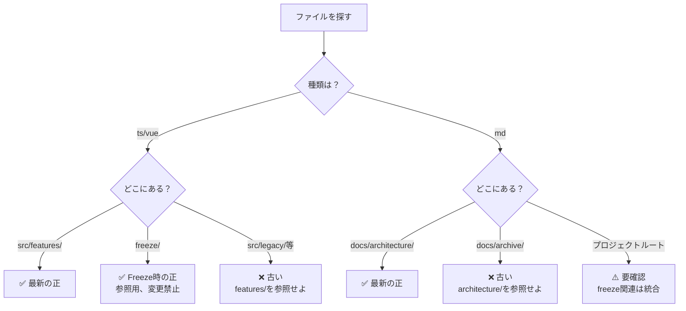

# ADR-003: ファイル整理戦略

**Status**: Accepted  
**Date**: 2026-01-16  
**Context**: SYSTEM_PHILOSOPHY.mdが古い（実装と乖離）、古い資料の誤参照を防止

---

## 決定事項

**最新性を担保するため、Single Source of Truthを明確化し、古い資料の参照を禁止する。**

---

## 背景

### 発生した問題

1. **SYSTEM_PHILOSOPHY.mdが古い**
   - `system_design.md`（2025/12/27）をベースに作成
   - 実装（`ClientUiSchema.ts`）に報酬設定等が追加されているが反映されていない

2. **AIが古い資料を参照**
   - `system_design.md`を「最新」と誤認
   - 実装ファイル（`src/features/`）を確認しなかった

3. **正しいファイルの特定不可**
   - ts/vueファイルがどこにあるのか分からない
   - 同じ概念が複数ファイルに散在

### 根本原因

- **Single Source of Truthが不明確**
- **古い資料と最新資料が混在**
- **AIが実装ファイルを確認するルールがない**

---

## Single Source of Truth

### 実装（コード）

| カテゴリ | 場所 | 説明 | ステータス |
|---------|-----|------|-----------|
| **最新の実装** | `src/features/**/*.ts`, `*.vue` | 型安全な新コード（ADR-001準拠） | ✅ 最優先で参照 |
| **Freeze時の正** | `freeze/**/*.vue`, `*.ts` | UI Freeze時のスナップショット（ADR-002準拠） | ✅ 参照用（変更禁止） |
| **旧コード** | `src/legacy/**`, `src/components/**`, `src/composables/**` | 段階的削除対象 | ❌ 参照禁止 |

### ドキュメント

| カテゴリ | 場所 | 説明 | ステータス |
|---------|-----|------|-----------|
| **最新の哲学** | `docs/architecture/SYSTEM_PHILOSOPHY.md` | システムの本質・哲学 | ✅ 最優先で参照 |
| **最新のADR** | `docs/architecture/ADR-001.md`<br/>`docs/architecture/ADR-002.md`<br/>`docs/architecture/ADR-003.md` | 設計決定記録 | ✅ 必読 |
| **議論記録** | `docs/sessions/SESSION_YYYYMMDD.md` | 哲学・動機の保持 | ✅ 参照 |
| **プロトコル** | `.gemini/brain/{id}/session-management-protocol-complete.md` | セッション管理プロトコル | ✅ 必読 |
| **古い資料** | `docs/archive/**` | 参考のみ | ⚠️ 最新性なし |

---

## 古い資料一覧（参照禁止）

| ファイル | 最終更新 | 理由 | 代わりに参照すべきファイル |
|---------|---------|------|--------------------------|
| `docs/system_design.md` | 2025/12/27 | 古い、実装と乖離 | `docs/architecture/SYSTEM_PHILOSOPHY.md` |
| `docs/archaeology/**` | - | 古い調査ファイル | `docs/sessions/*.md` |
| `src/legacy/**` | - | 旧コード | `src/features/**` |
| `src/components/**` | - | 旧コード | `src/features/**` |
| `src/composables/**` | - | 旧コード | `src/features/**` |

---

## AIの振る舞いルール

### SYSTEM_PHILOSOPHY.md更新時

```markdown
【必須チェックリスト】

1. ✅ 実装ファイルを確認したか？
   - src/features/**/*Schema.ts
   - src/features/**/*.vue

2. ✅ 古い資料を参照していないか？
   - ❌ docs/system_design.md
   - ❌ docs/archaeology/**
   - ✅ src/features/**

3. ✅ 確認したファイルパスを明記したか？
   - 例：「ClientUiSchema.ts（L1-95）を確認し、報酬設定を追加」
```

### データモデル更新時の優先順位

```
1. src/features/**/*Schema.ts  ← 最優先（実装）
2. SESSION_YYYYMMDD.md         ← 議論で確定した仕様
3. ADR-XXX.md                  ← 設計決定
4. docs/system_design.md       ← 参考のみ（最新性なし）
```

---

## 正しいファイルの探し方

### フローチャート



---

## 整理基準

### 保持

- 現在使用中
- プロジェクトの実行に必須
- 最新の設計・ドキュメント

### 移動（archive/）

- 古いが参考になる
- `docs/archive/`へ移動

### 削除

- 完全に不要
- テスト・デバッグ用の一時ファイル
- バックアップ（git履歴で十分）

---

## 整理対象ファイル

### 対象（gitで管理）

```
= 人間またはAIが編集するファイル
= プロジェクトの「資産」
```

| 場所 | 対象 | 理由 |
|------|------|------|
| プロジェクトルート直下 | ✅ Yes | 設定ファイル、gitで管理 |
| src/ | ✅ Yes | ソースコード、gitで管理 |
| docs/ | ✅ Yes | ドキュメント、gitで管理 |

### 対象外（.gitignoreされている）

```
= 自動生成・復元可能なファイル
```

| 場所 | 対象 | 理由 |
|------|------|------|
| dist/ | ❌ No | ビルド生成物、`npm run build`で復元 |
| node_modules/ | ❌ No | 依存関係、`npm install`で復元 |
| *.log | ❌ No | 一時ファイル、削除すべき |

---

## Migration Policy（正史確定とアーカイブ分離）

### **決定事項**

**新規実装・設計判断を一時的に全面停止し、既存ファイルを以下の3区分で強制分類する。**

| 区分 | 行き先 | 扱い |
|------|--------|------|
| **正史** | canonical領域（docs/architecture/, src/features/） | 実装根拠として使用可 |
| **歴史資料** | archive/philosophy/ | 参照のみ・再利用禁止 |
| **虚偽/誤解** | archive/rejected/ | 明示的に否定 |

---

### **ファイル移動の原則**

#### **1. archive/philosophy/へ移動**

**条件**:
- ADR-001/002（2026-01-15）以前の哲学・設計思想
- 議論の記録として価値がある
- 実装根拠としては使用しない

**例**:
- SCHEMA_MASTER_LIST.md（ROI計算の議論）
- FUNCTION_LIST.md（UseCase一覧）
- DECISION_LOG_20260114.md（Phase 6計画）

---

#### **2. archive/rejected/へ移動**

**条件**:
- 虚偽の「完了」報告（2026-01-12）
- 破綻した実装
- 明示的に否定すべき内容

**例**:
- PHASE5_COMPLETION_REPORT.md
- PHASE5B, C, D, G, H, Z_COMPLETION_REPORT.md
- 型安全が確保されていない実装

---

#### **3. archive/archaeology/へ移動**

**条件**:
- 古い調査ファイル
- 歴史的資料

**例**:
- docs/archaeology/

---

### **再利用禁止ルール（法典）**

```
archive配下の内容は、いかなる理由があっても
新規ADR・設計・実装判断の根拠として引用してはならない
```

**理由**:
- archive/は「過去の思考の記録」であり、「実装根拠」ではない
- 参照・反証資料としてのみ使用
- 新規実装は必ずCANONICAL_SOURCES.mdのファイルを根拠にする

**違反例**:
- ❌ archive/philosophy/のデータモデルをSYSTEM_PHILOSOPHY.mdにコピー
- ❌ archive/rejected/の実装を参考にする
- ❌ 「archive/に書いてあるから」という理由で実装判断

---

### **正史（Canonical Sources）**

**実装根拠とすべき正史のファイル一覧**:

詳細は [CANONICAL_SOURCES.md](file:///c:/Users/kazen/OneDrive/デスクトップ/ai_gogleanti/docs/architecture/CANONICAL_SOURCES.md) を参照。

**重要な原則**:
1. **src/features/ のみ実装根拠にする**
2. **src/legacy/ は「動いているが正しくない」**
3. **features 以外に新規実装禁止**
4. **archive は参照専用**

---

## 実装計画

### Phase 1: ADR-003の必読化

- [x] ADR-003を作成
- [x] Migration Policy追加
- [x] 再利用禁止ルール追加
- [ ] session-management-protocol-complete.mdに追加
- [ ] 次回セッション開始時から適用

### Phase 2: 古い資料の整理

- [x] archive/philosophy/ 作成
- [x] archive/rejected/ 作成
- [x] MIGRATION_LOG.md 作成
- [ ] docs/SCHEMA_MASTER_LIST.md → archive/philosophy/へ移動
- [ ] docs/FUNCTION_LIST.md → archive/philosophy/へ移動
- [ ] docs/PHASE5_*.md → archive/rejected/へ移動
- [ ] docs/archaeology/ → archive/archaeology/へ移動
- [ ] docs/system_design.md → archive/へ移動

### Phase 3: src/の整理

- [ ] src/backup_before_ironclad_v1/ 削除
- [ ] src/Mirror_sandbox/ 削除
- [ ] src/legacy/ 段階的削除

---

## 検証方法

### AIの振る舞いチェック

```markdown
次回セッション開始時：

1. SYSTEM_PHILOSOPHY.md更新を指示
2. AIが src/features/ を確認したか？
3. AIが system_design.md を参照していないか？
4. 確認したファイルパスを明記したか？

→ 全て Yes なら成功
```

---

## 関連

- [ADR-001: 型安全マッピング戦略](file:///c:/Users/kazen/OneDrive/デスクトップ/ai_gogleanti/docs/architecture/ADR-001-type-safe-mapping.md)
- [ADR-002: 段階的UI実装](file:///c:/Users/kazen/OneDrive/デスクトップ/ai_gogleanti/docs/architecture/ADR-002-gradual-ui-implementation.md)
- [SYSTEM_PHILOSOPHY.md](file:///c:/Users/kazen/OneDrive/デスクトップ/ai_gogleanti/docs/architecture/SYSTEM_PHILOSOPHY.md)
- [CANONICAL_SOURCES.md](file:///c:/Users/kazen/OneDrive/デスクトップ/ai_gogleanti/docs/architecture/CANONICAL_SOURCES.md)
- [MIGRATION_LOG.md](file:///c:/Users/kazen/OneDrive/デスクトップ/ai_gogleanti/docs/archive/MIGRATION_LOG.md)
- [SESSION_20260115.md](file:///c:/Users/kazen/OneDrive/デスクトップ/ai_gogleanti/docs/sessions/SESSION_20260115.md)
