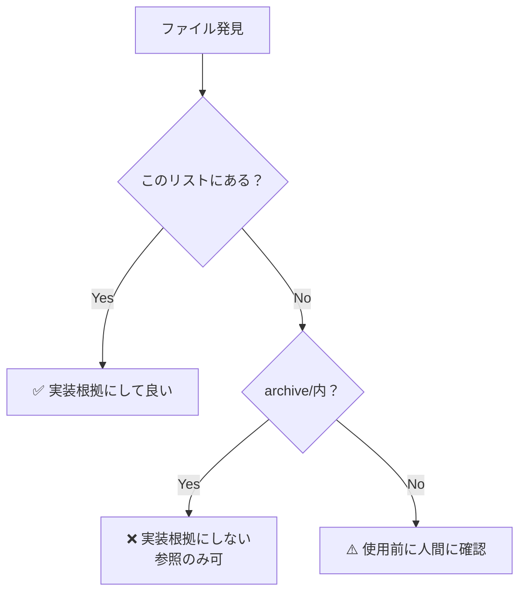

# 正史（Canonical Sources）

**最終更新**: 2026-01-25  
**ステータス**: ✅ Active（唯一の信頼できる情報源管理ファイル）

---

## このドキュメントの目的

**新規実装の根拠となるファイルを明確化する。**

### **重要な原則**

```
✅ このリストにあるファイルのみ実装根拠にする
❌ archive/内のファイルは実装根拠にしない
⚠️ このリスト以外のファイルは使用前に確認
```

---

## 📌 AI参照ガイドライン（2026-01-25追加）

### AI（私）が遵守すべきルール

**新セッション開始時**:
1. ✅ このファイル（CANONICAL_SOURCES.md）を最初に読む
2. ✅ 質問別FAQで正解ファイルを確認
3. ✅ 優先順位ルールに従って情報の信頼性を判断
4. ❌ UI_MASTER_LEGACY.md、sessions/*.md は参照禁止

**質問回答時**:
1. FAQ検索 → 該当する質問があれば正解ファイルを参照
2. メタデータ確認（最終更新日、ステータス、優先度）
3. 矛盾発見時は優先順位ルール（P0 > P1 > P2）に従う
4. 回答に根拠ファイルのリンクを明記

---

## 🔍 質問別FAQ（2026-01-25追加）

### Q1: Phase 1でCSV化する会計ソフトは？
- **正解**: [UI_MASTER_v2.md#phase1-csv-export](file:///C:/Users/kazen/OneDrive/デスクトップ/ai_gogleanti/docs/UI_MASTER_v2.md#phase1-csv-export)
- **確定日**: 2026-01-24
- **ステータス**: ✅ 確定
- **回答**: MFクラウド（1つのみ）
- **古い情報** (参照禁止):
  - ~~UI_MASTER_LEGACY.md~~ - 古い仕様
  - ~~sessions/SESSION_*.md~~ - 議論中の内容（未確定）

### Q2: 顧問先登録モーダルの項目は？
- **正解**: [UI_MASTER_v2.md#client-modal](file:///C:/Users/kazen/OneDrive/デスクトップ/ai_gogleanti/docs/UI_MASTER_v2.md#client-modal)
- **確定日**: 2026-01-23
- **ステータス**: ✅ 確定
- **回答**: 10項目（基本5+消費税5）

### Q3: JournalEntryのプロパティ数は？
- **正解**: [UI_MASTER_v2.md#journal-entry-schema](file:///C:/Users/kazen/OneDrive/デスクトップ/ai_gogleanti/docs/UI_MASTER_v2.md#journal-entry-schema)
- **確定日**: 2026-01-23
- **ステータス**: ✅ 確定
- **回答**: 19項目

### Q4: Step 3のAI実装で解決すべき問題は？
- **正解**: [step3_validation_issues.md](file:///C:/Users/kazen/.gemini/antigravity/brain/2826535e-a1b5-4cf1-899e-d11b8801f16d/step3_validation_issues.md)
- **確定日**: 2026-01-24
- **ステータス**: ✅ 確定
- **回答**: 5つの問題（ファイル形式別プロンプト、計算期間外チェック、重複検知、型定義厳密性、プロンプト設計）

### Q5: Phase 2に延期された事項は？
- **正解**: [phase2_postponed_issues.md](file:///C:/Users/kazen/.gemini/antigravity/brain/2826535e-a1b5-4cf1-899e-d11b8801f16d/phase2_postponed_issues.md)
- **確定日**: 2026-01-24
- **ステータス**: ✅ 確定
- **回答**: any型問題、Client型問題、unknown型変更

---

## 📊 優先順位ルール（矛盾時の判断基準）

| 優先度 | ファイル | 条件 | 用途 |
|-------|---------|------|------|
| **P0** | UI_MASTER_v2.md | メタデータ「確定」かつ最新日付 | 意思決定、項目リスト、ステップ管理 |
| **P1** | CANONICAL_SOURCES.md（このファイル） | 質問別の正解が明記 | FAQ、優先順位判断 |
| **P2** | docs/architecture/ADR-*.md | 設計判断の根拠 | ADR、設計決定 |
| **P3** | brain/implementation_code_collection.md | 実装コード検索専用 | 実装コード全文 |
| **P4** | brain/*.md（既存4ファイル） | 検索用アーカイブ | 実装コードのみ（意思決定は古い可能性） |
| **禁止** | UI_MASTER_LEGACY.md | 参照禁止 | 削除予定 |
| **禁止** | sessions/*.md | 参照禁止（履歴のみ） | 議論の経緯（最新情報なし） |

**ルール**: P0 > P1 > P2。矛盾時はP0を優先、P4は実装コード検索のみ使用、禁止ファイルは無視。

---

## ADR-001/002以降の「正」のファイル

### **1. ADR（Architecture Decision Record）**

| ファイル | 確立日 | 内容 |
|---------|--------|------|
| [ADR-001](file:///c:/Users/kazen/OneDrive/デスクトップ/ai_gogleanti/docs/architecture/ADR-001-type-safe-mapping.md) | 2026-01-15 | 型安全マッピング戦略 |
| [ADR-002](file:///c:/Users/kazen/OneDrive/デスクトップ/ai_gogleanti/docs/architecture/ADR-002-gradual-ui-implementation.md) | 2026-01-15 | 段階的UI実装 |
| [ADR-003](file:///c:/Users/kazen/OneDrive/デスクトップ/ai_gogleanti/docs/architecture/ADR-003-file-organization-strategy.md) | 2026-01-16 | ファイル整理戦略 |

**これが法典です。**

---

### **2. UI仕様の正解（2026-01-25追加）**

| ファイル | 確立日 | 内容 | 優先度 |
|---------|--------|------|--------|
| [UI_MASTER_v2.md](file:///C:/Users/kazen/OneDrive/デスクトップ/ai_gogleanti/docs/UI_MASTER_v2.md) | 2026-01-25 | **唯一の信頼できる情報源**（Phase/Step/Milestone、項目リスト、UI仕様） | **P0** |

**参照禁止**:
- ~~UI_MASTER_LEGACY.md~~ - 旧版、削除予定

---

### **3. 実装コード検索用（brain/）**

| ファイル | 確立日 | 内容 | 優先度 | 用途 |
|---------|--------|------|--------|------|
| [implementation_code_collection.md](file:///C:/Users/kazen/.gemini/antigravity/brain/2826535e-a1b5-4cf1-899e-d11b8801f16d/implementation_code_collection.md) | 2026-01-25 | 実装コード全文集 | **P3** | 検索専用 |
| [step3_ai_implementation_full.md](file:///C:/Users/kazen/.gemini/antigravity/brain/2826535e-a1b5-4cf1-899e-d11b8801f16d/step3_ai_implementation_full.md) | 2026-01-24 | Step 3実装計画 | P4 | 検索専用 |
| [step3_validation_issues.md](file:///C:/Users/kazen/.gemini/antigravity/brain/2826535e-a1b5-4cf1-899e-d11b8801f16d/step3_validation_issues.md) | 2026-01-24 | Step 3未解決問題 | P4 | 検索専用 |
| [phase2_postponed_issues.md](file:///C:/Users/kazen/.gemini/antigravity/brain/2826535e-a1b5-4cf1-899e-d11b8801f16d/phase2_postponed_issues.md) | 2026-01-24 | Phase 2延期事項 | P4 | 検索専用 |
| [adr010_part2_implementation.md](file:///C:/Users/kazen/.gemini/antigravity/brain/2826535e-a1b5-4cf1-899e-d11b8801f16d/adr010_part2_implementation.md) | 2026-01-24 | ADR-010実装手順 | P4 | 検索専用 |

**注意**: brain内ファイルは**実装コード検索専用**。意思決定情報は古い可能性があるため、UI_MASTER_v2.mdを優先。

---

### **4. システム哲学**

| ファイル | 確立日 | 内容 |
|---------|--------|------|
| [SYSTEM_PHILOSOPHY.md](file:///c:/Users/kazen/OneDrive/デスクトップ/ai_gogleanti/docs/architecture/SYSTEM_PHILOSOPHY.md) | 2026-01-15 | システムの本質・哲学 |
| [CHANGELOG_SYSTEM_PHILOSOPHY.md](file:///c:/Users/kazen/OneDrive/デスクトップ/ai_gogleanti/docs/architecture/CHANGELOG_SYSTEM_PHILOSOPHY.md) | 2026-01-15 | 変更履歴 |

---

### **5. セッション記録（2026-01-15以降）**

| ファイル | 日付 | 内容 |
|---------|------|------|
| [SESSION_INDEX.md](file:///c:/Users/kazen/OneDrive/デスクトップ/ai_gogleanti/docs/sessions/SESSION_INDEX.md) | 2026-01-15 | セッションインデックス |
| [SESSION_20260115.md](file:///c:/Users/kazen/OneDrive/デスクトップ/ai_gogleanti/docs/sessions/SESSION_20260115.md) | 2026-01-15 | 2026-01-15のセッション |

**注意**: sessions/*.mdは**履歴のみ**。最新の意思決定情報はUI_MASTER_v2.mdを参照。

---

### **6. 実装（src/features/）**

| ディレクトリ | 確立日 | 内容 |
|------------|--------|------|
| src/features/client-management/ | 2026-01-15以降 | 顧問先管理（ADR-001/002準拠） |

**Schema例**:
- ClientUiSchema.ts
- ClientFormSchema.ts
- ClientToUiMapper.ts

---

### **7. 型定義**

| ファイル | 内容 |
|---------|------|
| src/types/zod_schema.ts | Zodスキーマ定義（最新） |

---

### **8. UI Freeze Policy（2026-01-01確立）**

| ファイル | 内容 |
|---------|------|
| ui-freeze-policy.md | Phase A/B/C の定義 |
| ui-freeze-binding.md | Freeze契約 |
| ui-freeze-appendix-a.md | ストレステスト |
| ui-freeze-appendix-b.md | 補足 |

**注**: ADR-001/002以前だが、哲学として正しい

---

### **9. 開発規範（時期不明だが哲学として正しい）**

| ファイル | 内容 |
|---------|------|
| dev_guide.md | Anti-Rebellion Protocol（※サンドボックスは削除予定） |
| IRONCLAD_BOUNDARY.md | Ironclad Architecture |

---

## archive/内のファイル（参照専用）

### **archive/philosophy/**

**用途**: 過去の思考の記録（参照専用・再利用禁止）

**ファイル例**:
- truth-in-lies.md
- deduction-timeline.md
- salvaged-information-complete.md

### **archive/rejected/**

**用途**: 虚偽報告・破綻した実装の記録

**ファイル例**:
- phase5-false-complete.md（予定）
- broken-implementations.md（予定）

---

## ⚠️ 重要な原則（正史）

### **archive配下の絶対禁止ルール**

```
archive配下の内容は、いかなる理由があっても
新規ADR・設計・実装判断の根拠として引用してはならない
```

**理由**:
- archive/は「過去の思考の記録」であり、「実装根拠」ではない
- 参照・反証資料としてのみ使用
- 新規実装は必ずこのリスト（CANONICAL_SOURCES.md）のファイルを根拠にする

**違反例**:
- ❌ archive/philosophy/のデータモデルをSYSTEM_PHILOSOPHY.mdにコピー
- ❌ archive/rejected/の実装を参考にする
- ❌ 「archive/に書いてあるから」という理由で実装判断

---

## 判定フローチャート



---

## 更新履歴

| 日付 | 内容 |
|------|------|
| 2026-01-25 | FAQ、優先順位ルール、AI参照ガイドライン追加 |
| 2026-01-16 | 初版作成 |
