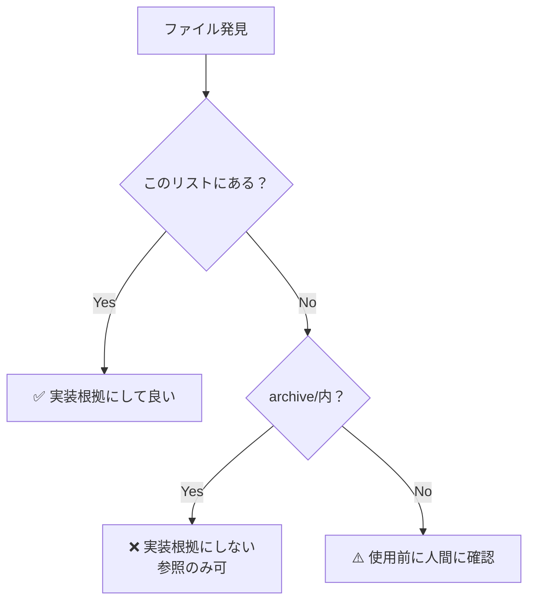

# 正史（Canonical Sources）

**最終更新**: 2026-01-16

---

## このドキュメントの目的

**新規実装の根拠となるファイルを明確化する。**

### **重要な原則**

```
✅ このリストにあるファイルのみ実装根拠にする
❌ archive/内のファイルは実装根拠にしない
⚠️ このリスト以外のファイルは使用前に確認
```

---

## ADR-001/002以降の「正」のファイル

### **1. ADR（Architecture Decision Record）**

| ファイル | 確立日 | 内容 |
|---------|--------|------|
| [ADR-001](file:///c:/Users/kazen/OneDrive/デスクトップ/ai_gogleanti/docs/architecture/ADR-001-type-safe-mapping.md) | 2026-01-15 | 型安全マッピング戦略 |
| [ADR-002](file:///c:/Users/kazen/OneDrive/デスクトップ/ai_gogleanti/docs/architecture/ADR-002-gradual-ui-implementation.md) | 2026-01-15 | 段階的UI実装 |
| [ADR-003](file:///c:/Users/kazen/OneDrive/デスクトップ/ai_gogleanti/docs/architecture/ADR-003-file-organization-strategy.md) | 2026-01-16 | ファイル整理戦略 |

**これが法典です。**

---

### **2. システム哲学**

| ファイル | 確立日 | 内容 |
|---------|--------|------|
| [SYSTEM_PHILOSOPHY.md](file:///c:/Users/kazen/OneDrive/デスクトップ/ai_gogleanti/docs/architecture/SYSTEM_PHILOSOPHY.md) | 2026-01-15 | システムの本質・哲学 |
| [CHANGELOG_SYSTEM_PHILOSOPHY.md](file:///c:/Users/kazen/OneDrive/デスクトップ/ai_gogleanti/docs/architecture/CHANGELOG_SYSTEM_PHILOSOPHY.md) | 2026-01-15 | 変更履歴 |

---

### **3. セッション記録（2026-01-15以降）**

| ファイル | 日付 | 内容 |
|---------|------|------|
| [SESSION_INDEX.md](file:///c:/Users/kazen/OneDrive/デスクトップ/ai_gogleanti/docs/sessions/SESSION_INDEX.md) | 2026-01-15 | セッションインデックス |
| [SESSION_20260115.md](file:///c:/Users/kazen/OneDrive/デスクトップ/ai_gogleanti/docs/sessions/SESSION_20260115.md) | 2026-01-15 | 2026-01-15のセッション |

---

### **4. 実装（src/features/）**

| ディレクトリ | 確立日 | 内容 |
|------------|--------|------|
| src/features/client-management/ | 2026-01-15以降 | 顧問先管理（ADR-001/002準拠） |

**Schema例**:
- ClientUiSchema.ts
- ClientFormSchema.ts
- ClientToUiMapper.ts

---

### **5. 型定義**

| ファイル | 内容 |
|---------|------|
| src/types/zod_schema.ts | Zodスキーマ定義（最新） |

---

### **6. UI Freeze Policy（2026-01-01確立）**

| ファイル | 内容 |
|---------|------|
| ui-freeze-policy.md | Phase A/B/C の定義 |
| ui-freeze-binding.md | Freeze契約 |
| ui-freeze-appendix-a.md | ストレステスト |
| ui-freeze-appendix-b.md | 補足 |

**注**: ADR-001/002以前だが、哲学として正しい

---

### **7. 開発規範（時期不明だが哲学として正しい）**

| ファイル | 内容 |
|---------|------|
| dev_guide.md | Anti-Rebellion Protocol（※サンドボックスは削除予定） |
| IRONCLAD_BOUNDARY.md | Ironclad Architecture |

---

## archive/内のファイル（参照専用）

### **archive/philosophy/**

**用途**: 過去の思考の記録（参照専用・再利用禁止）

**ファイル例**:
- truth-in-lies.md
- deduction-timeline.md
- salvaged-information-complete.md

### **archive/rejected/**

**用途**: 虚偽報告・破綻した実装の記録

**ファイル例**:
- phase5-false-complete.md（予定）
- broken-implementations.md（予定）

---

## ⚠️ 重要な原則（正史）

### **archive配下の絶対禁止ルール**

```
archive配下の内容は、いかなる理由があっても
新規ADR・設計・実装判断の根拠として引用してはならない
```

**理由**:
- archive/は「過去の思考の記録」であり、「実装根拠」ではない
- 参照・反証資料としてのみ使用
- 新規実装は必ずこのリスト（CANONICAL_SOURCES.md）のファイルを根拠にする

**違反例**:
- ❌ archive/philosophy/のデータモデルをSYSTEM_PHILOSOPHY.mdにコピー
- ❌ archive/rejected/の実装を参考にする
- ❌ 「archive/に書いてあるから」という理由で実装判断

---

## 判定フローチャート



---

## 更新履歴

| 日付 | 内容 |
|------|------|
| 2026-01-16 | 初版作成 |
