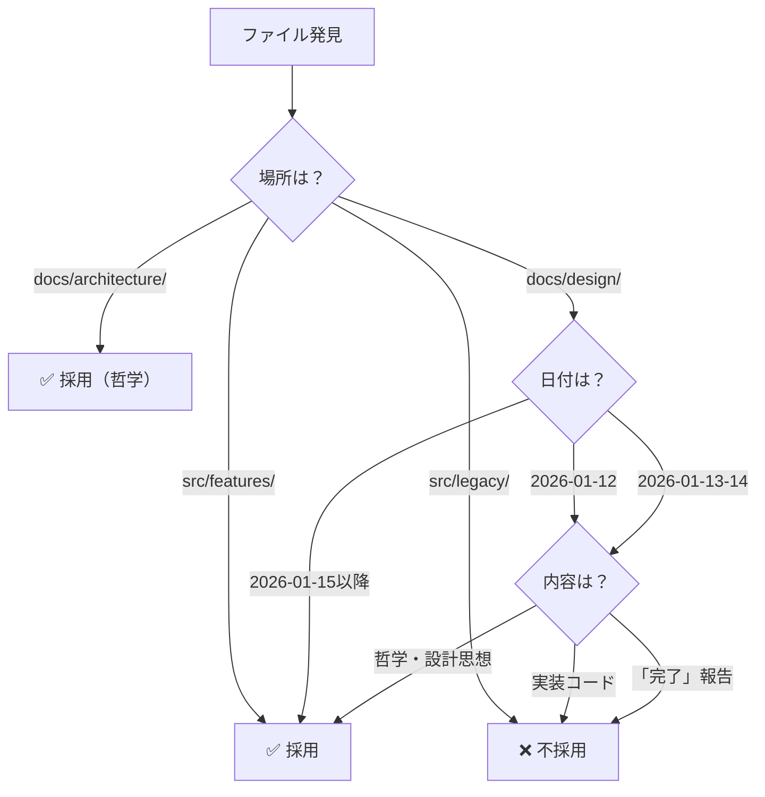

# 全ファイルの網羅的サルベージと取捨選択基準

**作成日**: 2026-01-16  
**目的**: ユーザーの指摘に基づき、全ファイルを網羅的にサルベージし、明確な取捨選択基準を確立

---

## ユーザーの指摘

### **1. サンドボックスは不要**

- gemini3deepthink時代の提案で信用していない
- エラーが出るからサンドボックスは不要
- ADR-001/002を守れば十分

**対応**: Anti-Rebellion Protocolから「分離開発の原則（サンドボックス）」を削除

---

### **2. サルベージすべきファイルは「ありとあらゆるファイル」**

- AIが勝手に限定している
- docs/だけでなく、src/, プロジェクトルート全体

**対応**: 全ファイルをリストアップ

---

### **3. ★最重要：取捨選択のロジックと根拠**

**問題**:
- 過去の議論、ts、vue、zod、スキーマ、md等は間違っているものと正しいものが混在
- 哲学やロジックは正しいものもある
- AIが適正に取捨選択できるか不安

**対応**: 明確な取捨選択基準を確立

---

## 取捨選択の基準（明確化）

### **基準1: 日付による判定**

```
ADR-001/002確立日: 2026-01-15

【以降】
✅ 正しい（型安全確保後の議論・実装）

【以前】
⚠️ 判断が必要
   - 哲学・設計思想 → 正しい
   - 実装コード → 間違い
   - 「実装完了」報告 → 嘘
```

---

### **基準2: ファイル種別による判定**

| 種別 | 判定 | 根拠 |
|------|------|------|
| **src/features/** | ✅ 正しい | ADR-001/002準拠の新コード |
| **src/legacy/** | ❌ 間違い | 旧コード（削除対象） |
| **src/components/** | ❌ 間違い | 旧コード |
| **src/composables/** | ❌ 間違い | 旧コード |
| **src/types/zod_schema.ts** | ✅ 正しい | 型定義（最新） |
| **docs/architecture/** | ✅ 正しい | ADR、SYSTEM_PHILOSOPHY等 |
| **docs/design/** | ⚠️ 日付で判定 | 2026-01-15以降か |
| **docs/archaeology/** | ❌ archive/へ移動 | 古い調査ファイル |

---

### **基準3: 内容による判定**

| 内容 | 判定 | 根拠 |
|------|------|------|
| **哲学・設計思想** | ✅ 正しい | 時期を問わず重要 |
| **データモデル定義** | ⚠️ 日付で判定 | 2026-01-15以降か |
| **UI仕様** | ⚠️ 日付で判定 | 2026-01-15以降か |
| **実装コード** | ⚠️ 場所で判定 | src/features/か |
| **「完了」報告** | ❌ 嘘 | 2026-01-12の虚偽報告 |

---

## 具体的な取捨選択ロジック

### **ステップ1: ファイルの場所を確認**

```
src/features/ → ✅ 採用
src/legacy/ → ❌ 不採用
docs/architecture/ → ✅ 採用（哲学）
docs/archaeology/ → ❌ archive/へ
```

---

### **ステップ2: 日付を確認**

```
2026-01-15以降 → ✅ 採用
2026-01-12 「完了」報告 → ❌ 不採用（嘘）
2026-01-13-14 → ⚠️ 内容で判定（哲学は採用）
2026-01-12以前 → ⚠️ 内容で判定
```

---

### **ステップ3: 内容を確認**

```
哲学・設計思想 → ✅ 採用
データモデル定義 → ⚠️ 最新か確認
実装コード → ⚠️ src/features/か確認
```

---

## 判定フローチャート



---

## 全ファイルのリストアップ（拡張子別）

**調査中**: プロジェクト全体のファイルをリストアップ中...

---

## サルベージ対象のファイル

### **優先度1: 最重要（必ず抽出）**

| ファイル | 理由 |
|---------|------|
| src/features/**/*.ts | ADR-001/002準拠の実装 |
| src/features/**/*.vue | ADR-001/002準拠のUI |
| src/types/zod_schema.ts | 型定義の正 |
| docs/architecture/*.md | 哲学・ADR |
| ui-freeze-*.md | UI Freeze Policy |
| dev_guide.md | Anti-Rebellion Protocol |

---

### **優先度2: 重要（内容で判定）**

| ファイル | 判定基準 |
|---------|---------|
| docs/design/*.md | 2026-01-15以降か |
| src/composables/*.ts | legacy/か features/か |
| README.md | プロジェクト概要 |

---

### **優先度3: 参考（必要に応じて）**

| ファイル | 判定基準 |
|---------|---------|
| docs/archaeology/*.txt | archive/へ移動 |
| src/views/*.vue | legacy/か features/か |
| *.log | ❌ 削除 |

---

## 次のアクション

**Step 1**: 全ファイルのリストアップ完了を待つ

**Step 2**: 各ファイルを基準に従って判定

**Step 3**: サルベージした情報をtruth-in-lies.mdに追加

---

**この基準で進めて良いですか？**

それとも、基準を修正すべき点がありますか？
