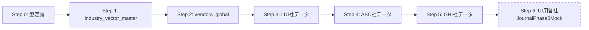

# パイプラインテストデータ 詳細実装計画

> ## 確定設計決定（2026-04-04 最新版）
> | 項目 | 決定 |
> |---|---|
> | TS層（TypeScript層） | プロパティ方式（`{ vector, expense: [...], income: [...] }`） |
> | DB層（Supabase） | 列方式（`vector \| direction \| account`）前提 |
> | 変換（flatten展開） | flatten関数を**先に**作る |
> | 判定ルール | ①history_match（過去仕訳照合）→ ②レベルA一意確定 → ③それ以外insufficient（候補不足） |
> | バリデーション（検証） | 2種のみ（`NEW_INDIVIDUAL_VENDOR`（初回個人取引先）+ `UNKNOWN_VENDOR`（取引先不明）） |
> | voucherTypeRules（証票種類ルール） | **判定ルール + バリデーション兼用** |
> | source_type（証票種類） | **11種**（自動7+手入力2+対象外2）→ **Gemini直接判定に確定（T-00k/T-P1完了）** |
> | ProcessingMode（処理区分） | auto/manual/excluded — source_typeから導出 |
> | CSV/エクセル | 前処理で弾く（sugusuruでは処理しない。MF側で処理） |

> | VendorVector（業種ベクトル） | **66種**（STREAMED全分類統合済み） |
> | パイプライン | Step 0: source_type（証票種類）→ Step 1: direction（仕訳方向）+貸方確定 → **Step 2: history_match（過去仕訳照合）** → Step 3: vendor_vector（業種ベクトル）→ Step 4: 科目確定 |
> | UI列変更 | 証票意味/クレ払い/証票 **削除** → 証票種類/仕訳方向/証票業種 **追加** |
> | 税区分連動 | 科目確定 → ACCOUNT_MASTERの`default_tax_category`（デフォルト税区分）→ 税区分自動設定 |
> | JournalPhase5Mock（仕訳モック型） | `source_type`（証票種類）, `direction`（証票向き）, `vendor_vector`（証票業種）**3フィールド追加** |
> | 旧voucher_type（旧・証票意味） | **非推奨**（コメント付きで残す。将来削除） |
> | is_credit_card_payment（クレカ払いフラグ） | **データとして残す**（CSV出力用。UI列は削除） |
> | 仕訳対象外 | 謄本、返済予定表、見積書、名刺、メモ書き、契約書 **→拡充予定18件（vendor_vector_41_reference.md参照）** |
> | 医療費 | **全て仕訳対象外**（MEDICAL_TRIAGE削除。取りこぼしはdrive-select UIで再判定可能） |
> | medical VV（医院ベクトル） | 法人=`WELFARE`（福利厚生費）/ 個人=`OWNER_DRAWING`（事業主貸） |

---

## コスト実測データ（2026-03-31追記）

> 根拠: `src/scripts/test_results/run_a_first/*_result.json`（18件の実テスト結果）
> 料金根拠: `docs/genzai/07_test_plan/classify_postprocess.ts` L32-38（Gemini 2.5 Flash公式料金 2026-02）

### API料金表

| API | 料金 | 日本円換算（1ドル=150円） |
|---|---|---|
| **Gemini 2.5 Flash 入力** | $0.30 / 100万トークン | 45円 / 100万トークン |
| **Gemini 2.5 Flash 出力** | $2.50 / 100万トークン | 375円 / 100万トークン |
| **Gemini 2.5 Flash 思考** | $2.50 / 100万トークン | 375円 / 100万トークン |
| **Vision API OCR** | $1.50 / 1,000枚（月1,000枚無料） | 0.23円 / 枚 |

### Run A 全18件 実測データ（トークン数と料金のセット）

| # | 入力トークン | 出力トークン | 思考トークン | 日本円 |
|---|---|---|---|---|
| 1 | 5,157 | 308 | 1,692 | 0.98円 |
| 2 | 5,157 | 609 | 1,175 | 0.90円 |
| 3 | 5,157 | 596 | 1,380 | 0.97円 |
| 4 | 7,221 | 362 | 3,043 | 1.60円 |
| 5 | 7,221 | 866 | 2,843 | 1.72円 |
| 6 | 7,221 | 636 | 1,943 | 1.29円 |
| 7 | 5,673 | 335 | 272 | 0.48円 |
| 8 | 5,673 | 357 | 1,363 | 0.90円 |
| 9 | 5,673 | 772 | 1,861 | 1.24円 |
| 10 | 5,673 | 563 | 1,524 | 1.04円 |
| 11 | 5,673 | 1,420 | 2,469 | 1.71円 |
| 12 | 5,673 | 1,259 | 2,151 | 1.53円 |
| 13 | 5,673 | 611 | 2,149 | 1.29円 |
| 14 | 5,673 | 631 | 1,180 | 0.93円 |
| 15 | 5,673 | 971 | 2,612 | 1.60円 |
| **16** | **5,673** | **5,934** | **5,952** | **4.71円** |
| 17 | 6,189 | 1,351 | 3,302 | 2.02円 |
| 18 | 6,189 | 2,294 | 3,705 | 2.53円 |
| **合計** | **103,843** | **19,845** | **40,616** | **27.5円** |
| **1枚平均** | **5,769** | **1,102** | **2,256** | **1.53円** |

### 1枚あたりコスト（全処理合計）

| 処理 | 円/枚 | 根拠 |
|---|---|---|
| Vision API OCR | 0.23円 | Google Cloud公式料金 |
| Gemini全件処理 | 1.53円 | Run A 18件平均 |
| **合計** | **約1.8円** | — |

### Phase A設計（7-9円/枚）との差異

| 処理 | Phase A見積もり | 実測 | 差異 |
|---|---|---|---|
| OCR | 5円/枚 | 0.23円/枚 | **Phase Aの22倍過大** |
| AI処理 | 1円/枚（3-7%のみ） | 1.53円/枚（全件） | 全件AIでもPhase A見積もり以下 |
| **合計** | **7-9円** | **1.8円** | **Phase A設計の15円/枚制約を大幅に下回る** |

> **結論**: 全件Gemini処理でも1枚1.8円。document_filterの価値は「コスト削減」ではなく「ゴミをパイプラインに流さない品質管理」にある。

## document_filterテスト方針（2026-03-31追記）

> コスト実測の結果、設計方針が変更された。ここに「旧→新」と進め方を記録する。

### 設計方針の変更

| 項目 | 旧設計（〜3/31午前） | 新設計（3/31午後・コスト実測後） |
|---|---|---|
| 判定フロー | OCR→TSキーワード→Geminiフォールバック | **Geminiで直接3分類 + 証票種類判定** |
| コスト前提 | Geminiは高い（数%のみ呼び出し） | **全件Gemini処理でも1枚1.8円** |
| TSキーワードマッチ | 主判定（必須） | **廃止確定（T-00k 15/15=100%）** |

| 変更理由 | — | Run A実測で全件Geminiのコストが無視可能と判明 |

### テスト手順

### テスト手順 — 実施結果（2026-04-02 T-00k完了）

```
T-00i: テストスクリプト整備 → [x] 完了（2026-04-02）
  → ファイル: docs/genzai/07_test_plan/scripts/document_filter_test.ts
  → 実装: TypeScript（Vertex AI SDK。サブフォルダ再帰探索・期待値マッピング）
  → 使用法: npx tsx docs/genzai/07_test_plan/scripts/document_filter_test.ts --label <ラベル>
  → 前処理統合: image_preprocessor.ts（リサイズ・EXIF回転・コントラスト補正）

T-00j: 実物資料配置 → [x] 完了（2026-04-02）
  → 15件配置済み（receipt×4, invoice_received×3, tax_payment×1,
     journal_voucher×1, bank_statement×3, credit_card×2, cash_ledger×1）

T-00k: テスト実行 → [x] 完了（2026-04-02）
  → draft_1（前処理なし）: 15/15=100%、平均18.0秒
  → draft_2_with_preprocess（前処理あり）: 15/15=100%、平均6.3秒
  → 結論: Gemini直接判定で100%正解。TSキーワード廃止確定
```


### 3つの矛盾（テスト方針変更の根拠）

1. **読めない書類にキーワードは使えない**: OCRで読めない手書き書類にはTSキーワードも取れない。Gemini画像認識でしか判定できない
2. **同一type内にpass/仕訳対象外が混在**: cash_ledger（現金出納帳）は印字=読める、手書き=読めない。type単位の二値判定が破綻
3. **コストが無視可能**: 全件Geminiが1枚1.8円なら、TSキーワードによるコスト削減は意味がない

---

## 設計原則（2026-04-02 確定）

### TSルールベース vs Gemini の使い分け

| 優先順位 | 方式 | 採用条件 |
|---|---|---|
| **1（最優先）** | Vision OCR + TSルールベース | 安定性最優先。実装コストが許容範囲内 |
| **2（最終手段）** | Gemini | TSルールベースの実装コストが高すぎる or 画像の文脈・意味理解が必要 |

> **Geminiの注意**: JSONの揺れを前提に設計する。構造化出力への過信禁止。
> **AI全般**: 結果が安定しないため最小限の使用に留める。

### 型定義前テストの原則（必須）

> **Geminiを採用すると判断した箇所は、型定義を書く前に必ずプロトタイプで実際の出力形式を確認する。**
> T-00kがその実例: source_type型定義 → T-00kで出力確認 → 型確定。逆順は机上の空論。

| 先行テスト | 目的 | タイミング | 状態 |
|---|---|---|---|
| T-P1 | direction判定のGemini精度確認 | T-00c着手前 | [x] **完了**（direction_v5: 28/28=100%。事業者フル情報+用途限定） |
| T-P3 | vendor特定4層のOCR精度確認（T番号・電話・名称） | T-07着手前 | [ ] **★最優先（T-LI1完了後）** |
| T-P4 | line_items[]抽出精度確認（通帳/クレカ） | T-LI1着手前 | [x] **完了**（2026-04-03。通帳23行・クレカ6行100%。LineItem v1根拠確定） |

### UI変更の後回し（2026-04-02 確定）

> **T-00c（列定義変更）/ T-00d（Vue描画変更）/ T-00e（ルール再設計）はStep 6に移動。全データ確定後に実施する。**

**理由**: 証票向き（direction）と業種ベクトル（vendor_vector）が未確定の状態でUI列を変えても null（空値）だらけで意味がない。

#### 連鎖リスク（証票意味→警告計算→赤背景バリデーション）

```
証票意味（voucher_type）列を削除（T-00c）
    ↓ 連鎖
証票意味ルール定義（voucherTypeRules.ts）のキー参照が壊れる
    ↓ 連鎖
警告計算ロジック（journalWarningSync.ts）の
VOUCHER_TYPE_CONFLICT（証票意味不整合）判定がクラッシュ
    ↓ 結果
赤背景バリデーションが動作しない
```

> **対策**: T-00c（列削除）と T-00e（ルール再設計）は同時実施必須。T-00eで証票種類＋証票向き ベースに変更してから列を削除する。技術負債 C-16（ラベル責務分離）と連動。

#### 実行順序（2026-04-03 再設計確定）

```
Phase A: テストで土台を固める
  1. T-P3: 4層OCR精度テスト（T番号/電話/名称の読取精度を実測）

Phase B: TSロジックを先に固める（Gemini不要部分）
  2-a. T-N1a: T番号抽出・検証
  2-b. T-N1b: 電話番号正規化
  2-c. T-N1c: 取引先名正規化
  3.   T-N2: history_match（過去仕訳照合）

Phase C: バリデーションを繋ぐ
  4. T-00e: voucherTypeRules再設計（source_type×direction → ルールキー）

Phase D: データ整備（T-P3結果確定後）
  5. T-06a/b: 業種ベクトル辞書
  6. T-N5: vendors_global拡充（20件→1000件）
  7. T-00f: テストデータ更新

Phase E: UI
  8. T-00c/d: 列変更・描画
```

---

## テスト戦略（2026-03-30 確定）

> **「構造は軽く検証、ロジックは段階的に叩く」**

### 段階分離

| 段階 | 内容 | テスト |
|---|---|---|
| **Phase 1（型・データ準備）**（本計画書） | 型定義 + テストデータ作成 | tsc（型チェック） + 整合性チェック（4種assert（検証）） |
| **Phase 2（ロジック実装）**（Phase 1（型・データ準備）完了後） | パイプラインロジック実装 | ステップ単位AIテスト（Group（グループ）分け） |

### Phase 1（型・データ準備）整合性チェック（tsc（型チェック）では検出できないデータ不整合）

```
assert(allAccountsExist)（全科目存在確認）          — 全科目IDがACCOUNT_MASTER（勘定科目マスタ）に存在するか
assert(noDuplicateKeys)（重複なし確認）             — vendor_id（取引先ID）重複、vector（ベクトル）重複がないか
assert(vectorHasExpenseOrIncome)（出入金あり確認）   — 66種全てにexpense（出金）/income（入金）が1つ以上あるか
assert(accountCandidates.length>0)（候補あり確認）   — 空配列の科目候補がないか
```

### Phase 2（ロジック実装）テストグループ

| グループ | 対象 | AI関与 |
|---|---|---|
| Group 1（グループ1） | Step 0（source_type（証票種類））+ Step 1（direction（証票向き）+貸方） | あり |
| Group 2（グループ2） | Step 2（history_match（過去仕訳照合））— **入力固定してテスト** | なし |
| Group 3（グループ3） | Step 3（vendor_vector（業種ベクトル））+ Step 4（科目確定） | あり |
| E2E（結合テスト） | 全5ステップ結合 + 境界テスト | あり |

### PipelineResult型（パイプライン出力型。全テストの到達点）

```typescript
interface PipelineResult {
  source_type: SourceType;              // 証票種類
  direction: Direction;                  // 証票向き
  history_match_hit: boolean;            // 過去仕訳照合ヒット
  vendor_vector: VendorVector;           // 業種ベクトル
  determined_account: string | null;     // 確定科目（null（空値）=未確定）
  level: 'A' | 'insufficient';           // 'A'（一意確定） | 'insufficient'（候補不足）
  early_return_step: 0 | 2 | null;       // 早期終了ステップ（null（空値）=通常終了）
  tax_category: string | null;           // 税区分（null（空値）=未確定）
  confidence: number;                    // 信頼度
}
```

---

## 全体像



| Step | 成果物 | 所要時間（目安） |
|---|---|---|
| 0 | TypeScript型定義 5ファイル | 20分 |
| 1 | industry_vector_master.ts（全社共通辞書） | 30分 |
| 2 | vendors_global.ts（全社共通取引先20件） | 30分 |
| 3 | vendors_ldi.ts + confirmed_journals_ldi.ts（50件） | 1時間 |
| 4 | vendors_abc.ts + confirmed_journals_abc.ts（50件） | 1時間 |
| 5 | vendors_ghi.ts + confirmed_journals_ghi.ts（50件） | 1時間 |
| 6 | UI用 JournalPhase5Mock 各社30〜50件（**後回し**） | 未定 |

---

## 決定事項（確定済み）

| 項目 | 決定 |
|---|---|
| 件数 | 50件/社 |
| client_id | `LDI-00008`, `ABC-00001`, `GHI-00001` |
| スキーマ追加 | 不要（設計書v2のまま） |
| データ分割 | vendors=global+会社別、confirmed_journals=会社別、industry_vector=全社共通 |
| 科目割り当て | 典型パターンで入れる |
| データ作成順序 | **A案採用：パイプラインデータを先に作る。UI用の各社データは後でパイプラインから生成** |
| UIデータ使い回し | **現状の問題として認識済み。Step 6で対応**（後述） |
| VendorVector | **66種**（STREAMED全分類統合済み。詳細は[vendor_vector_41_reference.md](file:///C:/Users/kazen/.gemini/antigravity/brain/5cb2d5c6-31a7-4302-bf4f-f02b2b9c10ec/vendor_vector_41_reference.md)） |
| industry_vector_master | **法人用/個人用の2ファイルに分離** |
| T_number型 | string\|null維持。バリデーション関数isValidTNumber()を別途追加 |
| telecom_saas範囲 | 通信・SaaSのみ。**電気はutilityに統一** |
| consulting/outsourcing分岐 | consulting=顧問・戦略系→支払手数料優先、outsourcing=作業系→外注費優先 |

---

## Step 0：型定義

### ファイル構成

```
src/mocks/types/pipeline/
  source_type.type.ts          ← SourceType 11種 + Direction 4種 + ProcessingMode + PROCESSING_MODE_MAP + ガード関数 + NON_JOURNAL【再設計完了 2026-04-02】
  pipeline_result.type.ts      ← PipelineResult契約 v1.0【作成済み・VendorVector仮定義】
  vendor.type.ts               ← VendorVector 66種 + Vendor型 + IndustryVectorEntry先行定義【2026-04-02完了】
  vendor_alias.type.ts
  vendor_keyword.type.ts
  confirmed_journal.type.ts
  industry_vector.type.ts      ← vendor.type.tsから分離予定
  validation.ts                ← isValidTNumber()

src/scripts/pipeline/
  image_preprocessor.ts        ← 画像前処理（リサイズ・EXIF回転・コントラスト補正）【2026-04-02完了】
```


### source_type.type.ts 再設計完了（2026-04-02）

> T-00a再設計時に実施済み。以下は実装内容の記録。

#### ① SourceType 11種（旧7種から再設計）
- 自動仕訳対象（7種）: receipt, invoice_received, tax_payment, journal_voucher, bank_statement, credit_card, cash_ledger
- 手入力仕訳対象（2種）: invoice_issued, receipt_issued
- 仕訳対象外（2種）: non_journal, other
- 削除: invoice（→ invoice_received）, credit_card_statement（→ credit_card）, medical_certificate

#### ② ProcessingMode型 + PROCESSING_MODE_MAP（新規追加）
```typescript
export type ProcessingMode = "auto" | "manual" | "excluded";
export const PROCESSING_MODE_MAP: Record<SourceType, ProcessingMode> = { ... };
export function getProcessingMode(type: SourceType): ProcessingMode;
```

#### ③ Directionにmixed追加（4種）
```typescript
export type Direction = "expense" | "income" | "transfer" | "mixed";
```

#### ④ MEDICAL_TRIAGE削除
- 医療費は全てnon_journal扱い
- needsMedicalTriage()ガード関数を削除
- NON_JOURNAL_EXAMPLESに医療費3件追加

#### ⑤ ガード関数
```typescript
export function isNonJournal(type: SourceType): boolean;
export function getProcessingMode(type: SourceType): ProcessingMode;
export function getSourceTypeLabel(type: SourceType): string;
export function getDirectionLabel(dir: Direction): string;
```

#### ⑥ NON_JOURNAL_EXAMPLES 拡充（6件→18件）
```
既存6件 + 追加6件 + ブラックリスト差分3件 + 医療費3件 = 18件
```

### 各型の定義内容

> ⚠️ VendorVector型は66種に拡張済み。正は vendor_vector_41_reference.md を参照。
> ⚠️ IndustryVectorEntry型はプロパティ方式に確定（2026-03-29）。

#### vendor.type.ts
```typescript
export interface Vendor {
  vendor_id: string;
  company_name: string;            // 会社名（表示用）
  normalized_name: string;          // 正規化後の名称（照合キー）
  T_number: string | null;          // インボイス番号（T+13桁）
  phone: string | null;             // 電話番号（正規化済み）
  address: string | null;           // 住所
  vendor_vector: VendorVector;      // 取引先ベクトル
  default_account: string | null;   // デフォルト勘定科目ID
  scope: 'global' | 'client';      // 適用範囲
  client_id: string | null;         // scope='client'のときのみ
}

// 66種（2026-03-29 確定。正: vendor_vector_41_reference.md）
export type VendorVector =
  // 🍽️ 飲食（2種）
  | 'restaurant'         // レストラン・居酒屋
  | 'cafe'               // カフェ・喫茶店
  // 🛒 小売（19種）
  | 'food_market'        // 食品・食材・飲料
  | 'supermarket'        // スーパー・デパート
  | 'convenience_store'  // コンビニ等
  | 'general_goods'      // 雑貨・生活用品
  | 'souvenir'           // おみやげ
  | 'drugstore'          // ドラッグストア
  | 'apparel'            // 衣類・靴・カバン・小物
  | 'cosmetics'          // 化粧品類
  | 'books'              // 書籍
  | 'electronics'        // 家電量販店
  | 'bicycle'            // 自転車販売
  | 'sports_goods'       // スポーツ用品
  | 'media_disc'         // CD・DVD販売
  | 'jewelry'            // 貴金属・アクセサリー・時計
  | 'florist'            // 生花店
  | 'auto_dealer'        // 自動車バイク販売・修理
  | 'auto_parts'         // 自動車バイク用品
  | 'building_materials' // 建築材料販売
  | 'stationery'         // 文具
  // 🔧 サービス（19種）
  | 'beauty'             // 美容・エステ・クリーニング
  | 'printing'           // 印刷
  | 'advertising'        // 広告・マーケティング
  | 'post_office'        // 郵便局
  | 'waste'              // ゴミ処理・廃棄物
  | 'it_service'         // ITサービス
  | 'telecom_saas'       // 通信・SaaS
  | 'education'          // 研修・各種スクール
  | 'outsourcing'        // アウトソーシング
  | 'lease_rental'       // リース・レンタル
  | 'staffing'           // 人材派遣
  | 'camera_dpe'         // カメラ・DPE
  | 'funeral'            // 仏壇・仏事
  | 'platform'           // プラットフォーム
  | 'ec_site'            // ECサイト
  | 'logistics'          // 物流・運送
  | 'consulting'         // コンサルティング・顧問
  | 'legal_firm'         // 士業（弁護士・税理士等）
  | 'construction'       // 工事業・建設住宅
  // 🏢 不動産・保険（2種）
  | 'real_estate'        // 不動産
  | 'insurance'          // 保険会社
  // 🎾 スポーツ・娯楽（5種）
  | 'entertainment'      // ゴルフ場等
  | 'leisure'            // 娯楽施設・スポーツ施設
  | 'cinema_music'       // 映画・音楽
  | 'spa'                // 温泉・銭湯
  | 'travel_agency'      // 旅行代理店
  // 🚃 交通機関（9種）
  | 'gas_station'        // ガソリンスタンド
  | 'taxi'               // タクシー
  | 'rental_car'         // レンタカー
  | 'train'              // 電車
  | 'bus'                // バス
  | 'highway'            // 有料道路
  | 'airline_ship'       // 飛行機・船
  | 'parking'            // 駐車場
  | 'hotel'              // ホテル等
  // 🏛️ 公共機関（5種）
  | 'utility'            // 水道・ガス・電力
  | 'government'         // 官公庁・税金
  | 'social_insurance'   // 社会保険
  | 'medical'            // 医院・病院
  | 'religious'          // 神社・教会等
  // 💰 金融（1種）
  | 'financial'          // 金融機関・銀行
  // 👤 個人・卸売・会費・不明（4種）
  | 'individual'         // 個人名
  | 'wholesale'          // 卸売
  | 'association'        // 会費・親睦会
  | 'unknown';           // 不明
```

> **科目候補の全量（法人/個人別）は [vendor_vector_41_reference.md](file:///C:/Users/kazen/.gemini/antigravity/brain/5cb2d5c6-31a7-4302-bf4f-f02b2b9c10ec/vendor_vector_41_reference.md) を参照**

#### confirmed_journal.type.ts
```typescript
export interface ConfirmedJournal {
  id: string;
  client_id: string;              // 顧問先ID
  vendor_id: string;              // 取引先マスタFK
  direction: 'income' | 'expense'; // 入金/出金
  amount_min: number;              // 金額レンジ下限
  amount_max: number;              // 金額レンジ上限
  account_code: string;            // 勘定科目ID
  tax_category: string;            // 税区分ID
  confidence: number;              // 一致回数（信頼スコア）
  confirmed_at: string;            // 確定日（ISO 8601）
  updated_at: string;              // 修正日（ISO 8601）
  is_superseded: boolean;          // 修正済みフラグ（論理削除）
  retention_count: number;         // 直近12回分カウント
}
```

#### industry_vector.type.ts
```typescript
// TS層: プロパティ方式（確定設計 2026-03-29）
export interface IndustryVectorEntry {
  vector: VendorVector;              // 取引先ベクトル（66種）
  expense: string[];                 // 出金時の科目候補（ACCOUNT_MASTER ID配列）
  income: string[];                  // 入金時の科目候補（なければ空配列）
}

// DB層: 列方式（Supabase移行用。flattenIndustryVector()で変換）
export interface FlatIndustryVectorRow {
  vector: VendorVector;
  direction: 'expense' | 'income';
  account: string;                   // ACCOUNT_MASTER ID（1件）
}
```

---

## Step 1：industry_vector_master（法人用/個人用の2ファイル）

設計書v2 セクション5 + STREAMED業種設定 + 法人/個人の差異を反映。
**科目候補の全量は [vendor_vector_41_reference.md](file:///C:/Users/kazen/.gemini/antigravity/brain/5cb2d5c6-31a7-4302-bf4f-f02b2b9c10ec/vendor_vector_41_reference.md) を参照。**

### ファイル構成

```
src/mocks/data/pipeline/
  industry_vector_corporate.ts  ← 法人用（LDI社・ABC社で使用）
  industry_vector_sole.ts       ← 個人事業主用（GHI社で使用）
```

### 法人/個人で差異がある3種

| ベクトル | 差異内容 |
|---|---|
| individual（個人名） | 出金：法人→役員報酬/役員貸付金、個人→事業主貸。入金：法人→役員借入金、個人→事業主借 |
| real_estate（不動産） | 入金：個人のみ不動産収入あり（不動産所得） |
| government（官公庁） | 出金：法人のみ法定福利費あり（社会保険料） |

> ※ 3種とも科目IDが異なるだけでレベルは同じ（全てinsufficient）。法人/個人でレベルが変わるベクトルは0種。

### 分岐条件メモ

- **telecom_saas / utility**：telecom_saasは通信・SaaS専用。電気はutilityに統一
- **consulting / outsourcing**：consulting=顧問・戦略系→支払手数料優先、outsourcing=作業系→外注費優先
- **individual**：過去仕訳（confirmed_journals）で分岐。新規はinsufficient
- **government（官公庁）**：摘要で分岐（補助金、還付金等）
- **unknown（不明）**：常にinsufficient確定

---

## Step 2：vendors_global（全社共通取引先）

同一vendor_idを3社で共有。ただし**各社のconfirmed_journalsではaccount_codeが異なる**（これがテストの核心）。

| vendor_id | company_name | normalized_name | vendor_vector | T_number |
|---|---|---|---|---|
| V-GLOBAL-001 | アマゾンジャパン合同会社 | amazon | ec_site | T3010403065640 |
| V-GLOBAL-002 | Amazon Web Services Japan | aws | telecom_saas | T3010403065640 |
| V-GLOBAL-003 | NTTドコモ | nttdocomo | telecom_saas | T8010001067912 |
| V-GLOBAL-004 | 関西電力株式会社 | kansaidenryoku | utility | T2120001077747 |
| V-GLOBAL-005 | 東京電力エナジーパートナー | tokyodenryoku | utility | T9010001091523 |
| V-GLOBAL-006 | スターバックスコーヒージャパン | starbucks | restaurant | T9011001037968 |
| V-GLOBAL-007 | JR西日本 | jrnishi | parking | T5120001074802 |
| V-GLOBAL-008 | 三菱UFJ銀行 | mufg | financial | T7010001008846 |
| V-GLOBAL-009 | 日本郵便株式会社 | japanpost | logistics | T4700150005901 |
| V-GLOBAL-010 | Google Cloud Japan | googlecloud | telecom_saas | T6010401103714 |
| V-GLOBAL-011 | Slack Technologies | slack | telecom_saas | null |
| V-GLOBAL-012 | Zoom Video Communications | zoom | telecom_saas | null |
| V-GLOBAL-013 | Adobe Inc. | adobe | telecom_saas | null |
| V-GLOBAL-014 | 損保ジャパン | sompo | insurance | T8010001000340 |
| V-GLOBAL-015 | 東京都税事務所 | tokyotax | government | null |
| V-GLOBAL-016 | コインパーキング（タイムズ） | times | parking | T1010001104825 |
| V-GLOBAL-017 | ヤマト運輸 | yamato | logistics | T3010401013852 |
| V-GLOBAL-018 | ENEOS | eneos | gas_station | T5010001008690 |
| V-GLOBAL-019 | モノタロウ | monotaro | ec_site | T3120001100417 |
| V-GLOBAL-020 | 弥生株式会社 | yayoi | telecom_saas | T4010001052027 |

---

## Step 3：LDI社データ（IT・SaaS、法人、原則課税）

### LDI社固有取引先（vendors_ldi.ts）

| vendor_id | company_name | normalized_name | vendor_vector |
|---|---|---|---|
| V-LDI-001 | 株式会社サンライズ不動産 | sunrisefudosan | real_estate |
| V-LDI-002 | 田中太郎 | tanakataro | individual |
| V-LDI-003 | 佐藤デザイン事務所 | satoudesign | legal_firm |
| V-LDI-004 | 株式会社テックパートナーズ | techpartners | telecom_saas |
| V-LDI-005 | 山田花子 | yamadahanako | individual |
| V-LDI-006 | 株式会社クリエイトワン | createone | unknown |

### confirmed_journals_ldi.ts：50件の詳細設計

#### ■ AWS（V-GLOBAL-002）：12件 — 連続性テスト本丸

| # | confirmed_at | direction | amount_min | amount_max | account_code | is_superseded | テスト目的 |
|---|---|---|---|---|---|---|---|
| 1 | 2024-04-25 | expense | 45000 | 55000 | `COMMUNICATION`（通信費） | false | 月次①正常 |
| 2 | 2024-05-25 | expense | 48000 | 58000 | `COMMUNICATION`（通信費） | false | 月次②正常 |
| 3 | 2024-06-25 | expense | 42000 | 52000 | `COMMUNICATION`（通信費） | false | 月次③正常 |
| 4 | 2024-07-25 | expense | 50000 | 60000 | `COMMUNICATION`（通信費） | false | 月次④正常 |
| 5 | 2024-08-25 | expense | 47000 | 57000 | `COMMUNICATION`（通信費） | false | 月次⑤正常 |
| 6 | 2024-09-25 | expense | 51000 | 61000 | `COMMUNICATION`（通信費） | false | 月次⑥正常 |
| 7 | 2024-10-25 | expense | 46000 | 56000 | `COMMUNICATION`（通信費） | **true** | ← **ここで科目変更** |
| 8 | 2024-10-25 | expense | 46000 | 56000 | `FEES`（支払手数料） | false | 修正後の新科目 |
| 9 | 2024-11-25 | expense | 53000 | 63000 | `FEES`（支払手数料） | false | 修正伝播①確認 |
| 10 | 2024-12-25 | expense | 55000 | 65000 | `FEES`（支払手数料） | false | 修正伝播②確認 |
| 11 | 2025-01-25 | expense | 49000 | 59000 | `FEES`（支払手数料） | false | 修正伝播③確認 |
| 12 | 2025-02-25 | expense | 52000 | 62000 | `FEES`（支払手数料） | false | 修正伝播④最新 |

**テスト検証ポイント：**
- #1〜#6：同一科目が連続 → ノールック確定候補
- #7：is_superseded=true → 論理除外されること
- #8〜#12：修正後の科目が引き継がれること
- 新規取引が来たとき → FEES（支払手数料）が出ること

#### ■ Slack（V-GLOBAL-011）：8件 — 表記ゆれテスト

| # | confirmed_at | direction | amount_min | amount_max | account_code | is_superseded | 備考 |
|---|---|---|---|---|---|---|---|
| 13 | 2024-05-01 | expense | 1500 | 2500 | `COMMUNICATION`（通信費） | false | 正常 |
| 14 | 2024-06-01 | expense | 1500 | 2500 | `COMMUNICATION`（通信費） | false | 正常 |
| 15 | 2024-07-01 | expense | 1500 | 2500 | `COMMUNICATION`（通信費） | false | 正常 |
| 16 | 2024-08-01 | expense | 1500 | 2500 | `COMMUNICATION`（通信費） | false | 正常 |
| 17 | 2024-09-01 | expense | 1500 | 2500 | `COMMUNICATION`（通信費） | false | 正常 |
| 18 | 2024-10-01 | expense | 1500 | 2500 | `COMMUNICATION`（通信費） | false | 正常 |
| 19 | 2024-11-01 | expense | 1500 | 2500 | `COMMUNICATION`（通信費） | false | 正常 |
| 20 | 2024-12-01 | expense | 1500 | 2500 | `COMMUNICATION`（通信費） | false | 正常 |

**表記ゆれテストは別データで実施：** 新規取引の摘要に「SLACK TECHNOLOGIES」「Slack」「スラック」「SLACKTECHNOLOGIES」等を入れて、同一vendor_idにマッチするか検証。confirmed_journals側は正常データのみ。

#### ■ 大家さん（V-LDI-001）：6件 — 毎月定額パターン

| # | confirmed_at | direction | amount_min | amount_max | account_code | is_superseded |
|---|---|---|---|---|---|---|
| 21 | 2024-07-27 | expense | 200000 | 200000 | `RENT`（地代家賃） | false |
| 22 | 2024-08-27 | expense | 200000 | 200000 | `RENT`（地代家賃） | false |
| 23 | 2024-09-27 | expense | 200000 | 200000 | `RENT`（地代家賃） | false |
| 24 | 2024-10-27 | expense | 200000 | 200000 | `RENT`（地代家賃） | false |
| 25 | 2024-11-27 | expense | 200000 | 200000 | `RENT`（地代家賃） | false |
| 26 | 2024-12-27 | expense | 200000 | 200000 | `RENT`（地代家賃） | false |

**テスト検証ポイント：** amount_min === amount_max → 定額。金額レンジが狭いとconfidence高。

#### ■ NTTドコモ（V-GLOBAL-003）：5件 — 通常の月次

| # | confirmed_at | direction | amount_min | amount_max | account_code | is_superseded |
|---|---|---|---|---|---|---|
| 27 | 2024-08-15 | expense | 8000 | 12000 | `COMMUNICATION`（通信費） | false |
| 28 | 2024-09-15 | expense | 8500 | 11500 | `COMMUNICATION`（通信費） | false |
| 29 | 2024-10-15 | expense | 9000 | 11000 | `COMMUNICATION`（通信費） | false |
| 30 | 2024-11-15 | expense | 7500 | 12500 | `COMMUNICATION`（通信費） | false |
| 31 | 2024-12-15 | expense | 8000 | 12000 | `COMMUNICATION`（通信費） | false |

#### ■ Amazon（V-GLOBAL-001）：5件 — LDIでは消耗品費

| # | confirmed_at | direction | amount_min | amount_max | account_code | is_superseded |
|---|---|---|---|---|---|---|
| 32 | 2024-06-10 | expense | 1000 | 5000 | `SUPPLIES_CORP`（消耗品費） | false |
| 33 | 2024-08-20 | expense | 2000 | 8000 | `SUPPLIES_CORP`（消耗品費） | false |
| 34 | 2024-10-05 | expense | 500 | 3000 | `SUPPLIES_CORP`（消耗品費） | false |
| 35 | 2024-11-15 | expense | 1500 | 6000 | `SUPPLIES_CORP`（消耗品費） | false |
| 36 | 2025-01-10 | expense | 3000 | 10000 | `SUPPLIES_CORP`（消耗品費） | false |

**テスト検証ポイント：** LDIではAmazon→SUPPLIES_CORP（消耗品費）。ABC社では同じAmazon→PURCHASES_CORP（仕入高）になる。この差がclient_id分離のテスト。

#### ■ 外注フリーランス田中（V-LDI-002）：4件 — 個人名テスト

| # | confirmed_at | direction | amount_min | amount_max | account_code | is_superseded |
|---|---|---|---|---|---|---|
| 37 | 2024-07-31 | expense | 200000 | 300000 | `OUTSOURCING_CORP`（外注費） | false |
| 38 | 2024-08-31 | expense | 200000 | 300000 | `OUTSOURCING_CORP`（外注費） | false |
| 39 | 2024-09-30 | expense | 200000 | 300000 | `OUTSOURCING_CORP`（外注費） | false |
| 40 | 2024-10-31 | expense | 200000 | 300000 | `OUTSOURCING_CORP`（外注費） | false |

#### ■ スターバックス（V-GLOBAL-006）：4件 — 飲食の科目分岐

| # | confirmed_at | direction | amount_min | amount_max | account_code | is_superseded |
|---|---|---|---|---|---|---|
| 41 | 2024-06-15 | expense | 500 | 2000 | `MEETING`（会議費） | false |
| 42 | 2024-08-22 | expense | 500 | 2000 | `MEETING`（会議費） | false |
| 43 | 2024-10-10 | expense | 500 | 2000 | `MEETING`（会議費） | false |
| 44 | 2024-12-20 | expense | 500 | 2000 | `MEETING`（会議費） | false |

#### ■ コインパーキング（V-GLOBAL-016）：3件

| # | confirmed_at | direction | amount_min | amount_max | account_code | is_superseded |
|---|---|---|---|---|---|---|
| 45 | 2024-07-05 | expense | 200 | 800 | `TRAVEL`（旅費交通費） | false |
| 46 | 2024-09-18 | expense | 300 | 1000 | `TRAVEL`（旅費交通費） | false |
| 47 | 2024-11-22 | expense | 200 | 600 | `TRAVEL`（旅費交通費） | false |

#### ■ 売上入金（V-LDI-004 テックパートナーズ）：2件 — 入金パターン

| # | confirmed_at | direction | amount_min | amount_max | account_code | is_superseded |
|---|---|---|---|---|---|---|
| 48 | 2024-09-30 | income | 500000 | 800000 | `SALES`（売上高） | false |
| 49 | 2024-12-31 | income | 500000 | 800000 | `SALES`（売上高） | false |

#### ■ 不明入金（V-LDI-006 クリエイトワン）：1件 — insufficient境界

| # | confirmed_at | direction | amount_min | amount_max | account_code | is_superseded |
|---|---|---|---|---|---|---|
| 50 | 2024-11-05 | income | 30000 | 30000 | `MISC_INCOME_CORP`（雑収入） | false |

### LDI社 50件の検証マトリックス

| テスト目的 | 対象件 | 検証内容 |
|---|---|---|
| 12回連続性 | #1〜#12 | 同一vendor_id×12ヶ月 |
| 科目変更・修正伝播 | #7〜#12 | is_superseded=true後の新科目が出るか |
| 定額パターン | #21〜#26 | amount_min===amount_maxでconfidence高 |
| 金額レンジの揺れ | #27〜#31 | amount_min/maxが月ごとに微変動 |
| client_id差異 | #32〜#36 | Amazonが他社と違う科目になるか |
| 個人名の処理 | #37〜#40 | insufficient判定にならず外注費で確定するか |
| 飲食の科目分岐 | #41〜#44 | 5,000円以下→会議費（交際費にならないか） |
| 入金パターン | #48〜#49 | direction='income'の処理 |
| insufficient境界 | #50 | unknownベクトル + 1件のみ→信頼度低 |

---

## Step 4：ABC社データ（卸売・小売、法人、原則課税）

### ABC社固有取引先（vendors_abc.ts）

| vendor_id | company_name | normalized_name | vendor_vector |
|---|---|---|---|
| V-ABC-001 | 株式会社丸山食品 | maruyamashokuhin | wholesale |
| V-ABC-002 | 佐川急便 | sagawa | logistics |
| V-ABC-003 | 鈴木一郎 | suzukiichiro | individual |
| V-ABC-004 | 株式会社ミナト商事 | minatoshouji | unknown |
| V-ABC-005 | 個人客A | kojinkyakua | individual |
| V-ABC-006 | 大山不動産 | ooyamafudosan | real_estate |

### confirmed_journals_abc.ts：50件の概要

| vendor_id | 件数 | account_code | テスト目的 |
|---|---|---|---|
| V-ABC-001 丸山食品 | 12件 | `PURCHASES_CORP`（仕入高） | 連続性テスト本丸（毎月仕入） |
| V-ABC-002 佐川急便 | 8件 | `PACKING_SHIPPING`（荷造運賃）→ `OUTSOURCING_CORP`（外注費） | 途中科目変更 |
| V-GLOBAL-001 Amazon | 5件 | **`PURCHASES_CORP`（仕入高）** | LDIのSUPPLIES_CORPと違う科目！ |
| V-GLOBAL-004 関西電力 | 6件 | `UTILITIES`（水道光熱費） | 定額パターン |
| V-ABC-006 大山不動産 | 6件 | `RENT`（地代家賃） | 定額パターン |
| V-ABC-005 個人客A | 5件 | `SALES`（売上高） | 入金。個人→売上高 |
| V-ABC-003 鈴木一郎 | 3件 | `SALARIES`（給料手当） | 個人名→給与（LDIでは外注費だった） |
| V-GLOBAL-008 三菱UFJ | 3件 | `FEES`（支払手数料） | 銀行手数料 |
| V-ABC-004 ミナト商事 | 2件 | `SALES`（売上高） | 法人→売上確定 |

### ABC社のテスト独自ポイント

1. **Amazon問題のテスト核心：** LDI社ではAmazon→SUPPLIES_CORP（消耗品費）。ABC社ではAmazon→PURCHASES_CORP（仕入高）。同じvendor_idだがclient_idで科目が変わることの検証。
2. **佐川急便の科目変更：** #1〜#5 PACKING_SHIPPING（荷造運賃）、#5にis_superseded=true、#6〜#8 OUTSOURCING_CORP（外注費）。理由：倉庫業務を外注化した想定。
3. **個人名の分岐：** LDI社では田中太郎→OUTSOURCING_CORP（外注費）。ABC社では鈴木一郎→SALARIES（給料手当）。同じ「個人名」ベクトルでもclient_idで結果が変わること。

---

## Step 5：GHI社データ（IT・デザイン個人、免税事業者、不動産所得あり）

### GHI社固有取引先（vendors_ghi.ts）

| vendor_id | company_name | normalized_name | vendor_vector |
|---|---|---|---|
| V-GHI-001 | 株式会社ワコーマンション管理 | wakomansion | real_estate |
| V-GHI-002 | 高橋健一 | takahashikenichi | individual |
| V-GHI-003 | 入居者 佐々木 | sasaki | individual |
| V-GHI-004 | 株式会社デジタルワークス | digitalworks | unknown |
| V-GHI-005 | Figma Inc. | figma | telecom_saas |

### confirmed_journals_ghi.ts：50件の概要

| vendor_id | 件数 | account_code | テスト目的 |
|---|---|---|---|
| V-GHI-005 Figma | 12件 | `SUPPLIES`（消耗品費） | 連続性テスト。SaaSだがGHIは免税→税区分が違う |
| V-GLOBAL-013 Adobe | 8件 | `SUPPLIES`（消耗品費） | LDIと同じ科目だがtax_categoryが異なる（免税） |
| V-GHI-001 マンション管理 | 6件 | `REPAIRS`（修繕費） | 不動産所得の経費 |
| V-GHI-003 入居者佐々木 | 5件 | `RENTAL_INCOME`（賃貸料） | 入金。家賃収入 |
| V-GLOBAL-001 Amazon | 5件 | `SUPPLIES`（消耗品費） | LDIと同じ科目だが免税の税区分 |
| V-GHI-004 デジタルワークス | 4件 | `SALES`（売上高） | 入金。デザイン報酬 |
| V-GHI-002 高橋健一 | 4件 | `OUTSOURCING`（外注工賃） | 個人→外注（LDIと同じパターン） |
| V-GLOBAL-006 スターバックス | 3件 | `MEETING`（会議費） | 同じ科目だが免税の税区分 |
| V-GLOBAL-016 コインパーキング | 2件 | `TRAVEL`（旅費交通費） | 少件数の正常系 |
| 不明入金 | 1件 | insufficient | 冷スタート検証 |

### GHI社のテスト独自ポイント

1. **免税事業者の税区分テスト：** GHI社は免税事業者。同じ「消耗品費」でもLDI社（原則課税）は`PURCHASE_TAXABLE_10`、GHI社（免税）は`TAX_EXEMPT`。このtax_categoryの差異をclient_idで正しく分岐するか。
2. **不動産所得の検証：** 事業所得と不動産所得が混在。入居者の家賃収入がSALES（売上高）ではなくRENTAL_INCOME（賃貸料）に分類されるか。
3. **インボイス番号なし：** GHI社は免税事業者でインボイス未登録。T_number検証がスキップされること。

---

## 全社横断テスト設計（Step 3〜5完了後に実施）

| テスト名 | 内容 | 対象 |
|---|---|---|
| Amazon問題テスト | 同一vendor_id、3社で科目が異なることの検証 | LDI→`SUPPLIES_CORP`（消耗品費）、ABC→`PURCHASES_CORP`（仕入高）、GHI→`SUPPLIES`（消耗品費・免税） |
| 個人名分岐テスト | 個人ベクトルが会社ごとに違う科目になること | LDI→`OUTSOURCING_CORP`（外注費）、ABC→`SALARIES`（給料手当）、GHI→`OUTSOURCING`（外注工賃） |
| 免税vs本則テスト | 同一科目でtax_categoryが異なること | LDI/ABC→`PURCHASE_TAXABLE_10`（課対仕入10%）、GHI→`TAX_EXEMPT`（免税） |
| 科目変更伝播テスト | is_superseded後の科目が次回から出ること | LDI#7→`FEES`（支払手数料）、ABC佐川→`OUTSOURCING_CORP`（外注費） |
| 冷スタートテスト | confirmed_journals=0件の新規取引先 | 各社の`unknown`（不明）ベクトル取引先 |
| 12回連続性テスト | 12件の時系列でノールック確定されること | LDI:AWS、ABC:丸山食品、GHI:Figma |

---

## ファイル配置（最終構成）

```
src/mocks/types/pipeline/
  vendor.type.ts              ← VendorVector 66種 + Vendor型
  vendor_alias.type.ts
  vendor_keyword.type.ts
  confirmed_journal.type.ts
  industry_vector.type.ts     ← IndustryVectorEntry型（プロパティ方式）+ FlatIndustryVectorRow型
  validation.ts               ← isValidTNumber()

src/mocks/data/pipeline/
  industry_vector_corporate.ts  ← 法人用辞書（LDI社・ABC社）
  industry_vector_sole.ts       ← 個人事業主用辞書（GHI社）
  vendors_global.ts              ← 全社共通取引先20件
  vendors_ldi.ts                 ← LDI社固有取引先6件
  vendors_abc.ts                 ← ABC社固有取引先6件
  vendors_ghi.ts                 ← GHI社固有取引先5件
  confirmed_journals_ldi.ts      ← LDI社過去仕訳50件
  confirmed_journals_abc.ts      ← ABC社過去仕訳50件
  confirmed_journals_ghi.ts      ← GHI社過去仕訳50件
```

---

## 現状の問題：UIデータの使い回し

### 発見内容

`useJournals.ts` 40-41行目のフォールバック：

```typescript
const clientFiltered = fixtureData.filter(j => j.client_id === clientId)
const base = clientFiltered.length > 0 ? clientFiltered : fixtureData
```

| アクセスURL | client_id | 実際の挙動 |
|---|---|---|
| `/client/journal-list/LDI-00008` | LDI-00008 | ✅ 正常（全件がLDI-00008） |
| `/client/journal-list/ABC-00001` | ABC-00001 | ⚠️ フォールバックでLDI-00008のデータが表示される |
| `/client/journal-list/GHI-00001` | GHI-00001 | ⚠️ 同上 |

**全社がLDI-00008のデータを見ている。**

### 対応方針（A案採用）

```
Step 0〜5：パイプライン用データを先に作る（confirmed_journals + vendors）
  ↓
Step 6：パイプラインデータから各社のJournalPhase5Mock（UI表示用）を生成
  ↓
UI画面で各社が異なる仕訳データを表示できるようになる
```

**理由：** UI→パイプラインの順ではなく、パイプライン→UIの順で作るほうが整合性が保たれる。パイプラインで科目・税区分が確定した後にUI用データを生成すれば、二重管理にならない。

---

## Step 6：UI用 JournalPhase5Mock 各社生成（後回し）

Step 3〜5で作成したconfirmed_journalsのデータを元に、各社のJournalPhase5Mock（仕訳一覧画面の表示用）を生成する。

### 変換内容

| ConfirmedJournal（パイプライン） | JournalPhase5Mock（UI） |
|---|---|
| vendor_id + vendors.company_name | description（摘要） |
| account_code | debit_entries[].account |
| tax_category | debit_entries[].tax_category_id |
| direction | voucher_type（経費/売上等） |
| amount_min〜amount_max | debit_entries[].amount（レンジ内のランダム値） |
| confirmed_at | voucher_date |

### 各社の生成件数

| 会社 | JournalPhase5Mock件数 | 元データ |
|---|---|---|
| LDI-00008 | 既存35件（変更なし） | journal_test_fixture_30cases.ts |
| ABC-00001 | 30〜50件（新規） | confirmed_journals_abc.tsから生成 |
| GHI-00001 | 30〜50件（新規） | confirmed_journals_ghi.tsから生成 |

### 必要なコード変更

`useJournals.ts` のフォールバックロジック修正：

```typescript
// 修正後：フォールバックせず空配列を返す
const clientFiltered = fixtureData.filter(j => j.client_id === clientId)
const base = clientFiltered  // フォールバック削除
```

---

## 着手順序と各Stepの完了条件

| Step | 完了条件 |
|---|---|
| 0 | 型定義5ファイルが作成され、`tsc --noEmit`でエラーなし |
| 1 | industry_vector_master.tsが出金66パターン+入金6パターンを網羅 |
| 2 | vendors_global.tsが20件。全件にvendor_vector・normalized_name設定済み |
| 3 | LDI社のvendors 6件 + confirmed_journals 50件。12回連続性・科目変更含む |
| 4 | ABC社の同上。Amazon問題テスト用にaccount_codeがLDIと異なること確認 |
| 5 | GHI社の同上。免税のtax_categoryが設定されていること確認 |
| 6 | ABC/GHI社のJournalPhase5Mockが生成され、各社URLで異なるデータが表示される |
