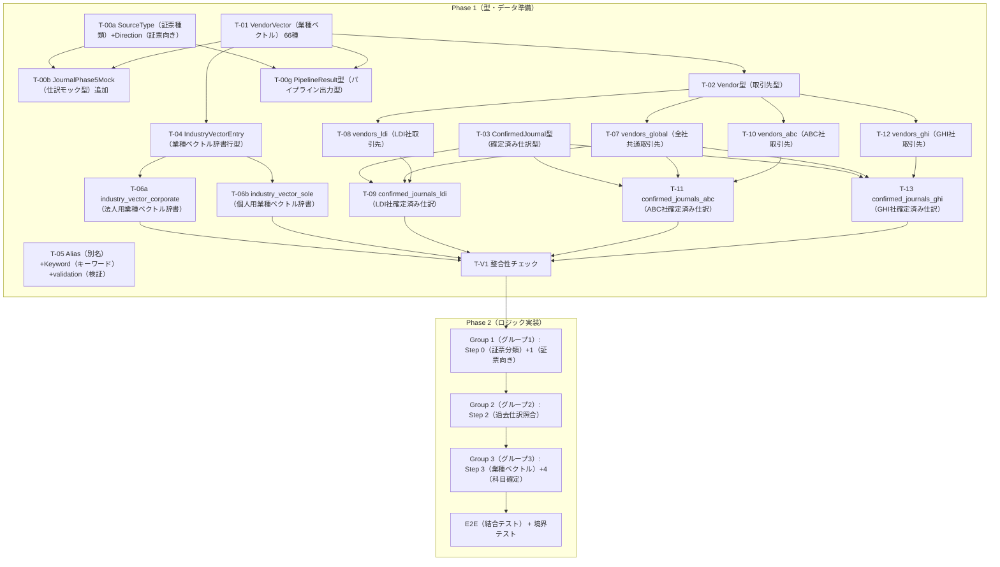

# パイプライン構築 タスクリスト（テスト戦略統合版）

> 計画書: [detailed_implementation_plan.md](file:///C:/Users/kazen/.gemini/antigravity/brain/05f3a9ba-5742-415e-844c-d1987fc3eb92/detailed_implementation_plan.md)
> 科目候補一覧: [vendor_vector_41_reference.md](file:///C:/Users/kazen/.gemini/antigravity/brain/5cb2d5c6-31a7-4302-bf4f-f02b2b9c10ec/vendor_vector_41_reference.md)（66種拡張済み）
> 監査結果: [pipeline_audit_and_id_correction.md](file:///C:/Users/kazen/.gemini/antigravity/brain/5cb2d5c6-31a7-4302-bf4f-f02b2b9c10ec/pipeline_audit_and_id_correction.md)
> **全科目IDはACCOUNT_MASTER（src/shared/data/account-master.ts）の正式IDに準拠**

---

## 設計原則（2026-04-04 更新）

### TSルールベース vs Gemini の使い分け

| 優先順位 | 方式 | 採用条件 |
|---|---|---|
| **1（最優先）** | Vision OCR + TSルールベース | 安定性最優先。実装コストが許容範囲内 |
| **2（最終手段）** | Gemini | TSルールベースの実装コストが高すぎる or 画像の文脈・意味理解が必要 |

> **Geminiの注意**: JSONの揺れを前提に設計する。構造化出力への過信禁止。
> **AI全般**: 結果が安定しないため最小限の使用に留める。

### 型定義前テストの原則（必須）

> **Geminiを採用すると判断した箇所は、型定義を書く前に必ずプロトタイプで実際の出力形式を確認する。**
> T-00kがその実例: source_type型定義 → T-00kで出力確認 → 型確定。逆順は机上の空論。

| 確認内容 | タイミング | 意図 |
|---|---|---|
| Geminiが実際に何を返すか（形式・揺れ幅） | 型定義の着手前 | 型が実態と乖離しないようにする |
| TSルールでどこまでカバーできるか | 型定義の着手前 | Gemini使用箇所を最小化する |
| TSが限界になる境界がどこか | 型定義の着手前 | 不要なGemini実装を排除する |

### N:N統一設計（2026-04-04 確定）

> **全source_typeで `line_items[]` を使用する。1:N / N:N の分岐は設けない。**
> レシート = `line_items.length === 1`（通常）。通帳 = `line_items.length === N`。同一構造で統一。

| 決定事項 | 内容 | 根拠 |
|---|---|---|
| **N:N統一** | 全source_typeで `line_items[]` 配列を使用 | プロンプト分岐を排除。構造の単純化 |
| **ReceiptItem / LineItem 分離維持** | レシート商品明細（ReceiptItem）と取引行（LineItem）は別型 | ReceiptItemはquantity/unit_price/tax_rateを持つ。通帳行にはない |
| **2段階型確定** | v1（T-P4実測済み5+1フィールド）→ v2（T-P3後にvendor_name追加） | 型定義前テスト原則に準拠 |
| **日付フォーマット** | YYYY-MM-DD維持（toMfCsvDateで変換済み） | Gemini内部でISO 8601が最安定 |
| **旧LineItem** | classify_schema.ts のLineItemは `@deprecated` | 旧世代コード（Phase A-2）。新設計はline_item.type.ts |
| **debit_account/credit_account** | 削除→directionに置換 | T-P4実測でGeminiはdebit_account/credit_accountを返さない |
| **date_on_document / amount_on_document** | LineItemには含めない | `date === null` でコード側導出可能 |
| **tax_rate** | LineItemには含めない | ReceiptItem側の責務。通帳/クレカ行には税率情報がない |

---

## テスト戦略（2026-03-30 確定）

> **「構造は軽く検証、ロジックは段階的に叩く」**

| 段階 | 内容 | テスト方法 |
|---|---|---|
| **Phase 1（型・データ準備）** | 型定義 + テストデータ作成 | tsc（型チェック） + 整合性チェック（4種assert（検証）） |
| **Phase 2（ロジック実装）** | パイプラインロジック実装 | ステップ単位AIテスト（Group（グループ）分け） |

### Phase 2（ロジック実装）テストグループ

| グループ | 対象 | テスト内容 | AI関与 |
|---|---|---|---|
| **Group 1（グループ1）** | Step 0（証票分類） + Step 1（証票向き判定） | source_type（証票種類）判定、direction（証票向き）判定、貸方確定、non_journal（仕訳対象外）除外、医療系分岐 | あり |
| **Group 2（グループ2）** | Step 2（history_match（過去仕訳照合）） | 完全一致、類似一致、不一致。**入力固定してテスト**（前段に依存しない） | なし |
| **Group 3（グループ3）** | Step 3（業種ベクトル判定） + Step 4（科目確定） | vendor_vector（業種ベクトル）分類、account_candidates（科目候補）取得、insufficient（候補不足）判定 | あり |
| **E2E（結合テスト）** | 全5ステップ | early return（早期終了）確認、vector_conflict（ベクトル競合）確認、境界テスト | あり |

### Step 2（過去仕訳照合）テスト時の注意

Step 2（history_match（過去仕訳照合））は正規化（Step 0前段）とvendor（取引先）特定（Step 3の一部）に依存する。
テスト時は入力を固定して分離する：

```typescript
input = {
  normalized_vendor_name: "amazon",  // 正規化済み取引先名
  direction: "expense",              // 証票向き（出金）
  amount: 3000                       // 金額
}
```

---

# Phase 1（型・データ準備）：型定義 + データ作成

## Step 0（証票分類・型定義）：型定義 + データ基盤（12タスク）

### ── UI基盤（最初にやる） ──

### T-00a：SourceType型 + Direction型 + ProcessingMode型の作成
- **ファイル**: `src/mocks/types/pipeline/source_type.type.ts`
- **目的**: 証票種類（11種）と仕訳方向（4種）と処理区分（3種）のunion型を定義。**AIが最初に判定する型**
- **完了条件（2026-04-02 再設計確定）**:
  - `SourceType`（11種）: 自動仕訳7種（receipt/invoice_received/tax_payment/journal_voucher/bank_statement/credit_card/cash_ledger）+ 手入力2種（invoice_issued/receipt_issued）+ 対象外2種（non_journal/other）
  - `Direction`（4種）: `'expense' | 'income' | 'transfer' | 'mixed'`
  - `ProcessingMode`（3種）: `'auto' | 'manual' | 'excluded'`
  - `PROCESSING_MODE_MAP`: source_type→処理区分の導出テーブル（Record<SourceType, ProcessingMode>）
  - 仕訳対象外定義（`NON_JOURNAL_EXAMPLES`）: 18件（医療費3件含む）
  - ガード関数: `isNonJournal()`, `getProcessingMode()`, `getSourceTypeLabel()`, `getDirectionLabel()`
  - ~~MEDICAL_TRIAGE~~（削除。医療費は全てnon_journal扱い）
  - ~~medical_certificate~~（削除。同上）
  - ~~needsMedicalTriage()~~（削除。getProcessingMode()に置換）
- **依存**: なし
- [x] **再設計完了（2026-04-02）**
- **最終設計決定（2026-04-02 確定。source_type_redesign_checklist.md参照）**:
  1. CSV・エクセルは前処理で弾く（source_typeには含めない。sugusuruでは処理しない。MF側で処理）
  2. 医療費は全て仕訳対象外（MEDICAL_TRIAGE削除。取りこぼしはdrive-select UIで再判定可能）
  3. source_typeから処理区分を直接導出（ルックアップ1回でauto/manual/excludedが決まる）
  4. receipt_issued（発行領収書）を追加（invoice_issuedと同様、手入力仕訳対象）
  5. Directionにmixed（混在）追加（通帳・現金出納帳用）
- **旧設計（～2026-03-31）**: SourceType 7種 + Direction 3種 + MEDICAL_TRIAGE

### T-00i：テストスクリプト整備（2026-03-31追加）
- **ファイル**: `docs/genzai/07_test_plan/scripts/document_filter_test.ts`
- **目的**: Gemini 2分類 + 証票種類（11種）+ 仕訳方向テスト用スクリプト作成
- **完了条件**: 証票画像を入力→2分類/証票種類/仕訳方向/トークン数/コスト/処理時間を出力
- **依存**: なし
- **実装**: TypeScript（Vertex AI SDK。サブフォルダ再帰探索・期待値マッピング・前処理統合済み）
- **使用法**: `npx tsx docs/genzai/07_test_plan/scripts/document_filter_test.ts --label <ラベル> --company <顧問先名>`
- **2026-04-02追記**: image_preprocessor.ts 統合済み。`--company`引数追加（顧問先名をプロンプトに埋め込み）。11種対応に再設計。
- [x] 完了（2026-04-02）

### T-00j：実物証票資料の用意（2026-03-31追加・人間タスク）
- **目的**: 証票種類11種の代表的なPDF/画像を収集
- **配置先**: `src/scripts/test_results/document_filter/input/`
- **実績（2026-04-02 初回）**:
  | # | フォルダ名 | 件数 | 状態 |
  |---|---|---|---|
  | 1 | receipt | 4件（実物3件+生成1件） | ✅ |
  | 2 | invoice_received | 3件 | ✅ |
  | 3 | tax_payment | 1件（実物） | ✅ |
  | 4 | journal_voucher | 1件 | ✅ |
  | 5 | bank_statement | 5件 | ✅ |
  | 6 | credit_card | 2件 | ✅ |
  | 7 | cash_ledger | 1件 | ✅ |
  | 8 | invoice_issued | 4件 | ✅ |
  | 9 | receipt_issued | 2件 | ✅ |
- **追加必要（2026-04-02 再設計に伴う）**:
  | # | フォルダ名 | 追加件数 | 内容 | 備考 |
  |---|---|---|---|---|
  | 10 | non_journal_test | 3件（新規） | 名刺、見積書、契約書 | 仕訳対象外の精度が完全未検証。最重要 |
  | 11 | medical | 2件（新規） | 診療費領収書、薬局領収書 | 医療費→non_journal分類の検証 |
- [x] 初回完了（2026-04-02。28件配置済み）
- [ ] T-P3用追加分（T番号付きレシート等）未配置

### T-00k：document_filterテスト実行（2026-03-31追加）
- **目的**: Gemini直接判定の精度を検証し、document_filterの最終設計を確定
- **結果（2026-04-02）**:
  | ラベル | 件数 | 分類正解率 | 証票種類正解率 | 前処理 | 平均処理時間 |
  |---|---|---|---|---|---|
  | draft_1 | 15/15 | **100%** | **100%** | なし | 18.0秒 |
  | draft_2_with_preprocess | 15/15 | **100%** | **100%** | あり | **6.3秒** |
- **結論**: TSキーワードマッチ不要。Gemini直接判定で100%正解。前処理でトークン18%削減・処理時間65%短縮
- **依存**: T-00i, T-00j
- [x] 完了（2026-04-02）

### T-00b：JournalPhase5Mock型に3フィールド追加
- **ファイル**: `src/mocks/types/journal_phase5_mock.type.ts`
- **目的**: 仕訳型に `source_type`, `direction`, `vendor_vector` フィールドを追加
- **完了条件**: 3フィールドが追加され、既存の`voucher_type`は非推奨コメント付きで残す
- **依存**: T-00a, T-01
- **実装（2026-04-02）**: source_type（証票種類）/direction（仕訳方向）/vendor_vector（業種ベクトル） 追加。voucher_type（証票意味）に @deprecated（非推奨）付与。tsc（型チェック）エラー0件
- [x] 完了（2026-04-02）

### ⚡ T-P1：Step 1（direction（仕訳方向）判定）先行テスト【型定義前テスト・必須】
- **目的**: Geminiがdirection（expense/income/transfer/mixed）を正しく判定できるかを実測確認
- **タイミング**: T-00c（列定義変更）着手前
- **結果（2026-04-02〜03）**:
  | ラベル | 件数 | 分類正解率 | 証票種類正解率 | 仕訳方向正解率 | 備考 |
  |---|---|---|---|---|---|
  | direction_v1 | 19/19 | **100%** | **100%** | **73.7%** | 自社情報なし |
  | direction_v2 | 19/19 | **94.7%** | **94.7%** | **89.5%** | `--company`で自社名追加 |
  | direction_v3 | 28/28 | **100%** | **100%** | **100%** | 11種再設計後。8件追加 |
  | direction_v4 | 28/28 | **89.3%** | **89.3%** | **89.3%** | 事業者フル情報（用途制限なし）→ 過剰判定3件 |
  | direction_v5 | 28/28 | **100%** | **100%** | **100%** | 事業者フル情報 + 用途限定 + 禁止事項 |
- **発見1**: `--company`引数で顧問先名をプロンプトに埋め込むと精度改善
- **発見2**: 事業者情報（カナ/代表者名/電話番号）を無制限に渡すと過剰判定が発生（v4）
- **発見3**: 顧問先情報の用途を「受取/発行判別のみ」に限定し、「自社の書類でないから対象外」判断を明示禁止すると100%復帰（v5）
- **プロンプト設計原則**:
  - 「大前提：全書類は顧問先の経理書類から届いたもの」を冒頭に配置
  - 顧問先情報は末尾に「受取/発行の判別専用」と明記して隔離
  - 禁止事項を明示（通帳・納付書等の判定に顧問先情報を使うな）
- **テストデータ不整合2件除外後**: 実質17/17=100%（v2時点）
  - journal_voucher期待値 transfer → income に修正
  - invoice_received内に非LDI画像混入
- **direction_v3〜v5で確認済み**:
  - invoice_issued 4件 → 全てinvoice_issued/income正解
  - receipt_issued 2件 → 全てreceipt_issued/income正解
  - non_journal 3件（名刺・契約書・見積書）→ 全てnon_journal正解
  - medical 2件（診療費・薬局）→ 全てnon_journal正解
- **依存**: T-00b完了・実物証票（T-00j）
- [x] 完了（2026-04-03。direction_v5で事業者フル情報+用途限定で全項目100%確認済み）

### T-00f：テストデータ35件に3フィールド追加
- **ファイル**: `src/mocks/data/journal_test_fixture_30cases.ts`
- **目的**: 既存の35件に `source_type`（証票種類）, `direction`（仕訳方向）, `vendor_vector`（業種ベクトル）値を追加
- **完了条件**: 35件全てに3フィールドが設定済み
- **依存**: T-P1完了後（仕訳方向の確定値が必要なため）
- [ ] 完了

> ⚠️ **T-00c/d/e（UI変更3件）はStep 6（UI変更）に移動済み**（2026-04-02）
> 理由: 仕訳方向（direction）と業種ベクトル（vendor_vector）が未確定の状態でUI列を変えても null（空値）だらけで意味がない。
> 先行テスト（T-P1/T-P3/T-P4）→ マスタデータ作成 → テストデータ更新（T-00f）→ UI変更（T-00c/d/e）の順で実施する。

### T-00g：PipelineResult型（パイプライン出力型）の作成 ★新規
- **ファイル**: `src/mocks/types/pipeline/pipeline_result.type.ts`
- **目的**: パイプライン5ステップの最終出力型を定義。Phase 2（ロジック実装）の全テストの到達点（assert（検証）先）
- **完了条件**:
  ```typescript
  interface PipelineResult {
    source_type: SourceType;              // 証票種類
    direction: Direction;                  // 証票向き
    history_match_hit: boolean;            // 過去仕訳照合ヒット
    vendor_vector: VendorVector;           // 業種ベクトル
    determined_account: string | null;     // 確定科目（null（空値）=未確定）
    level: 'A' | 'insufficient';           // 'A'（一意確定） | 'insufficient'（候補不足）
    early_return_step: 0 | 2 | null;       // 早期終了ステップ（null（空値）=通常終了）
    tax_category: string | null;           // 税区分（null（空値）=未確定）
    confidence: number;                    // 信頼度
  }
  ```
- **依存**: T-00a, T-01
- [/] 部分完了（VendorVector = string 仮定義。T-01完了後に差し替え）

### ── パイプライン型定義 ──

### T-01：VendorVector型の作成
- **ファイル**: `src/mocks/types/pipeline/vendor.type.ts`
- **目的**: 取引先ベクトルのunion型を定義する
- **入力ソース**: vendor_vector_41_reference.md（66種拡張済み）
- **完了条件**: **66種類**のベクトル値がunion型で定義されている。全件日本語コメント付き
- **依存**: なし
- **実装内容（2026-04-02）**: VendorVector union型66種 + VENDOR_VECTORS定数配列 + VENDOR_VECTOR_LABELS + VendorVectorWarning 2種
- [x] 完了（2026-04-02。型チェックエラー0件）

### T-02：Vendor型（取引先型）の作成
- **ファイル**: `src/mocks/types/pipeline/vendor.type.ts`（T-01と同一ファイル）
- **目的**: 取引先マスタのinterface（インターフェース）定義
- **完了条件**: vendor_id（取引先ID）, company_name（会社名）, normalized_name（正規化名称）, T_number（インボイス番号）, phone（電話番号）, address（住所）, vendor_vector（業種ベクトル）, default_account（デフォルト科目）, scope（適用範囲）, client_id（顧問先ID） の10フィールドが定義
- **依存**: T-01
- [x] 完了（2026-04-02。T-01と同一ファイルに実装）

### ⚡ T-P4：通帳/クレカ明細 line_items[] 抽出テスト【目的変更・LineItem v1根拠】
- **目的（変更後）**: Geminiが通帳/クレカ明細から `line_items[]` を正しく抽出できるかを実測確認。LineItem v1型の設計根拠を確定する
- **タイミング**: T-LI1（LineItem v1型定義）着手前
- **⚠️ 2026-04-03 設計転換**: vendor_vector辞書引きで科目確定が可能と判明。journal_inferenceの「Geminiに仕訳を考えさせる」シナリオは不要。
- **⚠️ 2026-04-04 目的変更**: T-P4の意義を「journal_inference出力形式確認」→「line_items[]抽出精度確認」に変更。通帳23行/クレカ6行の実測で5フィールド（date/description/amount/direction/balance）の抽出精度が100%と確認済み。
- **実測結果**:
  | source_type | 行数 | date | description | amount | direction | balance |
  |---|---|---|---|---|---|---|
  | 通帳 | 23行 | ✅ 100% | ✅ 100% | ✅ 100% | ✅ 100% | ✅ 100% |
  | クレカ | 6行 | ✅ 100% | ✅ 100% | ✅ 100% | ✅ 100% | null（正常） |
- **依存**: image_preprocessor.ts（完了済み）、実物証票数件
- [x] 完了（2026-04-03。目的変更：journal_inference→line_items[]抽出。LineItem v1の型根拠として確定）

### T-LI1：LineItem v1型定義 ★新規（2026-04-04追加）
- **ファイル**: `src/mocks/types/pipeline/line_item.type.ts`
- **目的**: Gemini line_items[] 出力の受け皿型（全source_type共通・N:N統一）
- **完了条件**:
  ```typescript
  interface LineItem {
    // T-P4実測済み（確定）
    date: string | null;              // 日付（YYYY-MM-DD）。nullは日付欄なし
    description: string;               // 摘要（印字そのまま）
    amount: number;                    // 金額（円・整数）
    direction: 'expense' | 'income';   // 入出金方向
    balance: number | null;            // 残高（通帳のみ。クレカ・レシートはnull）
    // コード側付番（Geminiには出させない）
    line_index: number;                // 行番号（1始まり。パイプライン内で自動付番）
    // 第2段階（T-P3後に追加予定）
    // vendor_name?: string | null;    // 行別取引先（N:N時）
  }
  ```
- **設計根拠**: T-P4実測（通帳23行・クレカ6行で5フィールド100%正確抽出）
- **N:N統一**: レシート=1行、請求書=N行、通帳=N行。全source_typeで同一型
- **ReceiptItem分離**: ReceiptItem（商品明細）は別型のまま維持。quantity/unit_price/tax_rateはLineItemに含めない
- **依存**: T-P4完了
- [ ] 完了

### T-03：ConfirmedJournal型（確定済み仕訳型）の作成
- **ファイル**: `src/mocks/types/pipeline/confirmed_journal.type.ts`
- **目的**: 確定済み仕訳のinterface（インターフェース）定義
- **完了条件**: 13フィールド定義（id, client_id（顧問先ID）, vendor_id（取引先ID）, direction（証票向き）, amount_min（最小金額）, amount_max（最大金額）, account_code（科目ID）, tax_category（税区分）, confidence（信頼度）, confirmed_at（確定日時）, updated_at（更新日時）, is_superseded（上書き済み）, retention_count（保持回数））
- **依存**: T-P4完了後（Gemini出力形式を確認してから型定義する）
- [ ] 完了

### T-04：IndustryVectorEntry型の作成
- **ファイル**: `src/mocks/types/pipeline/industry_vector.type.ts`
- **目的**: 業種ベクトルマスタのinterface定義。**プロパティ方式**（`{ vector, expense[], income[] }`）
- **完了条件**: `IndustryVectorEntry`（vector, expense, income）+ `FlatIndustryVectorRow`（vector, direction, account）が定義
- **依存**: T-01
- **実装（2026-04-02）**: vendor.type.ts 内に先行定義済み。IndustryVectorEntry + FlatIndustryVectorRow + flattenIndustryVector()関数
- [/] 先行完了（vendor.type.ts内。後でindustry_vector.type.tsに分離予定）

### T-05：VendorAlias型（取引先別名型） + VendorKeyword型（取引先キーワード型） + isValidTNumber（インボイス番号検証）の作成
- **ファイル**: `src/mocks/types/pipeline/vendor_alias.type.ts` + `vendor_keyword.type.ts` + `validation.ts`
- **目的**: エイリアス（別名）/特徴語（キーワード）のinterface（インターフェース） + インボイス番号バリデーション（検証）
- **完了条件**: VendorAlias型（取引先別名型）、VendorKeyword型（取引先キーワード型）、`isValidTNumber()`（インボイス番号検証） → `/^T\d{13}$/`
- **依存**: なし
- [ ] 完了

---

## Step 1（業種ベクトル辞書）：業種ベクトル辞書（4タスク）

### T-06a：industry_vector_corporate（法人用業種ベクトル辞書）
- **ファイル**: `src/mocks/data/pipeline/industry_vector_corporate.ts`
- **依存**: T-04
- [x] 完了（2026-04-03）VendorVector（業種ベクトル）×expense（出金）/income（入金）→科目候補リスト
- **入力ソース**: vendor_vector_41_reference.md 法人列（66種）
- **完了条件**: 66種全てにexpense（出金）あり。法人専用ID使用。`OWNER_DRAWING`（事業主貸）/`OWNER_INVESTMENT`（事業主借）は含まない
- **依存**: T-04

### T-06b：industry_vector_sole（個人事業主用業種ベクトル辞書）
- **ファイル**: `src/mocks/data/pipeline/industry_vector_sole.ts`
- **依存**: T-04
- [x] 完了（2026-04-03）VendorVector（業種ベクトル）×expense（出金）/income（入金）→科目候補リスト
- **入力ソース**: vendor_vector_41_reference.md 個人列（66種）
- **完了条件**: 66種全てにexpense（出金）あり。個人専用ID使用。`OFFICER_COMPENSATION`（役員報酬）/`OFFICER_LOANS`（役員貸付金）は含まない
- **依存**: T-04

### T-06c：バリデーション（検証）設計記録
- [x] 完了（vendor_vector_41_reference.mdに記載済み）

### T-06d：flatten（展開）変換関数の設計
- [x] 完了（vendor_vector_41_reference.mdに設計記載済み）

---

## Step 2（全社共通取引先）：全社共通取引先（1タスク）

### ⚡ T-P3：Step 3（vendor（取引先）特定4層）先行テスト【型定義前テスト・必須】
- **目的**: T番号・電話番号・取引先名のOCR読取精度を実測し、どのレイヤーでTSマッチが限界になるかを確認する
- **タイミング**: T-07（vendors_global（全社共通取引先））着手前
- **テストの意図**:
  - OCRがT番号（T+13桁）を正確に読み取れるか確認する
  - 電話番号・取引先名の正規化マッチがどこまで機能するか確認する
  - 4層（T番号→電話→名称→Gemini）のどこでGeminiが必要になるかを実測で特定する
  - Gemini使用頻度の見込みを把握してvendors_master（取引先マスタ）の設計方針を確定する
- **確認項目**:
  - レシート画像からOCRでT番号が正確に読めるか（フォントの崩れ等）
  - 電話番号の正規化（ハイフンあり/なし、市外局番あり/なし）でマッチできるか
  - 取引先名の表記ゆれ（「スターバックス」「STARBUCKS」「スタバ」）をTS正規化でどこまで吸収できるか
  - OCRが完全に失敗する場合（手書き・潰れ）の頻度はどの程度か
- **結果に基づく判断**: 4層の限界点を確定 → vendors_master（取引先マスタ）の正規化方針・Geminiフォールバック率を設計してからT-07に着手
- **依存**: image_preprocessor.ts（画像前処理・完了済み）、実物証票（T-00j）
- [ ] 完了

### T-07：vendors_global（全社共通取引先）データの作成
- **ファイル**: `src/mocks/data/pipeline/vendors_global.ts`
- **目的**: Amazon, AWS, NTT等の全社共通取引先20件
- **完了条件**: 20件。全件にvendor_vector（業種ベクトル）, normalized_name（正規化名称）, scope（適用範囲）='global'（全社共通）設定。T_number（インボイス番号）は実在番号
- **依存**: T-P3完了後（vendor（取引先）特定4層の設計方針確定後に正規化フィールドを設計する）
- [ ] 完了


---

## Step 3（LDI社データ）：LDI社データ（2タスク）

### T-08：LDI社固有取引先の作成
- **ファイル**: `src/mocks/data/pipeline/vendors_ldi.ts`
- **完了条件**: 6件。scope（適用範囲）='client'（顧問先固有）, client_id（顧問先ID）='LDI-00008'
- **依存**: T-02
- [ ] 完了

### T-09：LDI社confirmed_journals（確定済み仕訳） 50件
- **ファイル**: `src/mocks/data/pipeline/confirmed_journals_ldi.ts`
- **完了条件**: 50件（AWS 12件含む。#7 is_superseded（上書き済み）=true, #8〜#12 FEES（支払手数料））
- **依存**: T-03, T-07, T-08
- [ ] 完了

---

## Step 4（ABC社データ）：ABC社データ（2タスク）

### T-10：ABC社固有取引先の作成
- **ファイル**: `src/mocks/data/pipeline/vendors_abc.ts`
- **完了条件**: 6件。scope（適用範囲）='client'（顧問先固有）, client_id（顧問先ID）='ABC-00001'
- **依存**: T-02
- [ ] 完了

### T-11：ABC社confirmed_journals（確定済み仕訳） 50件
- **ファイル**: `src/mocks/data/pipeline/confirmed_journals_abc.ts`
- **完了条件**: 50件。Amazon→`PURCHASES_CORP`（仕入高・LDIの`SUPPLIES_CORP`（消耗品費）と異なる）
- **依存**: T-03, T-07, T-10
- [ ] 完了

---

## Step 5（GHI社データ）：GHI社データ（2タスク）

### T-12：GHI社固有取引先の作成
- **ファイル**: `src/mocks/data/pipeline/vendors_ghi.ts`
- **完了条件**: 5件。scope（適用範囲）='client'（顧問先固有）, client_id（顧問先ID）='GHI-00001'
- **依存**: T-02
- [ ] 完了

### T-13：GHI社confirmed_journals（確定済み仕訳） 50件
- **ファイル**: `src/mocks/data/pipeline/confirmed_journals_ghi.ts`
- **完了条件**: 50件。免税：tax_category（税区分）=`TAX_EXEMPT`（免税）
- **依存**: T-03, T-07, T-12
- [ ] 完了

---

## Phase 1（型・データ準備）検証（3タスク）

### T-V0：型定義のコンパイル検証
- **行動**: `npx tsc --noEmit`（型チェック） または IDE赤線なし
- **完了条件**: エラー0件
- **依存**: T-00a〜T-05, T-00g
- [ ] 完了

### T-V1：データ整合性チェック ★新規
- **行動**: 以下の4種assert（検証）を手動またはスクリプトで検証
- **目的**: tsc（型チェック）では検出できない「データの内容不整合」を構造検証する
- **チェック項目**:
  1. `assert(allAccountsExist)`（全科目存在確認） — industry_vector（業種ベクトル辞書）の全科目IDがACCOUNT_MASTER（勘定科目マスタ）に存在するか
  2. `assert(noDuplicateKeys)`（重複なし確認） — vendor_id（取引先ID）重複、vector（ベクトル）重複がないか
  3. `assert(vectorHasExpenseOrIncome)`（出入金あり確認） — 66種全てにexpense（出金）またはincome（入金）が1つ以上あるか
  4. `assert(accountCandidates.length > 0)`（候補あり確認） — 空配列の科目候補がないか（unknown（不明）のincome（入金）は空配列OKだが明示確認）
- **完了条件**: 4種全てパス
- **依存**: T-06a, T-06b, T-07〜T-13
- [ ] 完了

### T-V2：全体コンパイル検証
- **行動**: `npx tsc --noEmit`（型チェック）
- **完了条件**: Phase 1（型・データ準備）全ファイル追加後、エラー0件
- **依存**: T-00a〜T-13
- [ ] 完了

---

## Step 6：UI変更 + UI用データ生成（7タスク・全データ確定後に実施）

> ⚠️ **2026-04-02 調査結果**: UI変更は先行テスト・マスタデータ・テストデータが全て確定してから実施する。
> 理由: 証票向き（direction）と業種ベクトル（vendor_vector）が未確定の状態でUI列を変えても null だらけで意味がない。

### T-00c：journalColumns.ts 列変更（3列削除+3列追加）【Step 0から移動】
- **ファイル**: `src/mocks/columns/journalColumns.ts`
- **目的**: UIテーブル列をパイプライン3段階に合わせる
- **削除列**: `labelType`（証票）, `creditCardPayment`（クレ払い）, `voucher_type`（証票意味）
- **追加列**: `source_type`（証票種類）, `direction`（証票向き）, `vendor_vector`（証票業種）
- **完了条件**: 3列削除・3列追加後、ビルドエラー0件
- **依存**: T-P1完了・T-00f完了（全データが確定してからUI列を変更する）
- ⚠️ **連鎖リスク**: 証票意味（voucher_type）列の削除は、警告計算ロジック（journalWarningSync.ts）の VOUCHER_TYPE_CONFLICT（証票意味不整合）判定と連鎖する。T-00eと同時実施必須
- [ ] 完了

### T-00d：JournalListLevel3Mock.vue 列描画対応【Step 0から移動】
- **ファイル**: `src/mocks/components/JournalListLevel3Mock.vue`
- **目的**: 削除3列の描画コード除去 + 新規3列の描画コード追加
- **完了条件**: ブラウザで3新列が表示される。旧列3列が表示されない
- **依存**: T-00c
- [ ] 完了

### T-00e：voucherTypeRules.ts（証票意味ルール） 再設計（判定+バリデーション兼用）【Step 0から移動】
- **ファイル**: `src/mocks/utils/voucherTypeRules.ts`
- **目的**: 既存の証票意味キー（経費/売上/クレカ等）を 証票種類（source_type）+ 仕訳方向（direction）キーに変換
- **完了条件**: キーが `receipt:expense`（領収書:出金）, `credit_card_statement:expense`（クレカ明細:出金）, `bank_statement:income`（通帳:入金） 等に変更
- **依存**: T-P1完了（仕訳方向の判定境界が確定してからルール設計する）
- ⚠️ **連鎖リスク**: journalWarningSync.ts（警告同期）の証票意味不整合判定（VOUCHER_TYPE_CONFLICT）を 証票種類＋仕訳方向 ベースのバリデーションに同時変更が必要。技術負債 C-16（ラベル責務分離）と連動
- [ ] 完了

### T-14：ABC社 JournalPhase5Mock の作成
- **ファイル**: `src/mocks/data/journal_test_fixture_abc.ts`
- **依存**: T-11
- [ ] 完了

### T-15：GHI社 JournalPhase5Mock の作成
- **ファイル**: `src/mocks/data/journal_test_fixture_ghi.ts`
- **依存**: T-13
- [ ] 完了

### T-16：useJournals.ts のフィクスチャインポート追加
- **依存**: T-14, T-15
- [ ] 完了

### T-17：useJournals.ts のフォールバック削除
- **依存**: T-16
- [ ] 完了

---

# Phase 2（ロジック実装）：パイプラインロジック実装（Phase 1（型・データ準備）完了後に着手）

> Phase 2（ロジック実装）のタスク詳細はPhase 1（型・データ準備）完了時に設計する。以下は構造のみ。

## Group 1（グループ1）：Step 0（証票分類） + Step 1（仕訳方向判定）

| テスト項目 | 内容 |
|---|---|
| non_journal（仕訳対象外）除外 | 謄本/名刺/メモ等 → early_return_step（早期終了ステップ）=0 |
| 医療系3分岐 | non_journal（仕訳対象外） / medical_certificate（医療費証明） / receipt（領収書） |
| direction（仕訳方向）判定 | expense（出金） / income（入金） / transfer（振替） |
| 貸方確定 | source_type（証票種類） × direction（仕訳方向） → voucherTypeRules（証票意味ルール）で貸方科目 |

## Group 2（グループ2）：Step 2（history_match（過去仕訳照合））— AI不要

| テスト項目 | 内容 |
|---|---|
| 完全一致 | normalized_name（正規化名称） + direction（仕訳方向） + amount_range（金額範囲） → 過去科目で即確定 |
| 類似一致 | 金額レンジ外だがvendor（取引先）一致 → confidence（信頼度）低で一致扱い |
| 不一致 | 新規取引先 → Step 3（業種ベクトル判定）へ |
| 科目変更後 | is_superseded（上書き済み）=true のレコード除外 → 新科目で一致 |
| **入力固定** | `{ normalized_vendor_name（正規化取引先名）, direction（仕訳方向）, amount（金額） }` を直接渡す |

## Group 3（グループ3）：Step 3（業種ベクトル判定） + Step 4（科目確定）

| テスト項目 | 内容 |
|---|---|
| vector（ベクトル）判定 | 取引先名 → VendorVector（業種ベクトル・66種） |
| 科目候補取得 | vector（ベクトル） + direction（仕訳方向） → expense（出金）/income（入金）配列 |
| レベルA（一意確定） | 候補1つ → 自動確定 |
| insufficient（候補不足） | 候補2つ以上 → 人間判断 |

## E2E（結合テスト） + 境界テスト（全5ステップ結合）

| テスト項目 | 内容 |
|---|---|
| early return（早期終了・Step 0） | non_journal（仕訳対象外） → パイプライン即終了 |
| early return（早期終了・Step 2） | history_match hit（過去仕訳照合一致） → Step 3/4スキップ |
| Amazon問題 | 同一vendor_id（取引先ID）、3社で異なるaccount（勘定科目） |
| 個人名分岐 | individual（個人名）ベクトル、client_id（顧問先ID）で科目変化 |
| 免税vs本則 | 同一科目、tax_category（税区分）異なる |
| **境界テスト** | Step 2（過去仕訳照合）でマッチする/しないギリギリの金額 |
| **境界テスト** | Step 3（業種ベクトル判定）でvector（ベクトル）曖昧（キーワード複数一致） |
| **境界テスト** | Step 4（科目確定）で候補2つ（insufficient（候補不足）判定の正確性） |

---

## 不足タスク（2026-04-02追加 / 2026-04-03 分解・再設計）

### T-N1a：T番号の抽出・検証
- **ファイル**: `src/mocks/utils/pipeline/vendorIdentification.ts`
- [x] 完了（2026-04-03）条件**: `extractTNumber()` → `/^T\d{13}$/` でマッチ。国税庁DBでの実在確認は後工程
- **依存**: なし
- **テスト**: T番号の抽出パターンテスト（ハイフンあり/なし、スペース混入等）
- [ ] 完了

### T-N1b：電話番号の正規化
- **ファイル**: `src/mocks/utils/pipeline/vendorIdentification.ts`
- [x] 完了（2026-04-03）条件**: `normalizePhone()` → 「03-1234-5678」→「0312345678」、「(06)1234-5678」→「0612345678」
- **依存**: なし
- **テスト**: フリーダイヤル・市外局番・携帯等のパターンテスト
- [ ] 完了

### T-N1c：取引先名の正規化
- **ファイル**: `src/mocks/utils/pipeline/vendorIdentification.ts`
- **依存**: T-P3結果
- [/] スケルトン完了（2026-04-03。法人格除去・全角半角変換実装済み。詳細ルールはT-P3後）OCRテキストから取引先名を正規化（「スターバックス渋谷店」→「スターバックス」）
- **完了条件**: 店舗名・支店名・株式会社・全角数字等の除去ルールが定義され、テストが通過
- **依存**: T-P3（取引先特定のOCR精度テスト）の結果
- **テスト**: 正規化精度テスト（店舗名バリエーション・株式会社表記揺れ等）
- [ ] 完了

### T-N2：過去仕訳照合ロジック（history_match）
- **ファイル**: `src/mocks/utils/pipeline/historyMatch.ts`
- **目的**: 正規化した取引先名（normalized_name）で過去仕訳（confirmed_journals）を検索し、一致したら同じ科目を返す
- **完了条件**: normalized_name（正規化名称） + direction（仕訳方向） + amount_range（金額範囲）で検索し、一致/類似/不一致の3結果を返す
- **依存**: 最小限のConfirmedJournal型定義, T-N1c（正規化ロジック）
- **⚠️ 2026-04-03追記**: T-03（ConfirmedJournal型）のフル定義はT-P4待ちだが、history_matchに必要なフィールドは最小限（normalized_name / direction / amount / account_code）。最小型で先行実装可能。
- **テスト**: 完全一致/類似一致/不一致の3パターンテスト
- [ ] 完了

### T-N3：vendor_vector（業種ベクトル）判定ロジック
- **ファイル**: `src/mocks/utils/pipeline/vendorVectorClassifier.ts`
- **目的**: 過去仕訳不一致時に、取引先の業種（vendor_vector）を判定し、科目候補を取得する
- **判定4層（照合順序）**:
  1. T番号マッチ（T-N1a） → vendor確定 → vendor_vector取得【TS完結】
  2. 電話番号マッチ（T-N1b） → vendor確定 → vendor_vector取得【TS完結】
  3. 正規化名称マッチ（T-N1c） → vendor確定 → vendor_vector取得【TS完結】
  4. 全失敗 → Geminiフォールバック（vendor_vector 66種から推定）
- **完了条件**: 4層の順次照合が動作し、industry_vector（業種ベクトル辞書）から科目候補を返す
- **依存**: T-01（VendorVector型）, T-04（IndustryVectorEntry型）, T-06a/b（業種ベクトル辞書）
- **テスト**: 業種判定精度テスト（T-P3に相当）
- [ ] 完了

### T-N4：取引先マスタ学習ロジック
- **ファイル**: `src/mocks/utils/pipeline/vendorLearning.ts`
- **目的**: 人間が科目を確定した時、正規化した取引先名にvendor_vector（業種ベクトル）とdefault_account（デフォルト科目）を紐づけてVendorマスタに保存
- **完了条件**: 確定済み仕訳からVendorマスタ（scope（適用範囲）='client'（顧問先固有））への書き戻しが動作する
- **依存**: T-02（Vendor型（取引先型））, T-N1c（正規化ロジック）, T-N2（過去仕訳照合）
- **テスト**: 学習後の次回照合テスト（同じ取引先の2回目が自動確定されるか）
- [ ] 完了

### T-N5：vendors_global拡充（20件→1000件）— 2026-04-03追加
- **ファイル**: `src/mocks/data/pipeline/vendors_global.ts`
- **目的**: coldスタート時のGemini呼び出しを削減（カバー率50-60%目標）
- **カテゴリ別件数**:
  - チェーン飲食（200件）/ コンビニ・スーパー（100件）/ 通信・電力（50件）
  - 交通（80件）/ EC・SaaS（100件）/ 配送（20件）/ 保険（30件）
  - 金融機関（100件）/ 文具・オフィス（30件）/ 宿泊（50件）/ その他（240件）
- **依存**: T-P3結果（vendor_vector 66種の粒度確定後に紐付け）
- **実施方針**: 国税庁DB + チェーン店一覧から自動収集 → Geminiバッチでvendor_vector紐付け → 人間レビュー
- [ ] 完了

## 依存関係図



---

## 不足事項の実施ロードマップ（2026-03-31更新）

| # | 不足 | 実施タイミング | 目的 | 前提条件 |
|---|---|---|---|---|
| ① | テストスクリプト整備 | **T-00i（次にやる）** | Gemini直接判定の精度検証基盤 | なし |
| ②  | 実物証票資料の用意 | **T-00j（人間タスク）** | テスト入力データ | なし |
| ③ | document_filter（証票分類フィルタ）テスト | **T-00k（①②完了後）** | 3分類精度判明→TSキーワード要否確定 | T-00i, T-00j |
| ④ | ガード関数（isNonJournal（仕訳対象外判定）等） | T-00a修正時 | Step 0（証票分類）で「仕訳するか？」を1行で判定可能にする | T-00k結果待ち |
| ⑤ | パイプライン接続ロジック | Phase 2（ロジック実装） Group 1（グループ1） | 実際に画像→SourceType（証票種類）→Direction（証票向き）判定を動かす | Phase 1（型・データ準備）全完了 |
| ⑥ | テストデータに3フィールド追加 | T-00f | UIに表示・パイプラインテストの入力にする | T-00b, T-01完了後 |
| ⑦ | NON_JOURNAL（仕訳対象外）マスタデータ化 | Supabase移行時 | 税理士がUIから仕訳対象外リストを編集可能にする | DB環境構築後 |

---

## 進捗サマリ

> 最終更新: 2026-04-04（セッション bd8b5ef7）

| 区分 | タスク数 | 完了 |
|---|---|---|
| **Phase 1** | | |
| Step 0：型定義 + データ基盤 | 13 | **10/13**（T-00i/j/k/T-00b完了・T-01/T-02/T-04先行完了。T-LI1新規追加） |
| ⚡ 先行テスト（型定義前テスト） | 3 | **2/3**（T-P1完了。T-P4完了（目的変更：line_items[]抽出）。T-P3未実施） |
| Step 1：業種ベクトル辞書 | 4 | **4/4**（T-06c, T-06d完了） |
| Step 2：共通取引先 | 1 | 0/1 |
| Step 3：LDI社 | 2 | 0/2 |
| Step 4：ABC社 | 2 | 0/2 |
| Step 5：GHI社 | 2 | 0/2 |
| Phase 1 検証 | 3 | 0/3 |
| Step 6：UI変更 + UI用データ | 7 | 0/7（T-00c/d/eをStep 0から移動） |
| **Phase 1 小計** | **37** | **16/37** |
| **Phase 2** | | |
| Group 1: Step 0+1 | 設計待ち | — |
| Group 2: Step 2 | 設計待ち | — |
| Group 3: Step 3+4 | 設計待ち | — |
| E2E + 境界テスト | 設計待ち | — |

### 実行順序（2026-04-04 更新）

```
Phase A-0: LineItem v1 型確定（T-P4実測根拠あり。今すぐ実施可能）
  0. T-LI1: LineItem v1型定義（5+1フィールド）

Phase A: テストで土台を固める
  1. T-P3: 4層OCR精度テスト（T番号/電話/名称の読取精度を実測）

Phase A-1: LineItem v2 型確定（T-P3結果で vendor_name 追加）
  1-1. T-LI1 更新: vendor_name フィールド追加

Phase B: TSロジックを先に固める（Gemini不要部分）
  2-a. T-N1a: T番号抽出・検証
  2-b. T-N1b: 電話番号正規化
  2-c. T-N1c: 取引先名正規化
  3.   T-N2: history_match（過去仕訳照合）

Phase C: バリデーションを繋ぐ
  4. T-00e: voucherTypeRules再設計（source_type×direction → ルールキー）

Phase D: データ整備（T-P3結果確定後）
  5. T-06a/b: 業種ベクトル辞書
  6. T-N5: vendors_global拡充（20件→1000件）
  7. T-00f: テストデータ更新

Phase E: UI
  8. T-00c/d: 列変更・描画
```

### 先行テスト（型定義前テスト）一覧

| タスク | 目的 | タイミング | 状態 |
|---|---|---|---|
| T-P1 | 仕訳方向（direction）判定テスト | T-00f着手前 | [x] **完了**（v5: 28/28=100%）|
| T-P3 | 取引先特定4層のOCR精度確認 | T-07着手前 | [ ] **★最優先** |
| T-P4 | line_items[]抽出精度確認（通帳/クレカ） | T-LI1着手前 | [x] **完了**（2026-04-03。通帳23行・クレカ6行で100%。LineItem v1根拠確定） |

### Gemini責務境界（2026-04-03 確定）

> **Geminiは「目」。TSは「電卓」。**
> Geminiには「画像を見ないと判定不能なこと」だけをやらせる。
> 詳細: [gemini_boundary_map.md](file:///C:/Users/kazen/.gemini/antigravity/brain/29cbfbc7-2bf4-4dd5-b2b6-a72c8c7c7018/gemini_boundary_map.md)

| Gemini責務 | テスト状態 | 精度 |
|---|---|---|
| ① source_type（11種） | ✅ 完了 | **100%** |
| ② direction（4種） | ✅ 完了 | **100%** |
| ③ vendor_vector（66種）— 新規取引先のみ | ❌ **未テスト** | — |
| ④ OCR読み取り（最小限: 日付/金額/取引先名/T番号/摘要） | 🔶 旧実験のみ | 部分検証 |

> **journal_inference（Geminiに仕訳推論させる）は不要の可能性大。**
> vendor_vector × direction → industry_vector辞書 → 科目候補のTSルックアップで代替。
> 候補1つ → 自動確定（レベルA）。候補2つ以上 → 人間判断（insufficient）。

### 取引先特定4層（照合順序）

| Layer | 方法 | 精度予想 | Gemini？ |
|---|---|---|---|
| 1 | T番号マッチ（T+13桁完全一致） | 🟢 最高 | 不要 |
| 2 | 電話番号マッチ（正規化後一致） | 🟢 高 | 不要 |
| 3 | 正規化取引先名マッチ | 🟠 中 | 不要 |
| 4 | Geminiフォールバック（vendor_vector推定） | — | 必要 |

### coldスタート対策（2026-04-03追加）

| 対策 | 内容 | 効果 |
|---|---|---|
| vendors_global拡充 | 20件→1000件（T-N5） | カバー率50-60% |
| キーワードマップ | TSベースのvendor_vector推定（100語程度） | Gemini呼び出し3-4割削減 |
| バッチ内学習 | 同一バッチ内で確定→即マスタ反映 | 後半高速化 |

### 既存UI問題の記録（2026-04-02 調査）

| No. | 問題 | 影響度 | 対処時期 |
|---|---|---|---|
| No.7 | 売上原価IDが `COST_OF_GOODS_SOLD` のままUI表示（勘定科目マスタに存在しない可能性） | 🟠 | T-00f実施時に確認 |
| 全般 | 税区分不整合ポップアップ（「課税売上 10% 三種 → 課税売上 10%」1件） | 🟡 | テストデータの仕様。許容範囲 |

### 追加完了ファイル

| ファイル | 内容 | 完了日 |
|---|---|---|
| `src/scripts/pipeline/image_preprocessor.ts` | 画像前処理（リサイズ・EXIF回転・コントラスト補正）| 2026-04-02 |
| `src/mocks/types/pipeline/vendor.type.ts` | T-01+T-02+T-04先行実装 | 2026-04-02 |
| `src/mocks/types/journal_phase5_mock.type.ts` | T-00b: 証票種類/証票向き/業種ベクトル 追加 | 2026-04-02 |
| `src/mocks/types/pipeline/line_item.type.ts` | T-LI1: LineItem v1型（5+1フィールド。N:N統一） | **予定** |

### 既存コード世代問題（2026-04-04 更新）

| コード | 世代 | 問題 |
|---|---|---|
| classify_schema.ts | 旧（Phase A-2） | voucher_type 7種（旧設計）。新11種source_typeに未対応。**LineItem型は@deprecated（新設計はline_item.type.ts）** |
| classify_schema.ts LineItem | **旧（廃止対象）** | debit_account/credit_accountはT-P4実測と乖離。directionに置換済み |
| GeminiVisionService.ts | 旧（Phase 1） | gemini-pro-vision モデル（廃止済み） |
| FileTypeDetector.ts | 旧（Phase 1） | 8種ファイル形式（新11種と不整合） |
| journal_inference.ts | 新（スケルトン） | 287行だが未実装（throw Error）。不要の可能性大 |
| document_filter_test.ts | **新（稼働中）** | 11種+4種。唯一の新世代 |
| source_type.type.ts | **新（稼働中）** | 11種+ProcessingMode。新設計確定 |
| line_item.type.ts | **新（予定）** | LineItem v1（5+1フィールド）。N:N統一設計 |

---

## 後でやること（T-00kテスト結果確定後。2026-03-31追記）

| # | タスク | 実施条件 | 備考 |
|---|---|---|---|
| L-1 | ブラックリストのキーワードマップ定義 | Gemini精度が低い場合のみ | Gemini精度高ければ不要 |
| L-2 | 重複（duplicate）判定ロジック設計 | パイプライン基盤完成後 | 同一証票の重複投入検知 |
| L-3 | FilterResult.passのdocumentType追加 | JournalableType確定後 | T-00k結果で型が決まる |
| L-4 | 仕訳対象外UIのlabel表示設計 | UI実装フェーズ | 「見積書のため仕訳対象外」等の理由表示 |
| L-5 | PipelineResult.source_typeの型差し替え | JournalableType確定後 | SourceType→JournalableTypeへの移行 |

