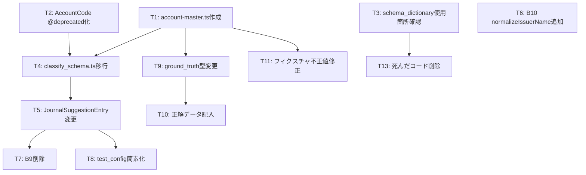

# STREAMED型移行 調査結果・課題・タスク

> 作成日: 2026-03-02（最終更新: 2026-03-25）
> 根拠: 本会話でのコード全量調査 + streamed_design_policy.md + streamed_mf_csv_spec.md + domain_type_design.md + マスタデータ確認

---

## 1. 調査結果

### 1-1. STREAMED型に寄せた結果のロジック変更

| 項目 | 変更前 | 変更後（STREAMED型） |
|------|--------|---------------------|
| 金額の持ち方 | tax込/税抜を`accounting_method`で切替 | **常に税込のみ** |
| 仮払/仮受消費税 | エンジンが`TAX_PAID`/`TAX_RECEIVED`を生成 | **エンジンは生成しない**（MFが自動生成） |
| 税額列（CSV） | エンジンが計算して出力 | **空欄**（MFが自動計算） |
| 経過措置の控除割合 | エンジン側で計算 | **MFが取引日で自動判定** |
| 税区分の範囲 | 独自enum 8値 | **MF正式名称と完全一致**（151件マスタ） |
| AI選択範囲 | 全税区分 | **4軸マトリクスで制御**（27件のみAI選択可） |
| ID体系 | enum値そのまま | **概念ID** → CSV出力時にMF名称に変換 |

**一言要約**: 税額に関わるロジックを全てMFに委譲するパススルー設計。

### 1-2. 型体系の現状（3世代が共存）

| 世代 | ファイル | 税区分 | 勘定科目 | 状態 |
|------|---------|--------|---------|------|
| 第1世代 | [schema_dictionary.ts](file:///c:/dev/receipt-app/src/shared/schema_dictionary.ts) | `TAX_SALES_10`等（独自16値） | なし | ❌ 死んだコード |
| 第2世代 | [journal.ts](file:///c:/dev/receipt-app/src/domain/types/journal.ts) | `LegacyTaxCategory`（8値enum） | `AccountCode`（30値enum） | ⚠️ `@deprecated`済みだが依存あり |
| 第3世代 | [tax-category.ts](file:///c:/dev/receipt-app/src/shared/types/tax-category.ts) + [tax-category-master.ts](file:///c:/dev/receipt-app/src/shared/data/tax-category-master.ts) | `TaxCategory`型（151件マスタ） | `Account`型（✅約140科目マスタ作成済） | ✅ 正解 |

### 1-3. フィクスチャの現状

[journal_test_fixture_30cases.ts](file:///c:/dev/receipt-app/src/mocks/data/journal_test_fixture_30cases.ts)（35件）を全件確認:

| 項目 | 状態 |
|------|------|
| `tax_category_id` | ✅ MF正式名称（`課税仕入 10%`, `対象外`）を使用中 |
| 科目名 | ✅ MF科目名（`旅費交通費`等）をそのまま使用 |
| 金額 | ✅ 税込金額のみ |
| `TAX_PAID`/`TAX_RECEIVED` | ✅ 使用されていない |

**不正値3件**:

| 行 | 問題 | 修正方針 |
|---|---|---|
| j011 | `tax_category_id: 'クレジットカード'` | マスタ参照に修正 |
| j034 | `account: '経費精算'` | MF科目名に修正 |
| j035 | `account: '売上原価'`, `'仕掛品'` | MF科目名に修正 or 科目マスタに追加 |

### 1-4. ground_truthの状態

[ground_truth.ts](file:///c:/dev/receipt-app/src/scripts/ground_truth.ts): **型定義のみ、実データ0件**（L359で終了）。

- 旧enum（`AccountCode`, `TaxCategory` 8値）をインポート中
- 正解データ未記入のため、新スキーマで最初から書ける（移行コストゼロ）

---

## 2. 課題一覧

### 課題A: 勘定科目マスターデータ ~~未作成~~ ✅解決済み

| 項目 | 詳細 |
|------|------|
| 現状 | ✅ `src/shared/data/account-master.ts` 作成済（約140科目、個人/法人/不動産全対応） |
| マスタUI | ✅ `/master/accounts` 独立ページ化済み（2026-03-06） |
| 設計ルール | ✅ [master_design_rules.md](file:///c:/dev/receipt-app/docs/genzai/02_database_schema/master_design_rules.md)（13ルール確定済み） |
| 参照 | [mf_account_master_reference.md](file:///c:/dev/receipt-app/docs/genzai/09_streamed/mf_account_master_reference.md) |

### 課題B: AccountCodeの@deprecated化が未完了

| 項目 | 詳細 |
|------|------|
| 現状 | `journal.ts`の`AccountCode`（30値enum）が`@deprecated`化されていない |
| 影響 | `classify_schema.ts`が旧enumに依存中。新コードでも旧enumを使い続けるリスク |
| 解決 | `LegacyTaxCategory`と同じパターンで`AccountCode`を`LegacyAccountCode`にリネーム |

### 課題C: classify_schema.tsがdomain旧enumに依存

| 項目 | 詳細 |
|------|------|
| 現状 | `classify_schema.ts`が`journal.ts`から`AccountCode`, `TaxCategory`をインポート |
| 影響 | Geminiスキーマが旧enumで定義されたまま。スキーマ移行のボトルネック |
| 解決 | フェーズ2でマスタ参照に切替。Geminiには概念IDのenum配列を渡す |

### 課題D: schema_dictionary.tsに死んだコード

| 項目 | 詳細 |
|------|------|
| 現状 | `TAX_SCHEMA_TEXT` + `TAX_OPTIONS`（第1世代）が残存 |
| 影響 | 新人が混乱する。3つの税区分定義が共存する異常状態 |
| 解決 | 使用箇所を確認し、参照ゼロなら削除 |

### 課題E: 支払先名の正規化が未実装

| 項目 | 詳細 |
|------|------|
| 現状 | `issuer_name`はGemini抽出のまま（株式会社等を含む） |
| 影響 | 将来の学習ルール（RULE_APPLIED）のマッチキーに使えない |
| 解決 | 層Bに`B10: normalizeIssuerName()`を追加。`PostProcessResult`に`normalized_issuer_name`フィールド追加 |

### 課題F: 補助科目のAI推定不可問題

| 項目 | 詳細 |
|------|------|
| 現状 | フィクスチャの`sub_account`に不正値あり（`'ガリツリ'`, `'現金'`等） |
| 影響 | MF CSVインポート時に補助科目名が完全一致しない → エラー |
| 解決 | AIは補助科目を新規推定しない。学習ルール（RULE_APPLIED、層C）から過去仕訳の値を引く。UIモックではnull or 既知値のみ |

### 課題G: 摘要の統一ルール未定義

| 項目 | 詳細 |
|------|------|
| 現状 | フィクスチャの`description`が科目名だったり支払先名だったりバラバラ |
| 影響 | UIの一貫性がない。CSV出力時の品質が不定 |
| 解決 | Phase A: Gemini直接抽出を維持。Phase B以降: テンプレート式（`{正規化支払先} {内容}`）をオプション導入 |

### 課題H: 中間コード vs MF限定

| 項目 | 詳細 |
|------|------|
| 現状 | `Account.id`が概念ID（例: `TRAVEL`）。`Account.name`がMF名（`旅費交通費`） |
| 結論 | **MF限定でよい**。概念IDが既に中間コードの役割を果たしている。将来弥生対応時は`yayoiName`フィールド追加で対応 |

---

## 3. 解決方法

### 方針: スキーマ定義 → フィクスチャは自動追従

ハードコート修正ではなく、マスターデータ（単一ソース）を先に定義し、フィクスチャ・UI・CSVがマスタを参照する構造にする。

```
マスタ（単一ソース）         参照側
────────────────           ──────────────
account-master.ts    ←──── フィクスチャの account
tax-category-master.ts ←── フィクスチャの tax_category_id
                     ←──── classify_schema.ts のenum
                     ←──── ground_truth.ts の型
                     ←──── UI ドロップダウン選択肢
                     ←──── CSV出力の名称
```

### 支払先正規化の設計

```typescript
// 層B追加: B10 normalized_issuer_name
//
// 入力:  GeminiClassifyResponse.issuer_name（株式会社○○）
// 出力:  PostProcessResult.normalized_issuer_name（○○）
//
// 除外パターン:
//   前置: 株式会社, 有限会社, 合同会社, 合名会社, 合資会社,
//         一般社団法人, 一般財団法人
//   後置: 同上
//   略称: (株), (有), (合), （株）, （有）, （合）
//
// 用途:
//   1. 学習ルール（RULE_APPLIED）のマッチキー
//   2. 摘要テンプレートの入力値
//   3. 重複検出の精度向上（issuer_name比較時にノイズ除去）
```

---

## 4. タスクリスト

### フェーズ2-0: スキーマ定義（前提作業）

- [x] **T1**: `src/shared/data/account-master.ts` ✅作成済（約140科目、法人/個人1マスタ管理、`target`で分岐）
  - マスタUI: `/master/accounts` 独立ページ化済み（2026-03-06）
  - 設計ルール: [master_design_rules.md](file:///c:/dev/receipt-app/docs/genzai/02_database_schema/master_design_rules.md)
- [ ] **T2**: `journal.ts`の`AccountCode`を`LegacyAccountCode`にリネーム + `@deprecated`
  - `LegacyTaxCategory`と同じパターン
  - 既存コードの参照は温存（壊さない）
- [ ] **T3**: `schema_dictionary.ts`の`TAX_SCHEMA_TEXT` + `TAX_OPTIONS`の使用箇所確認
  - 参照ゼロなら削除
  - 参照ありなら新マスタへの移行計画

### フェーズ2-1: classify_schema.ts移行

- [ ] **T4**: `classify_schema.ts`のenum定義をマスタ参照に変更
  - `AccountCode` → `account-master.ts`の`id`配列から生成
  - `TaxCategory` → `tax-category-master.ts`の`id`配列から生成（`aiSelectable: true`のみ）
  - `TAX_PAID` / `TAX_RECEIVED`をenumから除外
- [ ] **T5**: `JournalSuggestionEntry`の`tax_category`フィールドを概念IDに変更
  - 現在: `TaxCategory`（8値enum）
  - 変更後: `string`（概念ID）

### フェーズ2-2: 後処理移行

- [ ] **T6**: 層Bに`B10: normalizeIssuerName()`追加
  - `PostProcessResult`に`normalized_issuer_name: string | null`フィールド追加
- [ ] **T7**: 層Bから`B9: 禁止科目チェック`削除
  - `TAX_PAID`/`TAX_RECEIVED`がenumから消えるため不要
- [ ] **T8**: `test_config.ts`の5パターン → 1パターンに簡素化
  - `accounting_method`切替は不要（常に税込）

### フェーズ2-3: ground_truth移行

- [ ] **T9**: `ground_truth.ts`の型定義を新マスタ参照に変更
  - `AccountCode` → `string`（`account-master.ts`の概念ID参照）
  - `TaxCategory` → `string`（`tax-category-master.ts`の概念ID参照）
- [ ] **T10**: 正解データ記入（新スキーマで最初から）
  - 18件のテスト画像に対する正解値を新enum体系で記入

### フェーズ2-4: フィクスチャ修正

- [ ] **T11**: フィクスチャ不正値修正（3件）
  - j011: `tax_category_id` → マスタ参照
  - j034: `account` → MF科目名
  - j035: `account` → MF科目名 or 科目マスタ追加
- [ ] **T12**: フィクスチャの`description`命名ルール策定
  - Phase A: Gemini抽出のまま（自由文字列）。統一は不要
  - Phase B以降: テンプレート式オプション導入時に定義

### フェーズ2-5: 死んだコード清掃

- [ ] **T13**: `schema_dictionary.ts`のTAX関連コード削除（T3の結果次第）

---

## 5. 確定済み設計判断

| # | 判断事項 | 結論 | 根拠 |
|---|---------|------|------|
| D1 | 科目判定方式 | AI維持 + 将来学習ルール上位適用 | RULE_APPLIED定義済み。層C依存のため今は触らない |
| D2 | 摘要生成方式 | Gemini直接抽出を維持 | MF CSV摘要列は自由文字列。制約ゼロ |
| D3 | 屋号処理 | 今から正規化関数（B10）を追加 | 学習ルールのマッチキー + 摘要テンプレートの入力値に必要 |
| D4 | 通帳・クレカの科目判定 | AI維持。精度未検証をドキュメントに明記 | テストデータなし。フェーズ4で検証 |
| D5 | 補助科目 | AIは新規推定しない。学習ルール（層C）から過去仕訳の値を引く | MF完全一致ルール。AI推定 → インポートエラーのリスク |
| D6 | 中間コード | MF限定。概念IDが中間コードの役割を果たす | 将来弥生対応時はフィールド追加で対応 |
| D7 | スキーマ定義 vs ハードコート修正 | スキーマ定義が先。マスタを単一ソースにする | ハードコート修正は意味がない |

---

## 6. 依存関係



**クリティカルパス**: T1 → T4 → T5 → T7/T8 → T10

**独立タスク**（並行可能）: T3, T6, T12
