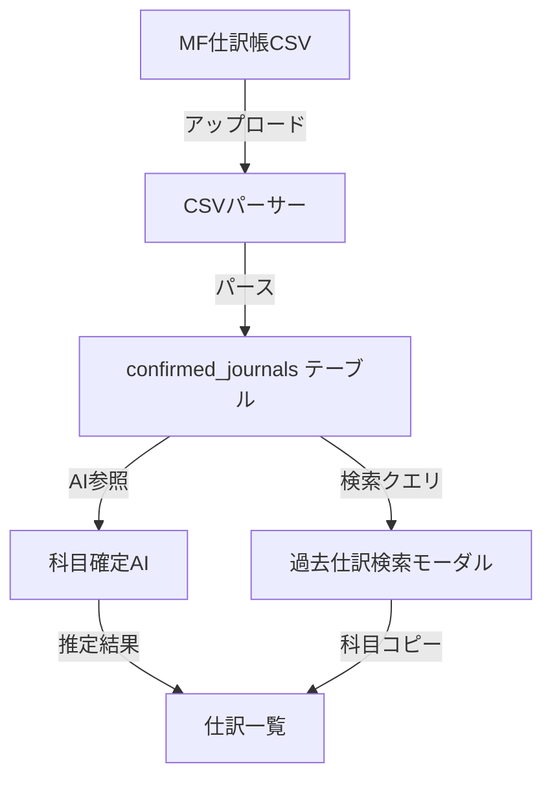

# 25_過去仕訳機能 設計・実装ドキュメント

> **作成日**: 2026-04-26  
> **目的**: 過去仕訳の取込・照合・活用に関する設計と実装状況をまとめる  
> **パイプライン位置**: ④科目確定AI の参照データ ＋ ⑤仕訳一覧の参照UI

---

## 1. 機能概要

過去仕訳機能は、MFクラウド会計からエクスポートした仕訳帳CSVを取り込み、新規証票の仕訳確定時に「過去の類似仕訳パターン」を参照できるようにする機能。

### パイプラインでの位置

```
① アップロード → ② 証票分類AI → ③ 選別 → ④ 科目確定AI → ⑤ 仕訳一覧 → ⑥ エクスポート
                                                │                    │
                                           過去仕訳参照          過去仕訳検索UI
                                           （AI精度向上）        （スタッフ確認用）
```

### 2つの利用経路

| 経路 | 利用者 | 目的 |
|------|--------|------|
| **AI参照** | 科目確定AI（④） | 同じ取引先・類似金額の過去仕訳を参照し、科目推定精度を向上 |
| **手動参照** | スタッフ（⑤） | 仕訳一覧で過去仕訳検索モーダルを開き、科目確認・コピーに利用 |

---

## 2. 実装状況

### 2-a. 過去仕訳取込画面

| 項目 | 状態 | ファイル |
|------|------|----------|
| ルーティング | ✅ | `/history-import/:clientId` |
| 画面 | ✅ | [MockHistoryImportPage.vue](file:///c:/dev/receipt-app/src/mocks/views/MockHistoryImportPage.vue) |
| CSVアップロード | ✅ | ドラッグ&ドロップ + ファイル選択 |
| MFフォーマット対応 | ✅ | 仕訳帳エクスポートCSV（UTF-8） |
| 取込実行 | ⚠ モック | `setTimeout 1.5秒`のダミー処理。実パース＆保存は未実装 |
| 取込履歴表示 | ✅ | 右カラムにリスト表示 |
| 削除 | ✅ | 確認ダイアログ付き |

> [!WARNING]
> 取込実行（`executeImport`）はL197 `// TODO: 実際のパース＆保存ロジックをここに実装` のまま。CSVパースは行数カウントのみ。Supabase移行時に`confirmed_journals`テーブルへの永続化が必要。

### 2-b. 仕訳一覧での過去仕訳検索

| 項目 | 状態 | ファイル |
|------|------|----------|
| 虫眼鏡アイコン | ✅ | [JournalListLevel3Mock.vue L510-534](file:///c:/dev/receipt-app/src/mocks/components/JournalListLevel3Mock.vue#L510-L534) |
| 検索モーダル | ✅ | [L1640-1910](file:///c:/dev/receipt-app/src/mocks/components/JournalListLevel3Mock.vue#L1640-L1910) |
| ドラッグ移動 | ✅ | `useDraggable` composable使用 |
| 検索条件 | ✅ | 取引先・日付範囲・金額（一致/以上/以下）・借方科目・貸方科目 |
| 2タブ切替 | ✅ | 「システム上の過去仕訳」/「会計ソフトから取り込んだ過去仕訳」 |
| ページネーション | ✅ | 10件/ページ |
| 検索ロジック | ⚠ モック | [L4949-5043](file:///c:/dev/receipt-app/src/mocks/components/JournalListLevel3Mock.vue#L4949-L5043) `localJournals`から検索（実データ未接続） |

### 2-c. `hasPastJournal` 判定

```typescript
// L5497: 先頭25件のみ過去仕訳ありと判定（モック）
function hasPastJournal(journal: JournalPhase5Mock): boolean {
  return localJournals.value.findIndex((j) => j.id === journal.id) < 25;
}
```

> [!NOTE]
> 本番では `confirmed_journals` テーブルに同一取引先の仕訳が存在するかで判定すべき。

---

## 3. データフロー（将来設計）



### confirmed_journals テーブル設計（Supabase）

| カラム | 型 | 備考 |
|--------|------|------|
| `id` | UUID | PK |
| `client_id` | TEXT | FK → clients |
| `voucher_date` | DATE | 取引日 |
| `description` | TEXT | 摘要 |
| `debit_account` | TEXT | 借方科目名 |
| `credit_account` | TEXT | 貸方科目名 |
| `amount` | INTEGER | 金額 |
| `tax_category` | TEXT | 税区分名 |
| `vendor_name` | TEXT | 取引先名（検索キー） |
| `source` | TEXT | `'mf_import'` / `'system'` |
| `imported_at` | TIMESTAMPTZ | 取込日時 |

> [!IMPORTANT]
> `T-03: ConfirmedJournal型`（task_unified.md）が未着手。Supabase DDL設計と合わせて実装する。

---

## 4. 未実装・課題

| # | 課題 | 優先度 | 関連タスク |
|---|------|--------|-----------|
| 1 | CSVパース＆永続化（MF形式→confirmed_journals） | 🔴 高 | T-03 |
| 2 | `hasPastJournal` の実データ判定への切替 | 🟡 中 | T-03完了後 |
| 3 | 科目確定AIからの過去仕訳参照（RAG/検索） | 🟡 中 | AI精度向上 |
| 4 | 過去仕訳からの科目コピー機能（モーダル→仕訳行に反映） | 🟢 低 | UI改善 |
| 5 | 複数期間CSVの重複排除 | 🟢 低 | データ品質 |
