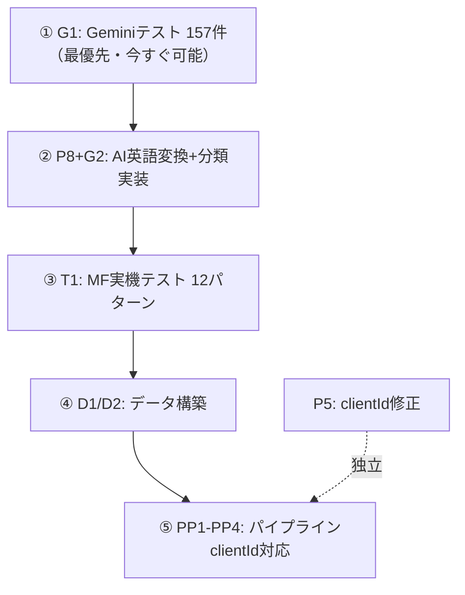

# 勘定科目・税区分マスタ — 統合ファクトシート

> 調査日: 2026-05-30（最終更新: 2026-06-01 23:55 — MF ID実機検証結果反映）
> 対象: `c:\dev\receipt-app`

---

## 1. データ構造

### 1-1. 勘定科目マスタ（account-master.json）: 全157件

| フィールド | 日本語 | 型 | 値域 | 件数分布 |
|-----------|--------|-----|------|---------|
| `id` | マスタID（一意キー） | string | `CASH`, `TRAVEL` 等 | 157件ユニーク |
| `name` | 科目名 | string | `現金`, `旅費交通費` 等 | 143ユニーク（14件重複） |
| `target` | 事業形態対象 | string | `both`（共通）=56, `individual`（個人）=52, `corp`（法人）=49 |
| `accountGroup` | 勘定科目グループ（大分類） | string | `BS_ASSET`（資産）=57, `PL_EXPENSE`（費用）=63, `BS_LIABILITY`（負債）=17, `PL_REVENUE`（収益）=12, `BS_EQUITY`（純資産）=8 |
| `category` | 科目分類（中分類） | string | 29種（`経費`, `売上`, `現金及び預金` 等） |
| `defaultTaxCategoryId` | デフォルト税区分ID | string | `COMMON_EXEMPT`, `PURCHASE_TAXABLE_10` 等 |
| `taxDetermination` | 税区分判定モード | string | `fixed`（固定）=105, `auto_purchase`（自動仕入）=43, `auto_sales`（自動売上）=9 |
| `deprecated` | 非表示フラグ | boolean | true=0, false=157 |
| `effectiveFrom` | 有効開始日 | string | `2019-10-01` 等 |
| `effectiveTo` | 有効終了日 | string\|null | 全件null |
| `sortOrder` | 表示順 | number | 1〜157 |
| `mfAccountId` | MF勘定科目ID | string\|undefined | あり=108件, なし=49件（31%欠損） |
| `mfAccountGroup` | MF勘定科目グループ | string\|undefined | `ASSET`, `EXPENSE` 等 |
| `mfFinancialStatementType` | MF財務諸表区分 | string\|undefined | `BALANCE_SHEET`, `PROFIT_LOSS` |
| ~~`mfDefaultTaxId`~~ | ~~MFデフォルト税区分ID~~ | — | 削除済み（2026-06-04）。MFのtax_idは事業者固有で保存する意味がない。仕訳送信はMCPリアルタイム名前照合で解決 |

**マスタID統計**: 長さ 最小=4文字, 最大=28文字, 平均=13文字

**uuidフィールド**: なし

### 1-2. 税区分マスタ（tax-category-master.json）: 全151件

| フィールド | 日本語 | 型 | 値域 |
|-----------|--------|-----|------|
| `id` | マスタID（一意キー） | string | `PURCHASE_TAXABLE_10` 等。151件ユニーク |
| `name` | 税区分名 | string | `課税仕入 10%` 等。151件ユニーク（重複0件） |
| `shortName` | 略称 | string | `課仕 10%` 等 |
| `direction` | 売上/仕入方向 | string | `sales`（売上）, `purchase`（仕入）, `common`（共通） |
| `qualified` | 適格インボイス対象 | boolean | |
| `aiSelectable` | AI選択可能 | boolean | |
| `deprecated` | 非表示フラグ | boolean | |
| `simplifiedOnly` | 簡易課税専用 | boolean | 48件がtrue |
| ~~`mfId`~~ | ~~MF税区分ID~~ | — | 全社マスタからは削除済み（2026-06-04）。MF IDは事業者固有で事業者間一致しない。顧問先別データでのみ使用 |

**マスタID統計**: 長さ 最小=12文字, 最大=34文字, 平均=20文字

**uuidフィールド**: なし

---

## 2. バリデーション骨格

### 2-1. 仕訳バリデーション（13種チェック）

[journalValidationCore.ts](file:///c:/dev/receipt-app/src/shared/validation/journalValidationCore.ts) で実装（SSOT）。

| # | チェック名 | ラベル | 使用する勘定科目フィールド | 使用する税区分フィールド |
|---|-----------|--------|------------------------|---------------------|
| 1 | 科目不明 | `ACCOUNT_UNKNOWN` | `id`（存在チェック） | — |
| 2 | 税区分不明 | `TAX_UNKNOWN` | — | `id`（存在チェック） |
| 3 | 摘要なし | `DESCRIPTION_UNKNOWN` | — | — |
| 4 | 日付なし | `DATE_UNKNOWN` | — | — |
| 5 | 金額未設定 | `AMOUNT_UNCLEAR` | — | — |
| 6 | 貸借不一致 | `DEBIT_CREDIT_MISMATCH` | — | — |
| 7 | 貸借科目矛盾 | `CATEGORY_CONFLICT` | **`accountGroup`（大分類）** | — |
| 7b | 同一科目借貸 | `SAME_ACCOUNT_BOTH_SIDES` | `id` | — |
| 8 | 証票意味矛盾 | `VOUCHER_TYPE_CONFLICT` | `id`, **`accountGroup`**, **`category`** | — |
| 9 | 科目×税区分不整合 | `TAX_ACCOUNT_MISMATCH` | **`taxDetermination`**, **`defaultTaxCategoryId`** | **`direction`** |
| 10 | 未来日付 | `FUTURE_DATE` | — | — |
| 11 | 期外日付 | `DATE_OUT_OF_RANGE` | — | — |
| 12 | 役員貸付金 | `DIRECTOR_LOAN` | `id` | — |
| 13 | 少額適格 | `AUTO_INVOICE_SMALL` | — | — |

> [!NOTE]
> ✅ SSOT統合完了。全13チェックは [journalValidationCore.ts](file:///c:/dev/receipt-app/src/shared/validation/journalValidationCore.ts) に集約。
> A（API）・B（フロント共通）・C（Vue内）はすべてSSOT呼出に統一済み。
> #11-#13は`ValidationContext`（オプショナル）で顧問先コンテキストを受け取る。
> 詳細は [42_validation_journal_factsheet.md](file:///c:/dev/receipt-app/docs/genzai/42_validation_journal_factsheet.md) 参照。

### 2-2. MF送信バリデーション（6種チェック）

[journalToMfConverter.ts](file:///c:/dev/receipt-app/src/api/services/journalToMfConverter.ts) で実装。

| # | チェック名 | 使用するフィールド |
|---|-----------|-----------------| 
| 1 | 科目MF未マッチ | `accountMap.has(entry.account)` — マスタID→MF名前照合 |
| 2 | 税区分MF未マッチ | `taxMap.has(entry.tax_category_id)` — マスタID→MF名前照合 |
| 3 | 科目-税区分方向整合性 | `accountDirectionMap` + `taxDirectionMap` |
| 4 | 免税の課税使用 | `taxDirectionMap` — `common`以外はNG |
| 5 | 簡易の非T系売上 | マスタIDパターン `_T[1-6]$` |
| 6 | 一括比例のCOMMON/NT系 | マスタIDパターン `_COMMON_`, `_NT_` |

> [!NOTE]
> #5, #6は**マスタIDのパターンマッチ**。顧問先独自追加でもID命名規則を守る必要がある。

### 2-3. フィールド依存チェーン

```
仕訳行 entry.account ───→ マスタIDで勘定科目マスタを引く
                            ├→ accountGroup（大分類）     → #7 貸借科目矛盾
                            ├→ category（中分類）         → #8 証票意味矛盾
                            ├→ taxDetermination（判定）   → #9 科目×税区分不整合
                            └→ defaultTaxCategoryId      → #9 固定税区分照合

仕訳行 entry.tax_category_id → マスタIDで税区分マスタを引く
                            └→ direction（方向）          → #9 科目×税区分不整合
```

---

## 3. フィールド付与タイミングと導出チェーン

### 3-1. 導出チェーン（`category`が全てを決定）

```
category（中分類）を設定すると:
  ├→ accountGroup      getCategoryAccountGroup()
  ├→ taxDetermination  deriveTaxDetermination()
  ├→ defaultTaxCategoryId  deriveCategoryDefaults()
  └→ direction（方向）  getCategoryDirection()
```

実装: [account-category-rules.ts](file:///c:/dev/receipt-app/src/data/master/account-category-rules.ts)

### 3-2. 勘定科目の付与タイミング

| フィールド | マスタ手動定義時 | MFインポート新規時 | 顧問先独自追加時 |
|-----------|---------------|-----------------|---------------|
| `id` | 人間が英語で命名 | `MF_{科目名}` ❌日本語混入 | `{3コード}_{英語名}` |
| `name` | 人間が設定 | MFの`name`を使用 | 人間が設定 |
| `target` | 人間が設定 | `deriveTarget()`で推定 | 人間が設定 |
| `accountGroup` | `category`から自動導出 | `category`から自動導出 | `category`から自動導出 |
| `category` | 人間が設定 | MF `category`→`MF_CATEGORY_MAP`変換 | 人間が設定 |
| `taxDetermination` | `category`から自動導出 | `category`から自動導出 | `category`から自動導出 |
| `defaultTaxCategoryId` | 人間 or 自動 | MF `tax_id`→マスタID変換 | 人間 or 自動 |
| `mfAccountId` | MFインポートで付与 | MFの`id`を設定 | MFインポートで付与 |

実装: [mfAccountImportService.ts L81-226](file:///c:/dev/receipt-app/src/api/services/mfAccountImportService.ts#L81-L226)

### 3-3. 税区分の付与タイミング

| フィールド | マスタ手動定義時 | MFインポート新規時 |
|-----------|---------------|-----------------| 
| `id` | 人間が英語で命名 | `MF_CUSTOM_{mfId}` |
| `direction` | 人間が設定 | `guessDirectionFromName()`で名前推定 |
| `qualified` | 人間が設定 | `guessQualifiedFromName()`で名前推定 |
| `mfId` | MFインポートで付与 | MFの`id`を設定 |

---

## 4. MF照合アーキテクチャ

### 4-1. 税区分（実装済み・検証済み）

```
税区分マスタ                        mf-tax-available.json
┌──────────────────────────┐      ┌──────────────────────────────────────────┐
│ id: SALES_TAXABLE_10     │      │ exempt:     { "SALES_TAXABLE_10": false } │
│ name: "課税売上 10%"      │      │ simplified: { "SALES_TAXABLE_10": true  } │
│ ※mfIdは削除済み          │──キー→│ individual: { "SALES_TAXABLE_10": true  } │
│                          │      │ proportional:{"SALES_TAXABLE_10": true  } │
└──────────────────────────┘      └──────────────────────────────────────────┘
```

| 事実 | 数値 |
|------|------|
| ~~マスタ`mfId`充足率~~ | `mfId`は全社マスタから削除済み（2026-06-04） |
| available.jsonのキー | **マスタID**（`SALES_TAXABLE_10`等）。2026-06-04にmfId→マスタIDに移行（604件変換） |
| 照合方式 | **名前ベース**（マスタ名前↔MF名前。151/151件一致） |
| MF IDの性質 | 事業者固有。TSK vs TST で 0/151件一致（MCP実機検証 2026-06-01/06-04） |

> [!CAUTION]
> **2026-06-01 MCP実機検証で確定: `mfId`は事業者（テナント）ごとに異なる。**
> 全社マスタの`mfId`は削除済み。available.jsonのキーもマスタIDに移行済み。
> 仕訳送信時はmfMappingServiceがMCPからリアルタイムに取得し名前照合で解決する。
> 詳細: `docs/genzai/45_mf_id_comparison.md`
| 中間対応表/UUID | **存在しない** |
| スナップショット取得 | 4パターン完了 |
| 基準顧問先 | 1つ（c_rODnkCDN = 法人） |

### 4-2. 勘定科目（部分的に実装）

| 事実 | 数値 |
|------|------|
| マスタ`mfAccountId`充足率 | **69%**（108/157） |
| `mfAccountId`の由来 | c_rODnkCDN（法人1社）のMF科目ID |
| 名前重複 | **14件**（法人/個人で同名） |
| `mf-account-available.json` | **⚠️ 未構築** |
| 照合方式（MF送信時） | **名前ベース**（mfMappingService） |
| スナップショット取得 | **8パターン**（法人4 + 個人4） |
| 取得済み顧問先 | c_rODnkCDN（法人）+ c_wTdnMKDO（個人） |

> [!WARNING]
> **MFインポートのテスト範囲が不十分。** 取得済みの8パターンはいずれも実運用顧問先であり、
> 全12パターンの体系的テスト（不動産あり/なし×4課税方式）は**未完了**。
> 特に「不動産所得なし×個人」の4パターンが未取得。
> `mf-account-available.json`（勘定科目の方式別表示可否テーブル）は**未構築**のまま。

### 4-3. MFスナップショット取得状況（実態）

| # | 顧問先 | 事業形態 | 課税方式 | ファイル | 状態 |
|---|--------|---------|---------|---------|:---:|
| 1 | c_rODnkCDN | 法人 | 免税 | `mf-snapshot-c_rODnkCDN-exempt.json` | ✅ |
| 2 | c_rODnkCDN | 法人 | 簡易 | `mf-snapshot-c_rODnkCDN-simplified.json` | ✅ |
| 3 | c_rODnkCDN | 法人 | 原則（個別） | `mf-snapshot-c_rODnkCDN-general_specific.json` | ✅ |
| 4 | c_rODnkCDN | 法人 | 原則（一括） | `mf-snapshot-c_rODnkCDN-general_proportional.json` | ✅ |
| 5 | c_wTdnMKDO | 個人（不動産あり） | 免税 | `mf-snapshot-c_wTdnMKDO-exempt.json` | ✅ |
| 6 | c_wTdnMKDO | 個人（不動産あり） | 簡易 | `mf-snapshot-c_wTdnMKDO-simplified.json` | ✅ |
| 7 | c_wTdnMKDO | 個人（不動産あり） | 原則（個別） | `mf-snapshot-c_wTdnMKDO-general_specific.json` | ✅ |
| 8 | c_wTdnMKDO | 個人（不動産あり） | 原則（一括） | `mf-snapshot-c_wTdnMKDO-general_proportional.json` | ✅ |
| 9-12 | （個人・不動産なし） | 個人 | 全4方式 | — | ❌ 未取得 |

### 4-4. 照合チェーン

```
■ インポート時（マスタ構築）:
  MF科目/税区分（任意方式）
    → 名前でマスタ照合
    → マスタのmfId/mfAccountId（基準方式由来）をキーにavailable更新

■ 仕訳送信時（MF API呼出）:
  マスタ科目名/税区分名
    → MF科目名/税区分名（名前照合）
    → その顧問先のMF科目ID/税区分IDを取得
```

### 4-5. 税区分と勘定科目の構造差

| 項目 | 税区分 | 勘定科目 |
|------|--------|---------|
| 名前重複 | **0件** | **14件**（法人/個人で同名） |
| 基準顧問先 | 1つ（課税方式だけ切替） | **2つ必要**（法人 + 個人） |
| マスタ件数 | 151件 | 157件（法人49 + 個人52 + 共通56） |
| MFでの名前変更 | ほぼない（MF固定名） | **ユーザーがMF上で変更可能** |
| カスタム科目追加 | MFで追加可能 | **MFで追加可能 + マスタ手動追加** |

> [!IMPORTANT]
> **2026-06-01実機検証確定: 税区分も勘定科目も、MF IDは事業者固有。事業者間のID照合は不可能。**
> 税区分で名前ベースが成立するのは「名前重複0件 + MF側で名前変更がほぼ起きない」条件があるから。
> 勘定科目はその条件を**満たさない**（14件重複 + MF上で変更可能）。
> MCP仕訳送信の49パターンテスト結果: `docs/genzai/46_mf_journal_send_49patterns.md`

---

## 5. MF照合方式 — 3案メリデメ比較

### 案A: 名前ベース照合（税区分と同じ方式）

```
マスタ科目名 ←名前一致→ MF科目名
```

| メリット | デメリット |
|---------|----------|
| ✅ 税区分と同一アーキテクチャ | ❌ 名前重複14件が解決不能（先勝ち問題） |
| ✅ 中間テーブル不要 | ❌ MFで科目名変更したら照合が切れる |
| ✅ MFに科目追加→名前で自動マッチ | ❌ mfMappingServiceも壊れる |
| ✅ 人間にとって直感的 | |

### 案B: 中間対応表（マスタID ↔ MF基準ID）★推奨

```json
{
  "tst": { "CASH": "cqFKUwCs...", "SUPPLIES_CORP": "RzBJyPxd..." },
  "tsk": { "CASH": "xyz789...", "OWNER_DRAW": "def456..." }
}
```

| メリット | デメリット |
|---------|----------|
| ✅ 名前重複14件が完全解決 | ⚠️ 初回構築コスト（12パターンのスナップショットから生成） |
| ✅ MFで科目名変更しても壊れない | ⚠️ MF新規科目追加時に対応表更新が必要 |
| ✅ 仕訳送信が安全（IDで直接引き） | ⚠️ 税区分と異なるアーキテクチャ |
| ✅ Supabase移行時にJOINテーブル化容易 | |

名前照合フォールバック付きハイブリッド:

```typescript
function resolveMfId(accountId, businessType, mfAccounts) {
  // 1. 対応表で直接引き（確実）
  const mapping = loadMapping(businessType === 'corp' ? 'tst' : 'tsk')
  if (mapping[accountId]) return mapping[accountId]
  // 2. フォールバック: 名前照合（新規科目用）
  const account = getAccountById(accountId)
  const mf = mfAccounts.find(m => m.name === account.name)
  if (mf) { mapping[accountId] = mf.id; saveMapping(...); return mf.id }
  return null
}
```

### 案C: 中間UUID

| メリット | デメリット |
|---------|----------|
| ✅ 完全に名前非依存 | ❌ MF側にUUIDを保持する手段がない |
| ✅ マルチ会計ソフト対応に強い | ❌ 結局ローカルに対応表 → 案Bと実質同じ |
| | ❌ オーバーエンジニアリング |

### 比較まとめ

| 評価軸 | 案A 名前ベース | 案B 中間対応表 | 案C 中間UUID |
|--------|:---:|:---:|:---:|
| 名前重複14件の解決 | △ 追加ロジック | ✅ 完全解決 | ✅ 完全解決 |
| MF科目名変更耐性 | ❌ 壊れる | ✅ 壊れない | ✅ 壊れない |
| 実装コスト | ◎ 最小 | ○ 中 | ❌ 最大 |
| 税区分との統一性 | ◎ 同一 | △ 異なるが類似 | ❌ 全く異なる |
| Supabase移行 | △ | ✅ JOIN化容易 | ○ |
| 仕訳送信の安全性 | △ 名前変更時unmatch | ✅ IDで直接引き | ✅ |

---

## 6. 仕訳パイプライン接続状況

### 6-1. パイプライン全段階

| 段階 | ファイル | 参照元 | 顧問先別接続 |
|------|---------|--------|------------|
| ① AI判定 | [accountDetermination.ts](file:///c:/dev/receipt-app/src/utils/pipeline/accountDetermination.ts) | vendorStore経由（`findByTNumber`/`findByMatchKey`）→ `vendor.debit_account`（マスタID） | ❌ |
| ② 仕訳保存 | [domain-journal.ts](file:///c:/dev/receipt-app/src/types/domain-journal.ts) | `entry.account` = 全社マスタID | — |
| ③ バリデーション | [journalValidation.ts](file:///c:/dev/receipt-app/src/api/services/journalValidation.ts) | `syncWarningLabelsCore()`にaccounts引数で渡す | ❌ |
| ④ MF送信照合 | [mfMappingService.ts](file:///c:/dev/receipt-app/src/api/services/mfMappingService.ts) | `loadSugusruAccounts()` = `account-master.json`直接読込 | ❌ |
| ⑤ MF変換 | [journalToMfConverter.ts](file:///c:/dev/receipt-app/src/api/services/journalToMfConverter.ts) (545行) | `maps.accountMap.get(entry.account)` | ❌ |

### 6-2. 顧問先別データの現状（実測値）

| ファイル | 件数 | パイプライン使用 |
|---------|------|---------------|
| `data/account-master.json` | 157件 | ③④⑤で使用 |
| `data/accounts-c_2sAINrqz.json` | 92件 | **未使用** |
| `data/accounts-c_46bSeC38.json` | 92件 | **未使用** |
| `data/accounts-c_LEaq8AXu.json` | 92件 | **未使用** |
| `data/accounts-c_VdAnGFq3.json` | 157件 | **未使用** |
| `data/accounts-c_wTdnMKDO.json` | 157件 | **未使用** |
| `data/tax-category-master.json` | 151件 | ③④⑤で使用 |
| `data/tax-categories-c_2sAINrqz.json` | 151件（source=mf: 151） | **未使用** |
| `data/tax-categories-c_46bSeC38.json` | 151件（source=mf: 0） | **未使用** |
| `data/tax-categories-c_LEaq8AXu.json` | 36件（source=mf: 0） | **未使用** |
| `data/tax-categories-c_VdAnGFq3.json` | 151件（source=mf: 0） | **未使用** |
| `data/tax-categories-c_wTdnMKDO.json` | 151件（source=mf: 151） | **未使用** |

> [!NOTE]
> 顧問先別ファイルは5社分存在。うち2社はMFインポート済み（c_2sAINrqz, c_wTdnMKDO: source=mf全件）。
> 1社（c_LEaq8AXu）は36件のみ — MF未連携先と推測。
> 全ファイルで `isCustom=0` — 顧問先独自追加は未実施。

### 6-3. パイプライン接続に必要な改修（4箇所）

| 箇所 | 現状 | 改修内容 |
|------|------|---------| 
| ③ バリデーション | `getAccountsForValidation()` | `getAccountsForValidation(clientId)` |
| ③ 名前ソートマップ | `getAccountNameMap()` | `getAccountNameMap(clientId)` |
| ④ MF送信照合 | `loadSugusruAccounts()` | `loadClientAccounts(clientId)` |
| ④ MF税区分照合 | `loadSugusruTaxes()` | `loadClientTaxes(clientId)` |

---

## 7. ID命名規則

### 7-1. 現状

| 種別 | ID例 | 問題 |
|------|------|------|
| 全社マスタ（勘定科目） | `CASH`, `TRAVEL`, `SALES` | なし |
| 全社マスタ（税区分） | `PURCHASE_TAXABLE_10`, `COMMON_EXEMPT` | なし |
| MFインポート新規（勘定科目） | `MF_未収賃貸料` | ❌ 日本語がIDに含まれる |
| MFインポート新規（税区分） | `MF_CUSTOM_{mfId}` | mfIdがBase64で長い |
| 仕訳行 `account` | `"CASH"` | マスタIDを直接保存 |
| 仕訳行 `tax_category_id` | `"PURCHASE_TAXABLE_10"` | マスタIDを直接保存 |

### 7-2. 合意済み方針

| 種別 | 方針 |
|------|------|
| 全社マスタ既存 | 現行ID維持（`CASH`, `TRAVEL`等） |
| 全社マスタ新規（MFインポート） | 英語表記でID化（例: `ACCRUED_RENTAL_INCOME`） |
| 顧問先独自追加 | `{3コード}_{英語名}`（例: `LDI_SPECIAL_SALES`） |
| マスタID = UUID | 新UUIDフィールド追加不要。現マスタIDが実質UUID |
| 保存方式 | 差分のみ方式（マスタ + overrides + additions） |

---

## 8. 顧問先別データ構造

### 8-1. 現状（accounts-{clientId}.json）

```json
{
  "accounts": [
    {
      "id": "CASH",
      "name": "現金",
      "target": "both",
      "accountGroup": "BS_ASSET",
      "category": "現金及び預金",
      "defaultTaxCategoryId": "COMMON_EXEMPT",
      "taxDetermination": "fixed",
      "deprecated": false,
      "sortOrder": 1,
      "hiddenInMaster": false,
      "isCustom": false
    }
  ],
  "subAccounts": null
}
```

### 8-2. 全社マスタ vs 顧問先別の差異

| 項目 | 全社マスタ | 顧問先別 |
|------|----------|---------|
| 件数 | 157件 | 92件（c_2sAINrqz等3社）/ 157件（c_VdAnGFq3, c_wTdnMKDO） |
| MFフィールド | `mfAccountId`等あり | **なし** |
| `isCustom` | 全件false | 全件false |
| `hiddenInMaster` | なし | あり |
| パイプライン接続 | ③④⑤で使用 | **未接続** |

---

## 9. 実装アーキテクチャ・ファイル一覧

### 9-1. アーキテクチャ（現状）

```
フロント                         バックエンド
MockMasterAccountsPage.vue       accountMasterRoutes.ts
  ├── useAccountSettings()         └── accountMasterStore.ts
  ├── MFインポート(API経由)            ├── loadAccounts()
  ├── フィルタ/ソート(フロント内)        ├── getFilteredAccounts()
  └── 保存 → PUT /api/accounts/master  └── saveAllAccounts() ← JSON永続化あり
                                     mfAccountImportService.ts
                                       └── POST /api/mf/import-master-accounts
```

### 9-2. ファイル一覧

| ファイル | 行数 | 役割 |
|---------|------|------|
| [MockMasterAccountsPage.vue](file:///c:/dev/receipt-app/src/views/master/MockMasterAccountsPage.vue) | 829行 | 勘定科目マスタUI（フィルタ・編集・MFインポートAPI呼出・保存） |
| [accountMasterRoutes.ts](file:///c:/dev/receipt-app/src/api/routes/accountMasterRoutes.ts) | 135行 | GET/PUT API（マスタ + 顧問先） |
| [accountMasterStore.ts](file:///c:/dev/receipt-app/src/api/services/accountMasterStore.ts) | 587行 | インメモリストア + JSON永続化 |
| [shared-account.ts](file:///c:/dev/receipt-app/src/types/shared-account.ts) | 72行 | `Account`型定義 |
| [mf-account-category-mapping.ts](file:///c:/dev/receipt-app/src/data/master/mf-account-category-mapping.ts) | 113行 | MFカテゴリ→マスタカテゴリ変換 |
| [account-category-rules.ts](file:///c:/dev/receipt-app/src/data/master/account-category-rules.ts) | 151行 | 科目分類ルール（カテゴリ→グループ・方向・導出） |
| [mfAccountImportService.ts](file:///c:/dev/receipt-app/src/api/services/mfAccountImportService.ts) | 227行 | MF科目インポートサービス（バックエンド） |
| **[journalValidationCore.ts](file:///c:/dev/receipt-app/src/shared/validation/journalValidationCore.ts)** | **630行** | **仕訳バリデーションSSOT（13種チェック統合）** |
| [journalValidation.ts](file:///c:/dev/receipt-app/src/api/services/journalValidation.ts) | 90行 | 仕訳バリデーション（API側ラッパー） |
| [journalWarningSync.ts](file:///c:/dev/receipt-app/src/utils/journalWarningSync.ts) | 27行 | フロント共通バリデーション（sharedへのre-export） |
| [mfMappingService.ts](file:///c:/dev/receipt-app/src/api/services/mfMappingService.ts) | 374行 | MF送信時のID変換マップ生成 |
| [journalToMfConverter.ts](file:///c:/dev/receipt-app/src/api/services/journalToMfConverter.ts) | 545行 | 仕訳→MF形式変換 + MF送信バリデーション |
| [accountDetermination.ts](file:///c:/dev/receipt-app/src/utils/pipeline/accountDetermination.ts) | 323行 | AI科目判定（第一層〜第四層） |

---

## 10. 問題点

### ✅ 解消済み

| # | 問題 | 解消内容 |
|---|------|---------|
| ~~P1~~ | ~~MFインポート処理がフロントに残っている~~ | ✅ `POST /api/mf/import-master-accounts` でバックエンドAPI化済み。フロントは`fetch()`呼出のみ（L385-452） |
| ~~P2~~ | ~~マスタ保存でJSON永続化がない~~ | ✅ `saveAllAccounts()` L196-202で`writeFileSync`実装済み |

### 🟡 残存

| # | 問題 | 内容 |
|---|------|------|
| P3 | フィルタロジックがフロント/バックエンドで重複 | フロント`filteredAccountRows` computed + バックエンド`getFilteredAccounts()`。インライン編集・ドラッグ並替えはフロントでOK（合意済み） |
| P4 | テンプレート内のハードコード | テンプレート（HTML）内に日本語ラベルが直書き。UI_MSGへの定数化進行中だが一部残存 |
| P5 | clientIdのハードコード | MF認証で`c_rODnkCDN`がL370にハードコード（`TODO: Supabase移行時にUI選択に変更`コメントあり） |
| P7 | `mf-account-available.json`未構築 | 勘定科目の方式別表示可否テーブルが存在しない。個人（不動産なし）4パターンのスナップショットも未取得 |
| P8 | MFインポート新規IDに日本語混入 | `MF_${mf.name}` で生成されるため`MF_未収賃貸料`等のIDが発生（L147） |

### 🟢 良い点（既に実装済み）

- ✅ `Account`型定義が shared-account.ts に集約済み
- ✅ `account-category-rules.ts` にカテゴリルールが集約済み
- ✅ `mf-account-category-mapping.ts` でMFカテゴリ変換がデータ駆動
- ✅ API層（GET/PUT + MFインポート）が存在
- ✅ `useUnsavedGuard`で未保存変更ガード実装済み
- ✅ カテゴリ変更時のaccountGroup・taxDetermination自動連動実装済み
- ✅ MFインポートがバックエンドAPI化済み（mfAccountImportService.ts）
- ✅ マスタ保存のJSON永続化実装済み（writeFileSync）

---

## 11. 前セッション実績（税区分適正化）と対比

### 11-1. 税区分適正化で実施した5項目

| # | 実施内容 | 効果 |
|---|---------|------|
| 1 | `consumptionTaxMode`値統一 | 旧値→新値に12ファイル＋JSONで一括変換 |
| 2 | 顧問先インポートのバックエンド移行 | フロント200行→40行。API 1本化 |
| 3 | IDパターンマッチ完全削除 | 4関数削除。ID命名規則変更に耐える設計 |
| 4 | `simplifiedOnly`フラグ追加 | 名前パターンマッチ→データ駆動。276件JSON更新 |
| 5 | `taxRate`優先化 | `extractRateFromName()`→`taxRate`フィールド優先使用 |

### 11-2. 勘定科目で対応すべき内容

| 税区分で実施済み | 勘定科目で対応すべき | 状態 |
|--------------|------------------|:---:|
| `importClientTaxes()` バックエンドAPI化 | `importFromMf()` バックエンドAPI化 | **✅ 完了** |
| JSON永続化（`persistClientTaxCategories`） | マスタ保存の永続化追加 | **✅ 完了** |
| IDパターンマッチ削除 | 該当なし（勘定科目はIDパターンマッチなし） | — |
| `simplifiedOnly`フラグ（データ駆動化） | 該当なし（不要） | — |
| `taxRate`優先化 | 該当なし | — |
| availableデータでフィルタ（データ駆動） | `target` + `category`ベース（既にデータ駆動） | — |
| — | **バリデーションSSOT統合** | **✅ 完了** |
| — | **consumptionTaxMode型統一** | **✅ 完了** |
| — | **二重定義・import残留解消** | **✅ 完了** |

---

## 12. UI列の現状と不足

### 12-1. 勘定科目マスタUI（全列追加済み）

| 列 | マスタUI | 顧問先別UI | バリデーションで必要 |
|---|:---:|:---:|:---:|
| ✓チェック | ✅ | ✅ | — |
| MF公式 | ✅ | ✅ | — |
| 税区分自動判定 | ✅ | ✅ | — |
| **`id`（マスタID）** | ✅ | ✅ | #1 科目不明・デバッグ |
| 勘定科目名（`name`） | ✅ | ✅ | — |
| 補助科目 | ✅ | ✅ | — |
| **`target`（事業形態）** | ✅ | ✅ | フィルタ・パイプライン |
| **`accountGroup`（大分類）** | ✅ | ✅ | **#7 貸借科目矛盾** |
| **`direction`（方向）** | ✅ | ✅ | #9 科目×税区分不整合（間接） |
| 科目分類（`category`） | ✅ | ✅ | #8 証票意味矛盾 |
| 税区分判定（`taxDetermination`） | ✅ | ✅ | #9 科目×税区分不整合 |
| デフォルト税区分（`defaultTaxCategoryId`） | ✅ | ✅ | #9 固定税区分照合 |
| **証票意味許容** | ✅ | ✅ | #8 可視化 |
| 適用開始/終了 | ✅ | ✅ | — |
| 出典 | ❌ | ✅ | — |

> [!NOTE]
> バリデーション依存フィールドは全てUI列に表示済み。不足列なし。
> 詳細は [42_validation_journal_factsheet.md](file:///c:/dev/receipt-app/docs/genzai/42_validation_journal_factsheet.md) 参照。

---

## 13. AI自動設定方針（2026-05-31改訂）

### 13-1. 背景

勘定科目の付随フィールド（§3参照）は人間が手動設定すると破綻する:
- `accountGroup`（5値）、`category`（29値）、`taxDetermination`（3値）、`defaultTaxCategoryId`（151択）、`target`（3値）
- 組み合わせが多すぎて人間が正しく設定するのは困難
- 設定を間違えるとバリデーション（§2）が誤動作する

### 13-2. 導出チェーン活用（`category` + `target`で全て決まる）

```
入力（AI判定 or 人間選択）:
  ├→ category（29値から1つ）
  └→ target（corp / individual / both）

自動導出（deriveCategoryDefaults()）:
  ├→ accountGroup      getCategoryAccountGroup()
  ├→ taxDetermination  deriveTaxDetermination()
  ├→ defaultTaxCategoryId  deriveCategoryDefaults()
  └→ direction         getCategoryDirection()
```

→ **AIが判定すべきは`category`と`target`の2フィールドのみ**。

### 13-3. G1テスト結果（2026-05-31実施）

8科目×2モデル×3回（延べ48判定）で検証。

| フィールド | 3.0-flash | 3.5-flash | 評価 |
|-----------|:---------:|:---------:|------|
| **category** | **100%** | **100%** | ✅ 完璧 |
| **accountGroup** | **100%** | **100%** | ✅ categoryと完全連動 |
| **target** | **100%** | **100%** | ✅ 全列挙+根拠ベースルールで解決 |
| **englishId** | 意味正確 | 意味正確 | ✅ 完全一致は不要（新規IDに正解は1つではない） |

**テストで判明した重要事項:**
1. target判定: 既存マスタのcorp/individual全科目（49件+52件）を全列挙し「合理的な根拠がなければboth」ルールで100%達成
2. 3.0-flashで十分（精度同等でコスト1/3）
3. テストスクリプト: [test-account-classifier.ts](file:///c:/dev/receipt-app/src/scripts/test-account-classifier.ts)

### 13-4. MCP制約の発見（★重大）

> [!CAUTION]
> **MF MCPに科目作成ツール（postAccounts）は存在しない。**
> REST API（api-accounting.moneyforward.com）もCloudflare WAFで全面403ブロック。
> **→ 未登録科目のMFへの自動登録は現時点で不可能。**

| 手段 | 科目作成 | 状態 |
|------|---------|------|
| MCP | `postAccounts`ツールなし | ❌ 存在しない |
| REST API | `api-accounting.moneyforward.com` | ❌ WAFで全面403 |
| MF管理画面 | 手動追加 | ✅ 唯一の手段 |

MCP `mfc_ca_postJournals`は`account_id`（MF内部ID）必須。存在しないIDはエラー。
**49パターン実機テスト（`docs/genzai/46_mf_journal_send_49patterns.md`）で確認済み。**
名前での送信、他社IDの流用、いずれも不可。

### 13-5. `target`フィールドの再評価

`target`（corp/individual/both）はsugusuru独自のフィールド。MFには存在しない概念。

**用途**: UI表示フィルタ。法人ユーザーに「事業主貸」を見せない、個人ユーザーに「役員報酬」を見せないために使用。

**使用箇所**:
- [accountMasterStore.ts L147-160](file:///c:/dev/receipt-app/src/api/services/accountMasterStore.ts#L147-L160): 科目一覧API（businessTypeでフィルタ）
- [accountMasterStore.ts L282-287](file:///c:/dev/receipt-app/src/api/services/accountMasterStore.ts#L282-L287): 同上（Supabase版）

> [!IMPORTANT]
> **MF連携済みの場合、target判定のためのAI分類は不要。**
> MFは事業所ごとに法人/個人の科目を管理しており、`mfc_ca_getAccounts`で取得した科目だけ表示すれば
> targetフィルタと同じ効果が得られる。

### 13-6. AI分類の必要性まとめ

| ケース | AI必要？ | 対応 |
|--------|:---:|------|
| MF連携済み・MFの科目で足りる | ❌ | MFから取得 |
| MF連携済み・MFに科目がない | ❌ | 人間に通知→MFで登録→再同期 |
| MF連携済み・MFに新科目追加 | ❌ | MCPで取得→マスタに反映 |
| MF未連携・全社マスタで足りる | ❌ | 既存マスタで運用 |
| MF未連携・マスタに科目がない | ❌ | 警告→手動追加 |
| 将来: MCPにpostAccountsが追加 | ✅ | AI判定で自動登録 |

> [!NOTE]
> **結論: AI分類（category/target判定）は現時点で本番に組み込む場所がない。**
> G1テストで得たプロンプト設計（category100%/target100%）は将来MCPが拡張された際の準備として保持。

---

## 15. 科目/税区分マスタ — 追加禁止ルール（2026-05-31策定）

### 15-1. 背景

> [!CAUTION]
> **sugusuru側での科目/税区分の独自追加は設計矛盾。**
> MFに存在しない科目で仕訳を作成するとMF送信時にエラーになる。
> MFがSSOTなら、追加・編集のSSOTもMFであるべき。

### 15-2. 操作制御ルール

| 操作 | MF連携済み | MF未連携 |
|---|---|---|
| 科目/税区分の**追加** | ❌ **禁止**（MFで追加→同期） | ⚠️ 全社マスタのみ使用（追加不可。不足時は警告） |
| 科目/税区分の**編集** | ❌ **禁止**（MFが正） | ⚠️ 読み取り専用 |
| 科目/税区分の**非表示** | ✅ 顧問先ごとのhiddenフラグのみ許可 | ✅ 同上 |
| MFからの**同期** | ✅ `mfc_ca_getAccounts`で取得→反映 | — |

### 15-3. 設計フロー

```
┌──────────────────────────────────────────────────┐
│ 全社マスタ（account-master.json）                 │
│ = MFデフォルト科目ベース（読み取り専用）           │
└──────────────────────┬───────────────────────────┘
                       │
        ┌──────────────┴──────────────┐
        ▼                             ▼
  MF連携済み顧問先              MF未連携顧問先
  ┌────────────────┐         ┌────────────────┐
  │ MFが科目SSOT   │         │ 全社マスタのみ  │
  │ 追加/編集 = MF │         │ 追加/編集 = 不可│
  │                │         │                │
  │ AIが科目判定    │         │ AIが科目判定    │
  │   ↓            │         │   ↓            │
  │ MFに未登録?    │         │ マスタに未登録? │
  │ → 人間に通知    │         │ → 警告表示     │
  │ → MF画面で登録 │         │                │
  │                │         │                │
  │ MFに新科目あり?│         │                │
  │ → MCPで取得    │         │                │
  │ → マスタに反映 │         │                │
  └────────────────┘         └────────────────┘
```

### 15-4. 現状の要改修箇所

| ファイル | 該当機能 | 現状 | 必要な対応 |
|---------|---------|------|----------|
| [MockClientAccountsPage.vue L589](file:///c:/dev/receipt-app/src/views/client/MockClientAccountsPage.vue#L589) | 顧問先独自科目追加 | `isCustom: true`で追加可能 | MF連携済みなら追加ボタンを非表示/無効化 |
| [MockClientTaxPage.vue L663](file:///c:/dev/receipt-app/src/views/client/MockClientTaxPage.vue#L663) | 顧問先独自税区分追加 | `isCustom: true`で追加可能 | 同上 |
| [useClientTaxCategories.ts L192](file:///c:/dev/receipt-app/src/features/tax-management/composables/useClientTaxCategories.ts#L192) | 税区分カスタム追加ロジック | `isCustom: true`で追加 | MF連携時はエラーを返す |

---

## 16. 会計ソフト別対応方針（2026-06-04確定）

**対応順序: MF → freee・弥生**

1. MF（マネーフォワード）を最優先で完成させる
2. freee・弥生はMF完了後に着手

**理由:**
- MFはMCP API連携あり。科目・税区分の同期が自動化できる
- freee・弥生はAPI連携なし。CSV出力→手動インポートの運用
- MF形式CSVをfreee・弥生にそのままインポートできない（CSV列構造が異なる）
- 科目名・税区分名の不一致時は会計ソフト側で手動マッピングが必要
- 変換・マッピング対応は工数が大きく、MF完成前に着手する意味がない

**現状:**
- CSVエクスポートはMF形式のみ実装済み（exportMfCsv.ts）
- 弥生・freee用のCSV列定義・税区分変換マッピングは定義済み（accountingConstants.ts）
- ただし定義を使うCSV出力コードは未実装（TaxCodeMapper.ts, CsvExportService.tsは削除済み）

**freee・弥生対応時にやること（MF完了後）:**
- 弥生インポート形式のCSV出力関数を実装
- freeeインポート形式のCSV出力関数を実装
- 税区分名の変換（MF名→弥生名/freee名）を実装
- 顧問先のaccountingSoftwareに応じて出力形式を切り替え

---

## 14. 未実施・未解決 全件一覧（2026-05-30 23:53 ゼロベースfact確認）

> [!IMPORTANT]
> 全項目を実コードで確認済み。推測・適当なコメントは排除。
> 「今やれない理由」がないものは全て「今やれる」に分類。

### 🔴 A. MF実機テスト — コード実装済み・実行0回

| # | 項目 | fact根拠 | 次アクション |
|---|------|---------|------------|
| T1 | MF勘定科目インポート実機テスト | `mf-raw/`に`pattern: master-accounts`のログ0件 | TST/TSK全12パターンで実行 |
| T2 | 個人（不動産なし）テスト顧問先 | TST(`c_rODnkCDN`法人)とTSK(`c_wTdnMKDO`個人不動産あり)は**clients.jsonに登録済み・MFインポート済み**。ただし個人（不動産なし）の顧問先がない | 個人不動産なしパターン用の顧問先をMFで作成 or 既存で代用 |

### 🔴 B. 未構築データ

| # | 項目 | fact根拠 | 依存 |
|---|------|---------|------|
| D1 | `mf-account-available.json` | `fs.existsSync()` = false | T1完了後に構築 |
| D2 | `mf-account-mapping.json`（中間対応表） | `fs.existsSync()` = false。§5で案B推奨だが**実装0行** | T1完了後に構築 |

### 🔴 C. 今やれるのにやっていない（コード改修）

| # | 項目 | fact根拠 | 改修内容 |
|---|------|---------|---------|
| PP1 | バリデーションが全社マスタのみ参照 | `journalRoutes.ts L172,L195`: `getAccountsForValidation()`引数なし。**`clientId`はL168/L191で取得済み**。`getClientAccounts(clientId)`は**accountMasterStore.ts L257に既に存在** | `getAccountsForValidation()`を`clientId`対応に変更。`getClientAccounts()`からバリデーション用形式に変換する関数を追加 |
| PP2 | 名前ソートマップが全社マスタのみ | `journalRoutes.ts L125`: `getAccountNameMap()`引数なし。**`clientId`はL109で取得済み** | `getAccountNameMap(clientId)`を追加 |
| PP3 | MF送信照合が全社マスタ直接読込 | `mfMappingService.ts`: `loadSugusruAccounts()`が`account-master.json`をreadFile。**名前ベース照合のみ**（`mfAccountId`未使用） | `clientId`引数追加→`getClientAccounts(clientId)`経由に変更 |
| PP4 | MF税区分照合が同上 | `mfMappingService.ts`: `loadSugusruTaxes()`が`tax-category-master.json`をreadFile | 同上。`getClientTaxCategories(clientId)`経由に変更 |
| P8 | 新規IDに日本語混入 | `mfAccountImportService.ts L147`: `` id: `MF_${mf.name.replace(...)}` `` — 正規表現が`\u3000-\u9FFF`を**許可**しており日本語が残る | ID生成を英語化（科目名→英語変換 or 連番） |
| P5 | clientIdハードコード | `MockMasterAccountsPage.vue L370`: `const MF_AUTH_CLIENT_ID = 'c_rODnkCDN'` | ルーターから`clientId`受取 or UI選択に変更 |

#### §6-1の❌で独立項目にしていないもの（省略理由）

| §6-1の段階 | ❌の意味 | 独立項目にしない理由 |
|---|---|---|
| ①AI判定 (`accountDetermination.ts`) | 顧問先別科目でフィルタしていない（法人専用科目が個人に提案される可能性） | 科目マスタを直接参照していない。科目確定は3経路あるが全て人間登録済みのマスタIDを返す: L234学習ルール(`rule.entries[0].account`), L250vendor(`debit_account`), L296その他。顧問先別科目一覧との照合は行っていない。ただし**チェック機構はない** |
| ⑤MF変換 (`journalToMfConverter.ts`) | `maps`が全社マスタベース | `maps`は`buildAllMaps()`の戻り値を引数で受け取るだけ。**PP3/PP4修正で自動解決** |

### 🔴 D. 未実施（AI/Gemini）

| # | 項目 | fact根拠 | 内容 |
|---|------|---------|------|
| G1 | カテゴリ分類正解率テスト | `src/utils/pipeline/`に`category`分類ファイル**0件** | 157件既存マスタ科目でGemini Flashの`category`+`target`判定精度を測定 |
| G2 | AI科目分類の実装 | `accountCategoryClassifier.ts` **存在しない** | §13設計に基づき実装 |

### 🟡 E. 合意済み（現時点で対応不要）

| # | 項目 | fact根拠 | 理由 |
|---|------|---------|------|
| P3 | フィルタロジック重複 | フロント`filteredAccountRows` computed + バックエンド`getFilteredAccounts()` | フロント=編集用、バックエンド=API取得用。分離は合理的 |
| P4 | テンプレート内ハードコード残存 | `MockMasterAccountsPage.vue`テンプレート内 | UI_MSG移行は進行中。完了時期未定だが機能に影響なし |

### 📊 実施済み（前提事実）

| 項目 | fact根拠 |
|------|---------|
| MFインポートAPI化 | `POST /api/mf/import-master-accounts` 実装済み（mfAccountImportService.ts 227行） |
| マスタ保存JSON永続化 | `saveAllAccounts()` L196-202に`writeFileSync`確認 |
| バリデーションSSOT | `journalValidationCore.ts` 630行・13種チェック |
| 顧問先別科目取得API | `getClientAccounts(clientId)` accountMasterStore.ts L257に存在 |
| 顧問先別税区分取得API | `getClientTaxCategories(clientId)` accountMasterStore.ts L531に存在 |
| スナップショット8パターン | `mf-snapshot-*.json` 8ファイル確認（読み取り専用。インポート実行ではない） |
| `mf-tax-available.json` | 構築済み |

### 📋 実装順序（2026-05-31 08:57 順序修正 — G1をT1前に移動）

> [!CAUTION]
> G1（Geminiテスト）が最優先。P8（AI英語変換）はG1のテスト結果に基づいて実装する。
> G1のテスト対象は既存マスタ157件（人間設定済み）であり、T1依存はない。今すぐ実行可能。
> MFインポートは繰り返し実行されるインフラであり、MF側の仕様変更で科目追加が起きた際に
> 自動検知・自動で正しい英語IDを生成できる仕組みが必要。P8はその仕組みの実装。
> 旧順序（P8→T1→D1→G1→G2）はP8でAI英語変換を使う前提を反映していなかった。

#### 依存関係図



#### 優先順位のfactベース検証

| 順 | 項目 | fact根拠（§参照） | なぜこの順序か |
|:--:|------|-----------------|-------------|
| ① | G1 | §13-4: 「157件の既存マスタ科目で正解率を測定」。テスト対象は既存マスタ157件（人間設定済み）でありT1結果は不要。§7-2: 合意済み方針は「英語表記でID化」→ AIで英語変換。テスト前にAI実装はできない | **G1はT1依存なし。今すぐ実行可能。** P8でAI英語変換を使うため、先にAIの精度を確認する必要がある |
| ② | P8+G2 | §7-1 L360: `MF_未収賃貸料`等の日本語ID混入。§7-2: 合意は英語ID。§13-3: 手動追加・顧問先独自追加でAI必要 | G1の精度結果に基づいてAI英語変換+AI分類を実装。MFインポートは繰り返し実行されるインフラであり、将来のMF仕様変更による科目追加を自動検知・自動対応できる仕組みが必要 |
| ③ | T1 | §4-2: `mfAccountId`充足率69%（31%欠損）、available未構築。TST/TSKはclients.json登録済み・MF認証済み | P8完了後にT1を実行することで、新規科目が出た場合もAI英語IDが自動生成される。mfAccountId欠損49件の充足もここで実施 |
| ④ | D1/D2 | §4-2 L185: `mf-account-available.json` **未構築**。§5 L255: 案B推奨だがmapping **実装0行** | T1結果がないと構築不可能。これがないと科目フィルタ（§12）もMF照合（§4-4）も正しく動かない |
| ⑤ | PP1-PP4 | §6-1 L313-317: 全段階❌。§6-2 L324-328: 顧問先別ファイル5社分存在するが**全て未使用** | 正しいデータ（④完了後）が入った状態で修正しないと検証不可能 |

#### 各項目の具体的修正内容

##### ① G1: Geminiテスト（最優先・今すぐ可能）

| 内容 | 詳細 |
|------|------|
| 入力 | `account-master.json`の157件の`name`フィールド |
| 期待出力 | `{ category: "経費"等29値, target: "corp"/"individual"/"both", englishId: "CASH"等 }` |
| 正解データ | 既存マスタの`category`、`target`、`id` |
| 評価指標 | category正解率、target正解率、englishId妥当性、category+target同時正解率 |
| モデル | Gemini 3.5 Flash / 3.0 Flash（§13-4: 29種分類は明確なルールがありPro不要） |
| 実装 | `src/scripts/test-account-classifier.ts`として新規作成 |
| T1依存 | **なし**（テスト対象は既存157件。人間設定済みのcategory/targetが正解データ） |

##### ② P8+G2: AI英語変換 + AI分類実装

**P8の修正:**

| ファイル | 行 | 現状 | 修正内容 |
|---------|:--:|------|---------|
| `mfAccountImportService.ts` | L147 | `` id: `MF_${mf.name.replace(/[^a-zA-Z0-9\u3000-\u9FFF]/g, '_')}` `` | G1テスト結果に基づき、Gemini FlashでAI英語ID変換関数を実装。科目名→英語ID（例: `未収賃貸料`→`ACCRUED_RENTAL_INCOME`） |

**G2の実装:**

| 内容 | 詳細 |
|------|------|
| 対象 | マスタ手動追加・顧問先独自追加時のcategory+target自動判定 |
| 実装 | `accountCategoryClassifier.ts`として新規作成（§13設計に基づく） |
| 顧問先独自追加のID | `{3コード}_{英語名}`（§7-2合意。例: `LDI_SPECIAL_SALES`） |

##### ③ T1: MF実機テスト

**作業フロー:**
1. 人間がMF管理画面でTST/TSKの課税方式を切替
2. AIが`POST /api/mf/import-master-accounts` body:`{ clientId: "c_rODnkCDN" }`を実行
3. 差分レポートを確認（新規科目のcategory/target/mfAccountId/英語IDが正しいか検証）
4. 1-3を12パターン繰り返し
5. 全パターン完了後、`mfAccountId`の欠損49件を充足

##### ④ D1/D2: データ構築

| ファイル | 現状 | 修正内容 |
|---------|------|---------|
| `data/mf-account-available.json` | 存在しない | T1の12パターン結果から`{ "exempt": { "mfAccountId": true/false }, ... }`形式で構築。税区分の`mf-tax-available.json`と同構造 |
| `data/mf-account-mapping.json` | 存在しない | §5案Bの中間対応表を構築。`{ "tst": { "CASH": "MF科目ID", ... }, "tsk": { ... } }`形式 |

##### ⑤ PP1-PP4: パイプラインclientId対応

| # | ファイル | 行 | 現状 | 修正内容 |
|---|---------|:--:|------|---------|
| PP1 | `journalRoutes.ts` | L172,L195,L217 | `getAccountsForValidation()` | `getClientAccounts(clientId).accounts`からバリデーション用形式に変換して渡す |
| PP2 | `journalRoutes.ts` | L125 | `getAccountNameMap()` | `getClientAccounts(clientId).accounts`からnameMapを生成して渡す |
| PP3 | `mfMappingService.ts` | L142 | `loadSugusruAccounts()` = `readFile('account-master.json')` | `getClientAccounts(tokenKey).accounts`に変更。シグネチャ不変 |
| PP4 | `mfMappingService.ts` | L181 | `loadSugusruTaxes()` = `readFile('tax-category-master.json')` | `getClientTaxCategories(tokenKey)`に変更。シグネチャ不変 |

##### P5: clientId修正（独立）

| ファイル | 行 | 現状 | 修正内容 |
|---------|:--:|------|---------|
| `MockMasterAccountsPage.vue` | L370 | `const MF_AUTH_CLIENT_ID = 'c_rODnkCDN'` | ルーターパラメータ`route.params.clientId`から取得。またはUI上でドロップダウン選択 |
| 同上 | L376,L393,L432 | `MF_AUTH_CLIENT_ID`参照（3箇所） | 上記変数の参照先を変更 |

#### T1実行計画

| # | 顧問先 | 課税方式（人間がMFで切替） | 状態 |
|---|--------|----------------------|:---:|
| 1 | TST(法人 `c_rODnkCDN`) | 免税 | ❌ |
| 2 | TST(法人 `c_rODnkCDN`) | 簡易 | ❌ |
| 3 | TST(法人 `c_rODnkCDN`) | 原則（個別） | ❌ |
| 4 | TST(法人 `c_rODnkCDN`) | 原則（一括） | ❌ |
| 5 | TSK(個人不動産あり `c_wTdnMKDO`) | 免税 | ❌ |
| 6 | TSK(個人不動産あり `c_wTdnMKDO`) | 簡易 | ❌ |
| 7 | TSK(個人不動産あり `c_wTdnMKDO`) | 原則（個別） | ❌ |
| 8 | TSK(個人不動産あり `c_wTdnMKDO`) | 原則（一括） | ❌ |
| 9-12 | 個人不動産なし（**顧問先不足**） | 全4方式 | ❌ |

> [!IMPORTANT]
> **即着手**: ① G1（Geminiテスト — 既存157件で精度測定。T1依存なし・今すぐ可能）
> **G1完了後**: ② P8+G2（AI英語変換+分類実装）→ ③ T1（MF実機テスト8パターン）
> **T1の人間操作**: MF管理画面で課税方式を切替
> **個人不動産なし**: 顧問先の確保が必要（既存で代用 or 新規作成）

