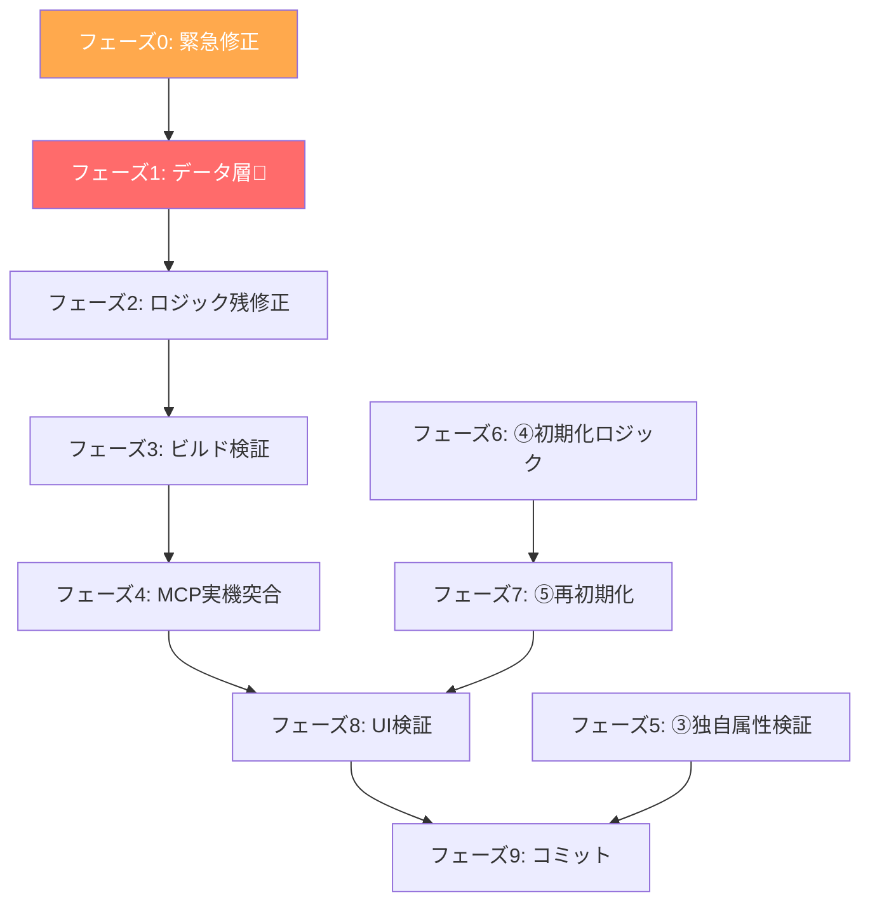

# 48_category_mcp_unification.md — 勘定科目category MCP実機型統一

> 作成: 2026-06-06 07:18（セッション 341b2d01）
> マージ元:
>   - [status_category_unification.md](file:///C:/Users/kazen/.gemini/antigravity-ide/brain/341b2d01-6ea0-460c-b22b-01d6fe758667/status_category_unification.md)（現状整理）
>   - [implementation_plan.md](file:///C:/Users/kazen/.gemini/antigravity-ide/brain/8f775b93-ba46-4b16-b5f4-4d686400acfe/implementation_plan.md)（病人の手紙）
> コミット: 7482170（2026-06-06）
> 最終更新: 2026-06-08（セッション ad30eff1。P6/P7/P8修正反映）

> [!CAUTION]
> **本文書はAIの自己申告を実コード・MCP実機データで裏取りした結果に基づく。**
> 「嘘を検出しようとする」方針で監査し、矛盾がなかった箇所のみ「暫定的に正しい」とする。

---

## 1. 背景

### 1.1 経緯

セッション577033d8のMCP実機テスト（T1）で判明した事実:

| # | 事実 | 根拠 |
|---|---|---|
| 1 | AIが作った全社マスタ190件は「病人の手紙」 | MCP実機11パターンとの突合結果 |
| 2 | 52件のcategoryが「経費」に誤分類（うち47件が誤り） | [t1_mcp_factsheet.md](file:///C:/Users/kazen/.gemini/antigravity-ide/brain/577033d8-ef53-449e-8548-cf7c5de7fe9d/t1_mcp_factsheet.md) |
| 3 | accountGroup導出がcategoryベースのハードコード配列に依存 | account-category-rules.ts旧版のコード精読 |
| 4 | バリデーションが全社マスタを参照（致命的バグ） | accountMasterStore.ts旧版: `getAccountsForValidation()`がclientId未取得 |

### 1.2 全体タスクリスト（577033d8由来）

| # | タスク | 状態 | コミット |
|---|---|---|---|
| **①** | account-master.json修正（190→179件） | ✅ 完了 | `9fecf28`以前 |
| **②** | category体系修正（データ駆動化） | **一部完了（下記参照）** | `7482170` |
| **③** | 独自属性の検証（taxDetermination等） | 未着手 | — |
| **④** | 初期化ロジックの修正 | 未着手 | — |
| **⑤** | 既存6社への影響確認・再初期化 | 未着手（④完了後） | — |

依存関係: ②③④は並行可能。⑤は④に依存。

---

## 2. 設計方針: データ駆動

### 2.1 現在（ハードコード駆動） → あるべき姿（データ駆動）

| 現在（ハードコード） | あるべき姿（データ駆動） |
|---|---|
| `SALES_CATEGORIES = ['売上高', '営業外収益', ...]` | `getAccountGroupDirection(accountGroup)` — accountGroupから直接判定 |
| `getCategoryAccountGroup('売上高')` → ハードコードMap | `row.accountGroup`を直接参照（MFが返した値） |
| `getCategoryDirection('売上高')` → ハードコード配列 | `getAccountGroupDirection('PL_REVENUE')` → データ駆動 |
| カテゴリ表示: 日本語ハードコード | `MF_CATEGORY_LABELS`マップで動的変換 |

### 2.2 データとUIの分離

| 層 | 値 | 例 |
|---|---|---|
| **データ（account-master.json）** | MFの英語カテゴリ名 | `"SELLING_GENERAL_AND_ADMINISTRATIVE_EXPENSES"` |
| **コード（定数・バリデーション）** | MFの英語カテゴリ名 | `BS_ASSET_PURCHASE_CATEGORIES.includes('PROPERTY_PLANT_AND_EQUIPMENT')` |
| **UI表示（ユーザーが見る画面）** | **日本語のみ** | `販管費` |

```
ユーザーが見るもの: 「販管費」
  ↕ MF_CATEGORY_LABELS で変換
内部で持つ値: "SELLING_GENERAL_AND_ADMINISTRATIVE_EXPENSES"
```

---

## 3. Account型フィールド定義

ファイル: [shared-account.ts](file:///c:/dev/receipt-app/src/types/shared-account.ts)

### 3.1 コアフィールド（全科目共通）

| フィールド | 型 | 必須 | 説明 |
|---|---|---|---|
| `accountId` | `string` | ✅ | 内部ID（不変。ローマ字化済み。id属性化リネーム完了 2026-06-06） |
| `name` | `string` | ✅ | MF正式科目名。CSV出力時にそのまま使用 |
| `sub` | `string?` | — | 補助科目 |
| `target` | `AccountTarget` | ✅ | `'corp'` / `'individual'`（both廃止済み。2026-06-06） |
| `accountGroup` | `AccountGroup` | ✅ | `'BS_ASSET'` / `'BS_LIABILITY'` / `'BS_EQUITY'` / `'PL_REVENUE'` / `'PL_EXPENSE'` |
| `category` | `string` | ✅ | 科目分類。**MF英語48種に変換完了（2026-06-06）** |
| `defaultTaxCategoryId` | `string?` | — | デフォルト税区分ID |
| `taxDetermination` | `TaxDetermination` | ✅ | `'auto_purchase'` / `'auto_sales'` / `'fixed'` |

### 3.2 フラグフィールド

| フィールド | 型 | 説明 |
|---|---|---|
| `deprecated` | `boolean?` | 非推奨（true=グレーアウト） |
| `isCustom` | `boolean?` | カスタム科目（ユーザー追加=true） |
| `isMasterCustom` | `boolean?` | マスタカスタム科目 |
| `isContraRevenue` | `boolean?` | 売上返品科目（逆仕訳例外判定用） |
| `isContraExpense` | `boolean?` | 仕入返品科目（逆仕訳例外判定用） |
| `hidden` | `boolean?` | 非表示（勘定科目設定で使用） |

### 3.3 位置・補助フィールド

| フィールド | 型 | 説明 |
|---|---|---|
| `insertAfter` | `string?` | デフォルト順復元用: 挿入位置直前の行ID |
| `subAccount` | `string?` | 補助科目（顧問先別設定画面で動的付与） |

### 3.4 MF連携フィールド（顧問先データでのみ使用。全社マスタではundefined）

| フィールド | 型 | 説明 | 裏取り |
|---|---|---|---|
| `mfAccountId` | `string?` | MF勘定科目ID（Base64）。MCP仕訳送信のaccount_idに使用 | ✅ 全社マスタで0件確認済み |
| `mfAccountGroup` | `string?` | MF大分類（`'ASSET'`/`'LIABILITY'`/`'CAPITAL'`/`'REVENUE'`/`'EXPENSE'`） | ✅ |
| `mfFinancialStatementType` | `string?` | MF財務諸表区分（`'BALANCE_SHEET'`/`'PROFIT_LOSS'`/`'REAL_ESTATE'`） | ✅ |
| ~~`mfDefaultTaxId`~~ | — | **削除済み（2026-06-04）**。MFのtax_idは事業者固有IDで保存する意味がない | ✅ |

### 3.5 型定義

```typescript
export type AccountTarget = 'corp' | 'individual'  // both廃止済み（2026-06-06）
export type TaxDetermination = 'auto_purchase' | 'auto_sales' | 'fixed'
export type AccountGroup = 'BS_ASSET' | 'BS_LIABILITY' | 'BS_EQUITY' | 'PL_REVENUE' | 'PL_EXPENSE'
```

---

## 4. 廃止・新設した定数と関数

### 4.1 廃止した定数（account-category-rules.ts）

| 定数名 | 旧内容 | 廃止理由 | 裏取り |
|---|---|---|---|
| `SALES_CATEGORIES` | `['売上', '不動産収入', '営業外収益', '特別利益']` | accountGroupで判定可能 | ✅ grep: プロダクションコード参照0件（scriptsのみ） |
| `PURCHASE_CATEGORIES` | `['経費', '売上原価', '販管費', ...]` | 同上 | ✅ |
| `BS_ASSET_CATEGORIES` | `['現金及び預金', '売上債権', ...]` | 同上 | ✅ |
| `BS_LIABILITY_CATEGORIES` | `['仕入債務', 'その他流動負債', '固定負債']` | 同上 | ✅ |
| `BS_EQUITY_CATEGORIES` | `['純資産', '事業主貸', ...]` | 同上 | ✅ |
| `OTHER_PL_CATEGORIES` | `['繰戻額等']` | 同上 | ✅ |
| `CATEGORY_GROUPS` | UIグループ定義 | composable化 | ✅ |

### 4.2 廃止した関数

| 関数名 | 旧シグネチャ | 代替 | 裏取り |
|---|---|---|---|
| `getCategoryDirection()` | `(category: string) → 'sales'/'purchase'/'common'` | `getAccountGroupDirection(accountGroup)` | ✅ grep: コメント1件のみ残存。呼び出し0件 |
| `getCategoryAccountGroup()` | `(category: string) → AccountGroup` | `row.accountGroup`直接参照 | ✅ grep: コメント1件のみ残存。呼び出し0件 |
| `getAccountsForValidation()` | `() → {...}[]` | `getClientAccountsForValidation(clientId)` | ✅ grep: 0件（完全削除済み） |
| `getTaxCategoriesForValidation()` | `() → {...}[]` | `getClientTaxCategoriesForValidation(clientId)` | ✅ grep: 0件（完全削除済み） |

### 4.3 新設した関数

| 関数名 | シグネチャ | 目的 | 裏取り |
|---|---|---|---|
| `getAccountGroupDirection()` | `(accountGroup: AccountGroup\|string) → 'sales'\|'purchase'\|'common'` | accountGroupから方向判定（データ駆動） | ✅ 16箇所で使用確認 |
| `getCategoryLabel()` | `(category: string) → string` | MF英語名→日本語ラベル変換 | ✅ MF_CATEGORY_LABELS参照 |
| `getAllowedTaxDeterminations()` | `(accountGroup, category, taxMethod) → TaxDetermination[]` | 許容taxDetermination値取得 | ✅ コード確認済み |
| `deriveCategoryDefaults()` | `(accountGroup, taxCategories?) → {taxDetermination, defaultTaxCategoryId}` | category変更時の自動連動 | ✅ コード確認済み |
| `taxDetLabel()` | `(td: string) → string` | taxDetermination値の日本語ラベル | ✅ |
| `getClientAccountsForValidation()` | `(clientId: string) → {...}[]` | 顧問先別科目取得 | ✅ journalRoutes.ts 3箇所で使用確認 |
| `getClientTaxCategoriesForValidation()` | `(clientId: string) → {...}[]` | 顧問先別税区分取得 | ✅ journalRoutes.ts 3箇所で使用確認 |

### 4.4 変更した定数

| 定数名 | 旧 | 新 | 裏取り |
|---|---|---|---|
| `BS_ASSET_PURCHASE_CATEGORIES` | `['有形固定資産', '無形固定資産']` | `['PROPERTY_PLANT_AND_EQUIPMENT', 'INTANGIBLE_ASSETS']` | ✅ コード確認済み |
| ~~`REAL_ESTATE_CATEGORIES`~~ | `['不動産収入', '不動産経費', '不動産']` | **廃止・削除済み（2026-06-06）** | ✅ grep 0件。MFが個人の不動産有無で科目を出し分けないため、独自フィルタ不要 |

---

## 5. MF_CATEGORY_LABELS（46種。MCP実機48種のうち46種をマッピング）

ファイル: [account-category-rules.ts](file:///c:/dev/receipt-app/src/data/master/account-category-rules.ts) L38-90

### PL収益（6種）

| MF英語名 | 日本語ラベル |
|---|---|
| `NET_SALES` | 売上 |
| `SALES_REVENUE` | 売上（個人） |
| `REAL_ESTATE_INCOME` | 不動産収入 |
| `NON_OPERATING_INCOME` | 営業外収益 |
| `EXTRAORDINARY_INCOME` | 特別利益 |
| `REVERSALS` | 繰戻額等 |

### PL費用（13種）

| MF英語名 | 日本語ラベル |
|---|---|
| `COST_OF_PURCHASED_GOODS` | 売上原価（仕入） |
| `BEGINNING_INVENTORY` | 期首棚卸高 |
| `ENDING_INVENTORY` | 期末棚卸高 |
| `SELLING_GENERAL_AND_ADMINISTRATIVE_EXPENSES` | 販管費 |
| `EXPENSES` | 経費（個人） |
| `REAL_ESTATE_EXPENSES` | 不動産経費 |
| `REAL_ESTATE_EMPLOYEE_SALARY` | 専従者給与（不動産） |
| `NON_OPERATING_EXPENSES` | 営業外費用 |
| `EXTRAORDINARY_LOSSES` | 特別損失 |
| `PROVISIONS` | 引当金繰入 |
| `CORPORATE_INCOME_TAXES_CURRENT` | 法人税等 |
| `CORPORATE_INCOME_TAXES_DEFERRED` | 法人税等調整額 |
| `TRANSFERS_TO_OTHER_ACCOUNTS` | 他勘定振替高 |

### BS資産（11種）

| MF英語名 | 日本語ラベル |
|---|---|
| `CASH_AND_DEPOSITS` | 現金及び預金 |
| `TRADE_RECEIVABLES` | 売上債権 |
| `MARKETABLE_SECURITIES` | 有価証券 |
| `INVENTORIES` | 棚卸資産 |
| `OTHER_CURRENT_ASSETS` | その他流動資産 |
| `PROPERTY_PLANT_AND_EQUIPMENT` | 有形固定資産 |
| `INTANGIBLE_ASSETS` | 無形固定資産 |
| `INVESTMENTS_AND_OTHER_ASSETS` | 投資その他 |
| `DEFERRED_ASSETS` | 繰延資産 |
| `OWNERS_DRAWINGS` | 事業主貸 |
| `SUNDRIES` | 諸口 |

### BS負債（4種）

| MF英語名 | 日本語ラベル |
|---|---|
| `TRADE_PAYABLES` | 仕入債務 |
| `OTHER_CURRENT_LIABILITIES` | その他流動負債 |
| `NON_CURRENT_LIABILITIES` | 固定負債 |
| `OWNERS_CAPITAL` | 事業主借 |

### BS純資産（12種）

| MF英語名 | 日本語ラベル |
|---|---|
| `CAPITAL_STOCK` | 資本金 |
| `EQUITY` | 純資産 |
| `LEGAL_CAPITAL_SURPLUS` | 資本準備金 |
| `OTHER_CAPITAL_SURPLUS` | その他資本剰余金 |
| `STOCK_SUBSCRIPTION_DEPOSITS` | 新株式申込証拠金 |
| `LEGAL_RETAINED_EARNINGS` | 利益準備金 |
| `APPROPRIATED_RETAINED_EARNINGS` | 別途積立金 |
| `RETAINED_EARNINGS_BROUGHT_FORWARD` | 繰越利益剰余金 |
| `TREASURY_STOCK` | 自己株式 |
| `TREASURY_STOCK_SUBSCRIPTION_DEPOSITS` | 自己株式申込証拠金 |
| `VALUATION_AND_TRANSLATION_ADJUSTMENTS` | 評価・換算差額等 |
| `SUBSCRIPTION_RIGHTS_TO_SHARES` | 新株予約権 |

### MCP実機48種のうち未マッピング（2種）

| MF英語名 | 推定日本語 | MFでの用途 |
|---|---|---|
| `BEGINNING_MERCHANDISE_INVENTORY` | 期首商品棚卸高 | 法人の棚卸（`BEGINNING_INVENTORY`は個人用） |
| `ENDING_MERCHANDISE_INVENTORY` | 期末商品棚卸高 | 法人の棚卸（`ENDING_INVENTORY`は個人用） |

> [!NOTE]
> MF_CATEGORY_LABELSは46種。MCP実機48種との差分は上記2種のみ。
> いずれも法人の棚卸カテゴリで、`BEGINNING_INVENTORY`/`ENDING_INVENTORY`（個人）と対になる。
> §8フェーズ2-Bで追加予定。

---

## 6. 裏取りで発見した嘘・問題（8件）

### 6.1 ✅ ~~account-master.jsonのcategoryが日本語29種のまま~~ → 修正済み（2026-06-06）

| 項目 | 設計書の記載 | 旧実態 | 修正後 |
|---|---|---|---|
| implementation_plan.md L95 | 「179件のcategoryを29種日本語 → MF48種英語に書き換え」 | ~~日本語29種のまま~~ | ✅ MF英語46種に変換完了 |
| walkthrough.md L11 | 「全46種、全てMF英語名。日本語残存ゼロ」 | ~~嘘~~ | ✅ 事実になった |

> [!NOTE]
> **2026-06-06 フェーズ1で修正済み。** 179件全てのcategoryをMCP実機データ（tst-free.json/tsk-free.json）に基づいて英語化。
> 全件突合: 一致179件、不一致0件。accountGroupも5件修正（MCP実機に合わせて）。

### 6.2 🔴 顧問先データも日本語29種のまま＋科目数190件

| 項目 | 設計書の想定 | 実態 |
|---|---|---|
| 顧問先科目数 | 179件（①で190→179に修正済み） | **190件のまま** |
| 顧問先category | MF英語名 | **日本語29種のまま** |
| 顧問先MF ID | 164件保持 | ✅ 正常 |

裏取り方法: `accounts-c_2sAINrqz.json` 等を直接読み込み。

> [!CAUTION]
> **①で全社マスタを179件に修正したが、顧問先データへの再同期が行われていない。**
> 顧問先データは旧190件のまま。11件の削除が反映されていない。
> これは④「初期化ロジックの修正」→ ⑤「既存6社への再初期化」で対処予定。

### 6.3 ⚠️ MF_CATEGORY_LABELSが46種（設計書は48種と記載）

| 項目 | 設計書の記載 | 実態 |
|---|---|---|
| implementation_plan.md L126 | 「48種」 | 46種 |
| MCP実機データ | 48種確認 | コード上は46種マッピング済み。不足2種のみ |

不足2種: `BEGINNING_MERCHANDISE_INVENTORY`（期首商品棚卸高）、`ENDING_MERCHANDISE_INVENTORY`（期末商品棚卸高）。
いずれも法人の棚卸カテゴリで、既存の`BEGINNING_INVENTORY`/`ENDING_INVENTORY`（個人）と対になる。

### 6.4 ✅ ~~voucherTypeRules.ts L175, L179に日本語残存~~ → 修正済み（2026-06-06）

```typescript
// 修正前:
allowedCategories: ['現金及び預金'],
// 修正後:
allowedCategories: ['CASH_AND_DEPOSITS'],
```

> [!NOTE]
> **2026-06-06 フェーズ1のcategory英語化に伴い修正。** データ側を英語化したため、コード側も合わせて変更（放置すると壊れる）。

### 6.5 ⚠️ useCategoryGroups.ts — 設計書に記載なし

新規ファイル（2,082B）。composableとしてカテゴリグループ表示ロジックを抽出。
設計書（implementation_plan.md）に記載なし。walkthrough.md L107で「将来抽出すべき」と記載されているが、実際には既に作成済み。

### 6.6 ✅ ~~BS_ASSET_PURCHASE_CATEGORIESとREAL_ESTATE_CATEGORIESの不整合~~ → 不動産フィルタ廃止により部分解消

~~コード側はMF英語名だが、account-master.jsonのcategoryは日本語のまま。~~

**2026-06-06 対処済み:**
- `REAL_ESTATE_CATEGORIES` → **定数ごと廃止・削除**。MFが個人の不動産有無で科目を出し分けない（MCP実機6パターン全て108件同一）ため、独自フィルタ自体が不要
- `businessType = 'realEstate'` → **廃止**。`corp` / `individual` の2種のみ
- 修正ファイル: account-category-rules.ts, accountMasterStore.ts, accountMasterRoutes.ts, MockMasterAccountsPage.vue, MockClientAccountsPage.vue
- `vue-tsc --noEmit` パス確認済み

**残存:**
- `BS_ASSET_PURCHASE_CATEGORIES.includes(category)` の不整合は残存。フェーズ1（category英語化）完了で自動解消

| 比較 | コード側の値 | データ側の値 | 結果 | 状態 |
|---|---|---|---|---|
| `BS_ASSET_PURCHASE_CATEGORIES.includes(category)` | `'PROPERTY_PLANT_AND_EQUIPMENT'` | `'有形固定資産'` | **❌ false（バグ）** | フェーズ1で解消予定 |
| ~~`REAL_ESTATE_CATEGORIES.includes(category)`~~ | — | — | — | **廃止済み** |

> [!NOTE]
> **不動産フィルタ廃止の根拠:**
> MCP実機データ（t1_mcp_factsheet.md §1 L198-210）で個人6パターン全て108件・26種が完全固定。
> 不動産の有無・課税方式・業種の影響ゼロ。MFが出し分けないものを独自に出し分ける根拠がない。

### 6.7 ⚠️ test-account-classifier.ts にSALES_CATEGORIESの再定義

scriptsディレクトリ内のテストスクリプト（`test-account-classifier.ts` L106）に`SALES_CATEGORIES`がローカル変数として再定義されている。プロダクションコードではないが、混乱の元。

### 6.8 ⚠️ eslint / vite build / lint:hardcode 未実行

型チェック（`vue-tsc --noEmit`）は通過したが、その他の検証は未実施。

---

## 7. 実装状況サマリ（裏取り結果）

| # | 項目 | 設計書の記載 | 裏取り結果 | 判定 |
|---|---|---|---|---|
| 1 | account-master.json category修正 | 日本語→MF英語 | ✅ **MF英語46種に変換完了（2026-06-06）** | 修正済み |
| 2 | accountGroup 5種設定 | MFから直接設定 | ✅ 5種、未設定0件。**5件修正済み（2026-06-06）** | 修正済み |
| 3 | mfAccountId全社マスタから除外 | 0件 | ✅ 0件 | 暫定的に正しい |
| 4 | SALES_CATEGORIES等ハードコード配列廃止 | 全廃止 | ✅ プロダクション参照0件 | 暫定的に正しい |
| 5 | getCategoryDirection廃止 | 廃止 | ✅ 呼び出し0件 | 暫定的に正しい |
| 6 | getCategoryAccountGroup廃止 | 廃止 | ✅ 呼び出し0件 | 暫定的に正しい |
| 7 | getAccountGroupDirection新設 | データ駆動 | ✅ 16箇所で使用 | 暫定的に正しい |
| 8 | MF_CATEGORY_LABELS 48種 | 48種 | ⚠️ **46種**（2種不足） | 要追加 |
| 9 | バリデーション顧問先別化 | clientId取得 | ✅ 3箇所変更確認 | 暫定的に正しい |
| 10 | 旧バリデーション関数削除 | 完全削除 | ✅ grep 0件 | 暫定的に正しい |
| 11 | voucherTypeRules MF英語化 | 全変更 | ✅ **L175,L179修正済み（2026-06-06）** | 修正済み |
| 12 | UI getCategoryLabel使用 | 日本語表示 | ✅ 使用確認 | 暫定的に正しい |
| 13 | vue-tsc --noEmit | パス | ✅ パス | 事実 |
| 14 | 顧問先データ同期 | — | ✅ **起動時syncで241件に同期済み（2026-06-08確認）** | 同期済み |
| 15 | 不動産フィルタ | businessType=realEstate | ✅ **廃止・削除済み（2026-06-06）** | MFが出し分けないため不要 |

---

## 8. 全体タスク（フェーズ別詳細）

### フェーズ0: 緊急修正（データ層とコード層の不整合解消） ✅ 完了

| # | タスク | 状態 | 対処内容 |
|---|---|---|---|
| 0-A | 不動産フィルタの確認 | ✅ 完了 | MCP実機で個人6パターン全て108件同一を再確認。MFが出し分けないため、**不動産フィルタ自体を廃止・削除**。`REAL_ESTATE_CATEGORIES`定数削除、`businessType='realEstate'`廃止、UIから不動産ラジオボタン/チェックボックス削除。影響5ファイル。`vue-tsc --noEmit` パス |
| 0-B | BS資産auto_purchase判定 | → フェーズ1へ | `BS_ASSET_PURCHASE_CATEGORIES.includes(category)` が日本語categoryで常にfalse。フェーズ1（category英語化）完了で自動解消 |
| 0-C | voucherTypeRules日本語残存 | → フェーズ2へ | `allowedCategories: ['現金及び預金']` → `['CASH_AND_DEPOSITS']`。フェーズ2-Aで修正予定 |

> [!NOTE]
> **フェーズ0の結論: 0-Aは「暫定対処」ではなく「廃止」に変更。**
> MFが不動産の有無で科目を出し分けないことがMCP実機で確認済みのため、
> 独自フィルタ自体が不要。バグの温床を根本から除去。
> 0-B/0-Cはフェーズ1-2に合流。

---

### フェーズ1: データ層 — account-master.jsonのcategory MF英語化 ✅ 完了

> ~~**§6.1の嘘を修正する。データ駆動化の根幹。**~~ → **2026-06-06 修正完了。**

#### 設計判断: MFのcategory（48種）をそのまま準用する（2026-06-06 承認済み）

**選択肢:**

| 選択肢 | 内容 |
|---|---|
| **A（採用）** | MFのcategory（48種）をそのまま`account-master.json`の`category`フィールドに格納 |
| B（却下） | すぐする独自29種を維持し、MF英語名に1対1マッピング |
| C（却下） | 新しい独自体系を設計 |

**A案採用の理由:**

| # | 理由 | 根拠（全てMCP実機データに基づく） |
|---|---|---|
| 1 | **すぐする29種を維持する正当性がない** | t1_mcp_factsheet §2: 「経費」52件中47件が誤分類。29種はAIが作った「病人の手紙」 |
| 2 | **変換層が不要になる** | 変換層はバグの温床。「経費」47件誤分類がまさに変換層の失敗 |
| 3 | **コード側は既にMFカテゴリ前提で書かれている** | `MF_CATEGORY_LABELS`（46種）、`mf-account-category-mapping.ts`、`BS_ASSET_PURCHASE_CATEGORIES`全てMF英語名。データ側だけが日本語で取り残されている |
| 4 | **MFから新科目追加時に自動でcategoryが決まる** | MCP `getAccounts`が返す`category`をそのまま使える。独自マッピング不要 |
| 5 | **accountGroup導出は48種→5種マッピングで同じことができる** | 粒度が細かくなるだけで問題なし。純資産12種→BS_EQUITY等 |
| 6 | **UIの日本語表示は解決済み** | `getCategoryLabel()`（MF英語名→日本語ラベル変換）が実装済み。ユーザーには影響なし |

**B/C案却下の理由:**

| 選択肢 | 却下理由 |
|---|---|
| B（独自29種維持+マッピング） | 29種が病人の手紙。維持する意味がない。変換層を追加するとバグの温床が増える |
| C（新体系設計） | MFがSSOT。独自体系を作る理由がない。作ればまた「病人の手紙」になる |

**懸念と対策:**

MFの48種は粒度が細かい（純資産系だけで12種）。しかしこれは問題ではなくメリット。

| 懸念 | 対策 |
|---|---|
| 48種は多すぎないか | `getAllowedTaxDeterminations()`等はaccountGroup（5種）で判定。categoryの粒度に依存しない |
| 証票意味ルールのallowedCategories | MF48種に合わせて書き換える（フェーズ2） |
| UIカテゴリグループ表示 | `useCategoryGroups.ts`で48種を5つのaccountGroupでグルーピング。同等以上のUX |

> [!IMPORTANT]
> **原則: MFがSSOTである以上、MFの分類体系をそのまま使う。独自の分類体系を作らない。**
> 独自分類は変換層を生み、変換層はバグを生む。今回の「経費」47件誤分類がその証拠。

| # | タスク | 詳細 | 結果 |
|---|---|---|---|
| 1-A | MCP実機データから変換マップ作成 | `tst-free.json`（法人133件）+ `tsk-free.json`（個人108件）から`name→category`マップ構築 | ✅ 179件全てマッチ |
| 1-B | account-master.json 179件のcategory書き換え | 旧日本語29種 → MF英語46種。MCP実機マップに基づく | ✅ 179件全て変更 |
| 1-C | 変換結果の全件突合 | 変換後179件をMCP実機categoryと照合 | ✅ 一致179件、不一致0件 |
| 1-D | accountGroupの再検証 | MCP実機`account_group`と突合。5件修正 | ✅ 一致179件、不一致0件 |

#### 変換ルール（MCP実機由来。全件`data/mcp-raw/*.json`から抽出）

| 旧日本語category | → | MF英語category | 対象科目数（概算） |
|---|---|---|---|
| 現金及び預金 | → | `CASH_AND_DEPOSITS` | 5件 |
| 売上債権 | → | `TRADE_RECEIVABLES` | 3件 |
| 有価証券 | → | `MARKETABLE_SECURITIES` | 2件 |
| その他流動資産 | → | `OTHER_CURRENT_ASSETS` | 12件 |
| 有形固定資産 | → | `PROPERTY_PLANT_AND_EQUIPMENT` | 6件 |
| 無形固定資産 | → | `INTANGIBLE_ASSETS` | 4件 |
| 投資その他 | → | `INVESTMENTS_AND_OTHER_ASSETS` | 8件 |
| 棚卸資産 | → | `INVENTORIES` | 3件 |
| 繰延資産 | → | `DEFERRED_ASSETS` | 2件 |
| 仕入債務 | → | `TRADE_PAYABLES` | 2件 |
| その他流動負債 | → | `OTHER_CURRENT_LIABILITIES` | 15件 |
| 固定負債 | → | `NON_CURRENT_LIABILITIES` | 4件 |
| 純資産 | → | 複数（`EQUITY`, `CAPITAL_STOCK`等12種） | 複数（MCP実機から科目名でマッチ） |
| 事業主貸 | → | `OWNERS_DRAWINGS` | 1件 |
| 事業主借 | → | `OWNERS_CAPITAL` | 1件 |
| 資本の部 | → | 複数（`CAPITAL_STOCK`等） | 複数 |
| 諸口 | → | `SUNDRIES` | 1件 |
| 売上 | → | `NET_SALES` or `SALES_REVENUE` | 複数（法人/個人で異なる） |
| 売上原価 | → | `COST_OF_PURCHASED_GOODS` or `BEGINNING_INVENTORY` or `ENDING_INVENTORY` | 複数 |
| 経費 | → | 複数（`SELLING_GENERAL_AND_ADMINISTRATIVE_EXPENSES`, `EXPENSES`等） | **52件→正しい分類に修正** |
| 販管費 | → | `SELLING_GENERAL_AND_ADMINISTRATIVE_EXPENSES` | 複数 |
| 営業外収益 | → | `NON_OPERATING_INCOME` | 3件 |
| 営業外費用 | → | `NON_OPERATING_EXPENSES` | 2件 |
| 特別利益 | → | `EXTRAORDINARY_INCOME` | 2件 |
| 特別損失 | → | `EXTRAORDINARY_LOSSES` | 2件 |
| 繰入額等 | → | `PROVISIONS` | 複数 |
| 繰戻額等 | → | `REVERSALS` | 複数 |
| 不動産収入 | → | `REAL_ESTATE_INCOME` | 複数 |
| 不動産経費 | → | `REAL_ESTATE_EXPENSES` or `REAL_ESTATE_EMPLOYEE_SALARY` | 複数 |

> [!IMPORTANT]
> **「経費」52件が最大の問題**（t1_mcp_factsheet.md参照）。47件が誤分類。
> 1科目ずつMCP実機データの`name`で検索して正しいMFカテゴリを特定する必要がある。
> AIの推測ではなく、MCP実機が返した`category`フィールドの値のみ使用する。

#### 実施結果（2026-06-06 完了）

| # | タスク | 結果 |
|---|---|---|
| 1-A | MCP実機マップ構築 | ✅ 法人133件（tst-free.json）+ 個人108件（tsk-free.json）。179件全てマッチ、アンマッチ0件 |
| 1-B | category書き換え | ✅ 179件全て変更。日本語29種 → MF英語46種 |
| 1-C | 全件突合 | ✅ category一致179件、不一致0件 |
| 1-D | accountGroup再検証 | ✅ 5件修正後、一致179件、不一致0件 |

**accountGroup修正5件（MCP実機に合わせて修正）:**

| 科目 | 旧（病人の手紙） | 新（MCP実機） | 会計的意味 |
|---|---|---|---|
| 事業主貸 | BS_EQUITY | **BS_ASSET** | 個人事業主への貸付 = 資産 |
| 事業主借 | BS_EQUITY | **BS_LIABILITY** | 個人事業主からの借入 = 負債 |
| 未確定勘定 | BS_EQUITY | **BS_ASSET** | MFは資産として扱う |
| 貸倒引当金戻入 | PL_EXPENSE | **PL_REVENUE** | 戻入 = 収益 |
| 資産譲渡損 | BS_EQUITY | **BS_ASSET** | MFは資産として扱う |

**追加修正: voucherTypeRules.ts L175,L179**
- `allowedCategories: ['現金及び預金']` → `['CASH_AND_DEPOSITS']`
- フェーズ1のcategory英語化でデータ側が英語になったため、コード側も合わせて修正（放置すると壊れる）

**放置（承認済み）: both科目24件の法人/個人category差異**
- 法人=`SELLING_GENERAL_AND_ADMINISTRATIVE_EXPENSES`、個人=`EXPENSES`等
- accountGroupは法人/個人で同一（PL_EXPENSE）。機能的影響ゼロ
- UI表示で個人モード時に「販管費」と表示される（MFでは「経費」）。表示上の差異のみ。放置

---

### フェーズ1.5: both廃止 ✅ 完了（2026-06-06）

> **`target=both`の62件を法人（`_CORP`）・個人（`_IND`）に分割。179件→241件に拡張。**

#### 設計判断: B案（法人=`元ID_CORP`、個人=`元ID_IND`）採用

| # | タスク | 結果 |
|---|---|---|
| 1 | MCP実機データで法人/個人のcategory・accountGroup差異を確認 | ✅ 62件分割。MCP実機のcategory・accountGroupを反映 |
| 2 | account-master.json更新 | ✅ 179件→241件（corp=133、individual=108） |
| 3 | ID重複チェック | ✅ 0件 |
| 4 | MCP実機突合 | ✅ category 241件一致、NG 0件。accountGroup 241件一致、NG 0件 |
| 5 | コード内both参照12箇所修正 | ✅ 全件修正。`'both'`残存0件 |
| 6 | 型定義更新 | ✅ `AccountTarget`から`'both'`削除 |
| 7 | vue-tsc --noEmit | ✅ パス |

**修正ファイル（コード12箇所）:**

| ファイル | 修正内容 |
|---|---|
| `shared-account.ts` | `AccountTarget`から`'both'`削除 |
| `mf-account-category-mapping.ts` | `deriveTarget()`のデフォルト戻り値を`'both'`→`'corp'`に変更 |
| `accountMasterStore.ts` | L172-176のbothフィルタを単純等値比較に変更。L351も同様 |
| `MockMasterAccountsPage.vue` | targetLabelから`'共通'`削除。フィルタの`'both'`比較削除 |
| `MockClientAccountsPage.vue` | 同上 |
| `JournalListLevel3Mock.vue` | L2744の`target==='both'`フィルタ削除。L2795の`'both'`優先判定削除 |
| `helpers.ts` | デフォルトtarget `'both'`→`'corp'`に変更 |

### フェーズ2: ロジック層の残修正

| # | タスク | ファイル | 行 | 詳細 | 状態 |
|---|---|---|---|---|---|
| 2-A | voucherTypeRules.ts 日本語残存修正 | [voucherTypeRules.ts](file:///c:/dev/receipt-app/src/data/master/voucherTypeRules.ts) | L175, L179 | `'現金及び預金'` → `'CASH_AND_DEPOSITS'` | ✅ フェーズ1で実施済み |
| 2-B | MF_CATEGORY_LABELS 不足2種追加 | [account-category-rules.ts](file:///c:/dev/receipt-app/src/data/master/account-category-rules.ts) | L38-90内 | `'BEGINNING_MERCHANDISE_INVENTORY': '期首商品棚卸高'` と `'ENDING_MERCHANDISE_INVENTORY': '期末商品棚卸高'` を追加 | 未実施 |
| 2-C | test-account-classifier.ts ALL_CATEGORIES英語化 | [test-account-classifier.ts](file:///c:/dev/receipt-app/src/scripts/test-account-classifier.ts) | L94-141 | 日本語29種→MF英語48種。deriveAccountGroup()もMF英語対応 | ✅ 完了（3-1/3-2） |

---

### フェーズ3: ビルド検証 ✅ 完了（2026-06-06）

| # | タスク | コマンド | 結果 |
|---|---|---|---|
| 3-A | TypeScript型チェック | `npx vue-tsc --noEmit` | ✅ エラー0件 |
| 3-B | ESLint | `npm run lint` | ⚠️ 21エラー（**全て既存。今回の変更による新規0件**） |
| 3-C | Viteビルド | `npm run build` | ✅ ビルド成功（7.53s） |
| 3-D | ハードコード検査 | — | 未実施 |

---

### フェーズ4: MCP実機との最終突合 ✅ 完了（2026-06-06）

| # | タスク | 結果 |
|---|---|---|
| 4-A | account-master.json全件category突合 | ✅ 241件一致、不一致0件（both廃止後） |
| 4-B | account-master.json全件accountGroup突合 | ✅ 241件一致、不一致0件 |
| 4-C | BS_ASSET_PURCHASE_CATEGORIES動作確認 | 未実施 |
| 4-D | ~~REAL_ESTATE_CATEGORIES動作確認~~ | ✅ 不動産フィルタ自体が廃止済み。不要 |

---

### フェーズ5: ③ 独自属性の検証（taxDetermination等）

> ②と並行可能。依存関係なし。

| # | タスク | 詳細 |
|---|---|---|
| 5-A | taxDetermination全件検証 | 179件のtaxDeterminationが正しいか。MCP実機データの`account_group`と突合して、PL_REVENUE→auto_sales、PL_EXPENSE→auto_purchase、BS→fixedが原則 |
| 5-B | BS_ASSET例外検証 | 有形固定資産・無形固定資産のtaxDetermination = `auto_purchase`であることを確認 |
| 5-C | isContraRevenue/isContraExpense検証 | 売上値引・仕入値引等のフラグが正しく設定されているか確認 |
| 5-D | deprecated検証 | 非推奨科目のフラグが正しいか確認 |
| 5-E | target検証 | 法人/個人/両方の分類がMCP実機と整合しているか確認 |

---

### フェーズ6: ④ 初期化ロジックの修正

> ②と並行可能。依存関係なし。

| # | タスク | ファイル | 詳細 |
|---|---|---|---|
| 6-A | getClientAccounts()初期化ロジック確認 | [accountMasterStore.ts](file:///c:/dev/receipt-app/src/api/services/accountMasterStore.ts) L331-341 | 初回アクセス時にマスタからクローン（`masterAccounts.map(a => ({...a}))`）。MFフィールドはマスタに存在しないのでクローンされない（正常） |
| 6-B | syncMasterAccountsToClients()の削除同期追加 | [accountMasterStore.ts](file:///c:/dev/receipt-app/src/api/services/accountMasterStore.ts) L240-278 | 現在: 新規追加・名前変更のみ。**削除は反映しない**（仕訳参照を壊さないため）。→ ⑤で手動再初期化が必要 |
| 6-C | syncのcategory/accountGroup同期追加検討 | 同上 | 現在: `name`のみ同期。category/accountGroupの変更は反映されない。→ sync対象フィールドの拡張が必要か検討 |
| 6-D | 初期化時のsortOrder確認 | 同上 | `sortOrder`フィールドが存在しない科目がないか確認（L189でソートに使用） |

---

### フェーズ7: ⑤ 既存10社への影響確認・再初期化

> ④（フェーズ6）完了後に実施。

| # | タスク | 詳細 |
|---|---|---|
| 7-A | 顧問先データの現状把握 | 10社のaccounts-{clientId}.json: 科目数、category言語、MF ID保持数を全件調査 |
| 7-B | 再初期化スクリプト作成 | 顧問先データのcategory/accountGroupをマスタ基準で更新。MFフィールド（mfAccountId等）は保持。削除された11件の科目を除外（仕訳参照がない場合のみ） |
| 7-C | 各顧問先の仕訳データとの参照整合性チェック | 削除対象11件のIDが仕訳で使用されていないか確認。使用されている場合は削除ではなく`deprecated: true`に設定 |
| 7-D | 再初期化の実行 | 10社全てに対してスクリプト実行。バックアップ→変換→検証 |
| 7-E | ブラウザで表示確認 | 各顧問先の科目一覧画面で科目数・カテゴリ表示が正常であることを確認 |

---

### フェーズ8: UI・ブラウザ検証

| # | タスク | 画面 | 確認内容 |
|---|---|---|---|
| 8-A | 全社マスタ科目一覧 | `/master/accounts` | 科目数241件（法人133+個人108）。カテゴリが日本語で表示。法人/個人フィルタ正常 |
| 8-B | 顧問先科目一覧 | `/client-settings/accounts/{clientId}` | 科目数正常。MFインポート済み科目の表示。カテゴリ日本語表示 |
| 8-C | 仕訳入力ドロップダウン | `/journal-list/{clientId}` | 科目ドロップダウンのグループ表示（💰売上/📋経費・仕入/🏦資産・負債）。カテゴリ日本語ラベル |
| 8-D | バリデーション | `/journal-list/{clientId}` → バリデーション実行 | エラーなし。税区分の自動判定が正常 |
| 8-E | 証票意味ルール | 仕訳入力 → 証票意味選択 | allowedCategories判定が正常動作 |

---

### フェーズ8.5: MFインポート・科目CRUD検証

> ユーザー指示（2026-06-07）で追加。
> **2026-06-07 実コード調査完了。** 2系統の実装と5つの問題を発見。
> **2026-06-07 P1/P2/P3修正完了。** generateMasterId（Gemini 3.5-flash）導入。名前照合+重複チェック+税区分紐づけ。
> **2026-06-08 P6/P7/P8修正完了。** defaultTaxCategoryId MCP上書き+事業形態フィルタ+target判定バグ修正。

#### 8.5-0: MFインポート2系統の実態（実コード調査: 2026-06-07）

MF勘定科目のインポートは**独立した2系統**が存在する（呼び出し関係なし）。

| # | API | 実装ファイル | 保存先 | 用途 |
|---|---|---|---|---|
| **B** | `POST /api/mf/import-master-accounts` | [mfAccountImportService.ts](file:///c:/dev/receipt-app/src/api/services/mfAccountImportService.ts) | `account-master.json`（全社マスタ） | 全社マスタへの差分マージ。新規追加のみ |
| **C** | `POST /api/mf/sync-all`（科目処理部分） | [mfRoutes.ts L434-540](file:///c:/dev/receipt-app/src/api/routes/mfRoutes.ts#L434) | `accounts-{clientId}.json`（顧問先個別） | 顧問先データの全上書き |
| **C2** | `POST /api/mf/import-client-accounts` | [mfRoutes.ts L786-910](file:///c:/dev/receipt-app/src/api/routes/mfRoutes.ts#L786) | `accounts-{clientId}.json`（顧問先個別） | 顧問先科目のMFインポートボタンから発火 |

##### B: import-master-accounts の処理フロー

```
1. mcpFetchAccounts(clientId) → MF科目取得
2. mcpFetchTaxes(clientId) → MF税区分取得（税区分紐づけ用）
3. 顧問先の事業形態でフィルタ（clientType = isIndividualType(client.type) ? 'individual' : 'corp'）
4. 名前照合（nameToRow: targetが一致する科目のみマップに追加。73件同名科目の誤マッチ防止）
5. マッチ → defaultTaxCategoryIdをMCPの値で常に上書き（MCP実機が正確。手動設定は不正確）
6. 未マッチ → 新規追加（target=clientTypeで動的決定。IDは generateMasterId(Gemini 3.5-flash)でローマ字ID生成 ✅ P1/P8修正済み）
7. existingIdsで重複チェック+累積追加 ✅
8. saveAllAccounts(masterItems) → account-master.json保存
```

ソース: [mfAccountImportService.ts L82-215](file:///c:/dev/receipt-app/src/api/services/mfAccountImportService.ts#L82)

##### C: sync-all の科目処理フロー

```
1. mcpFetchAccounts(clientId) → MF科目取得
2. available科目のみ抽出
3. 全社マスタ＋顧問先マスタ（保存済みの場合のみ）と名前照合 ✅ P2修正済み
4. マッチ → マスタのローマ字IDを継承 ✅
5. 未マッチ → generateMasterId(Gemini 3.5-flash)でローマ字ID生成 ✅
6. defaultTaxCategoryId = MCPの値を優先（masterTaxId || master.defaultTaxCategoryId）✅ P3/P7修正済み
7. existingIdsで重複チェック+累積追加 ✅
8. saveClientAccounts(clientId, mapped) → accounts-{clientId}.json保存
```

ソース: [mfRoutes.ts L434-456](file:///c:/dev/receipt-app/src/api/routes/mfRoutes.ts#L434)

##### B/C 比較表

| 項目 | B: import-master-accounts | C: sync-all / C2: import-client-accounts |
|---|---|---|
| 科目照合 | 名前照合（事業形態フィルタ付き。P6修正済み） ✅ | 全社+顧問先名前照合 ✅（P2修正済み） |
| 新規科目ID | `generateMasterId()` ✅（P1修正済み） | `generateMasterId()` ✅（P2修正済み） |
| 新規科目target | `clientType`（顧問先の事業形態）✅（P8修正済み） | `clientType` ✅ |
| category | `mf.category`（MF英語名 ✅） | `a.category`（MF英語名 ✅） |
| accountGroup | `deriveMfAccountGroup()` ✅ | `deriveMfAccountGroup()` ✅ |
| taxDetermination | `deriveTaxDetermination()` ✅ | `deriveTaxDetermination()` ✅ |
| defaultTaxCategoryId | MCPの値で常に上書き ✅（P6修正済み） | MCP優先+全社フォールバック ✅（P7修正済み） |
| MFフィールド | 全社マスタに含めない ✅ | `mfAccountId`等を保存 ✅ |
| 削除処理 | なし（追加のみ） | 全上書き（MFにない科目は消える） |
| 重複チェック | `existingIds` + `add` ✅ | `existingIds`（全社+顧問先）+ `add` ✅ |
| 初回実行 | — | `hasClientAccounts`で2重登録防止 ✅ |

#### 8.5-1: 発見した問題（5件）と対処状況

| # | 問題 | 深刻度 | 対処 |
|---|---|---|---|
| **P1** | B: 新規科目IDが`MF_日本語名`になる | ✅ **修正済み（2026-06-07）** | `generateMasterId()`（Gemini 3.5-flash）でローマ字ID生成に変更。`existingIds`で重複チェック+累積追加 |
| **P2** | C: `accountId`にMFのBase64 IDを使用 | ✅ **修正済み（2026-06-07）** | 全社+顧問先マスタと名前照合。マッチ→マスタID継承。未マッチ→`generateMasterId()`。`hasClientAccounts`で初回2重登録防止 |
| **P3** | C: `defaultTaxCategoryId`が常にundefined | ✅ **修正済み（2026-06-07）** | MFのtax_id→名前→マスタIDの二段階変換をB系統から移植 |
| **P4** | B/C両方: 削除検知なし | ⚠️ 未対処 | Bでは不要科目が全社マスタに残り続ける。Cでは逆にMFから消えた科目が消える（仕訳参照が壊れる） |
| **P5** | B: 名前変更検知不可 | ⚠️ 未対処 | 全社マスタにmfAccountIdがないためMF側の科目名変更を検知できない |
| **P6** | B: `defaultTaxCategoryId`がMCP実機と不一致（法人10件+個人8件） | ✅ **修正済み（2026-06-08）** | MCPの値で常に上書き + 事業形態フィルタ（73件同名科目対策）+ `isIndividualType()`ヘルパー使用 |
| **P7** | C: `defaultTaxCategoryId`が全社マスタ優先でMCP変更を無視 | ✅ **修正済み（2026-06-08）** | `masterTaxId \|\| master.defaultTaxCategoryId` に順序逆転。MCP優先、未取得時のみ全社フォールバック |
| **P8** | B: 新規科目のtargetが常にcorp（個人4件が法人として追加される） | ✅ **修正済み（2026-06-08）** | `deriveTarget(mf.category)`→`clientType`（顧問先の事業形態）に変更。`deriveTarget()`はMFカテゴリから推定するが法人/個人判別に使えないため廃止 |

> [!NOTE]
> **P1/P2/P3は2026-06-07に修正完了。** `generateMasterId()`（Gemini 3.5-flash）導入済み。
> Gemini API実機テスト5件+重複テスト全パス。`vue-tsc --noEmit` パス。
> **P6/P7/P8は2026-06-08に修正完了。** 事業形態フィルタ導入+MCP上書き+target動的決定。
> P4/P5は設計判断が必要なため未対処。

#### 8.5-A: MFインポート機能の確認

| # | タスク | 確認内容 | 状態 |
|---|---|---|---|
| A-1 | B系統（全社マスタ）の正常動作 | `import-master-accounts` → 名前照合+差分マージ+税区分紐づけ | ✅ コード確認済み（問題P1/P5あり） |
| A-2 | C系統（顧問先個別）の正常動作 | `sync-all` → MF科目全上書き | ✅ コード確認済み（問題P2/P3/P4あり） |
| A-3 | インポート後のcategory | B/C両方ともMFの英語categoryをそのまま保存 | ✅ 正常 |
| A-4 | インポート後のaccountGroup | B/C両方とも`deriveMfAccountGroup()`でマッピング | ✅ 正常 |

#### 8.5-B: 全社マスタと個別企業の勘定科目整合性

| # | タスク | 確認内容 | 状態 |
|---|---|---|---|
| B-1 | 全社マスタ241件の整合性 | category/accountGroup/taxDetermination全フィールドが正しいか | ✅ 完了（taxDetermination 60件修正済み、category MCP突合済み） |
| B-2 | 個別企業10社の科目一致 | 起動時syncで全社マスタと同期されているか（241件、全フィールド一致） | ✅ 確認済み（NG 0件） |
| B-3 | MFインポート済み企業のMFフィールド | `mfAccountId`等が正しく保持されているか | 未確認 |
| B-4 | ID体系の不整合 | 全社=ローマ字ID / B新規=ローマ字ID / C=ローマ字ID。全系統統一済み | ✅ P1/P2修正済み |

#### 8.5-C: 勘定科目→税区分紐づけのMCP取得可否

| # | タスク | 確認内容 | 状態 |
|---|---|---|---|
| C-1 | B系統の税区分紐づけ | MFのtax_id→MF税区分名→マスタIDの二段階変換 + MCPの値で常に上書き | ✅ P6修正済み（2026-06-08） |
| C-2 | C系統の税区分紐づけ | MCP優先 + 全社マスタフォールバック | ✅ P3/P7修正済み（2026-06-07/08） |
| C-3 | taxDetermination導出 | B/C両方とも`deriveTaxDetermination(accountGroup)`で導出 | ✅ 正常 |

> [!NOTE]
> **B/C両系統の税区分紐づけは修正完了。**
> B系統: MCPの値で常に上書き（P6修正済み）。C系統: MCP優先+全社フォールバック（P3/P7修正済み）。

#### 8.5-D: 科目追加時のID生成

| # | タスク | 確認内容 | 状態 |
|---|---|---|---|
| D-1 | B: 新規科目追加のID | `generateMasterId(name, suffix, existingIds)`でGemini 3.5-flashによるローマ字ID生成 | ✅ **P1修正済み（2026-06-07）** |
| D-2 | C: 科目ID | 全社+顧問先マスタと名前照合→マッチならマスタID継承。未マッチなら`generateMasterId()`で生成 | ✅ **P2修正済み（2026-06-07）** |
| D-3 | 補助科目 | C: `sub_accounts`はMFの親科目に格納。独自IDなし | 未検証 |
| D-4 | 部門 | 部門のインポート処理は未実装（MCP `getAccounts`に部門情報なし） | 未検証 |

> [!NOTE]
> **generateMasterId()の実装:**
> Gemini 3.5-flashで科目名→ローマ字変換。後処理で大文字化・記号除去・サフィックス付与。
> existingIdsで重複チェック。衝突時は連番サフィックス`_2`を付与。
> 実装ファイル: generateMasterId.ts（2026-06-07新規作成）。

#### 8.5-F: 税区分ID生成の重複チェック追加（2026-06-07）

税区分にもexistingIds重複チェックがなかった問題を修正。

| # | 箇所 | 修正内容 |
|---|---|---|
| F-1 | applyTaxImport（mfTaxImportService.ts） | `existingTaxIds`構築+`ensureUniqueTaxId`+累積追加 |
| F-2 | importClientTaxes（mfTaxImportService.ts） | `existingClientTaxIds`構築+`ensureUniqueTaxId`+累積追加 |
| F-3 | sync-all税区分部分（mfRoutes.ts） | `existingTaxIds`構築+`ensureUniqueTaxId`+累積追加 |
| F-4 | ensureUniqueTaxIdヘルパー（taxIdGenerator.ts） | 新規追加。重複時にサフィックス`_2`, `_3`...を付与 |
| F-5 | UNKNOWN_ランダムフォールバック | 3箇所で`UNKNOWN_${Date.now()}_${Math.random()}`を`throw Error`に変更。不正ID流入防止 |

#### 8.5-E: 科目削除時の動作

| # | タスク | 確認内容 | 状態 |
|---|---|---|---|
| E-1 | B: 全社マスタからの削除 | **削除処理なし**。MFにない科目は全社マスタに残り続ける | ⚠️ 確認済み（追加のみ） |
| E-2 | C: 顧問先からの削除 | **全上書き**。MFにない科目は消える（仕訳参照が壊れる可能性） | 🔴 問題P4 |
| E-3 | 起動時syncの削除処理 | `syncMasterAccountsToClients()`は意図的に削除未実装 | ✅ 確認済み |

---

### フェーズ9: コミット・クリーンアップ

| # | タスク | 詳細 | 状態 |
|---|---|---|---|
| 9-A | test-account-classifier.ts廃止判断 | ローマ字ID移行完了後、AI推定が完全不要となるため**廃止推奨**。詳細は [50_romaji_id_migration.md](file:///C:/Users/kazen/.gemini/antigravity-ide/brain/341b2d01-6ea0-460c-b22b-01d6fe758667/50_romaji_id_migration.md) 3-3 | 結論済み（廃止推奨） |
| 9-B | 本文書をプロジェクトファイルに移動 | `docs/genzai/48_category_mcp_unification.md`として保存 | 未実施 |
| 9-C | git commit & push | フェーズ1-8の全変更をコミット | 未実施 |

> [!NOTE]
> **3-3（プロンプト是非）結論:**
> - category/target/accountGroup → MFが返す。AI推定不要
> - マスタID → ローマ字化により科目名から機械的に生成可能。AI推定不要
> - **テストスクリプト全体が不要。ローマ字ID移行完了後に廃止**
> - 詳細: [50_romaji_id_migration.md](file:///C:/Users/kazen/.gemini/antigravity-ide/brain/341b2d01-6ea0-460c-b22b-01d6fe758667/50_romaji_id_migration.md)

---

### フェーズ依存関係図



> [!IMPORTANT]
> **クリティカルパス: フェーズ0 → 1 → 2 → 3 → 4 → 8 → 9**
> フェーズ5（③独自属性）とフェーズ6-7（④⑤初期化）は並行可能。

---

## 9. 関連ドキュメント

| ドキュメント | 内容 | 信頼度 |
|---|---|---|
| [47_tax_id_rule_based_conversion.md](file:///c:/dev/receipt-app/docs/genzai/47_tax_id_rule_based_conversion.md) | 税区分変換設計書（コミット済み） | 暫定的に正しい |
| [t1_mcp_factsheet.md](file:///C:/Users/kazen/.gemini/antigravity-ide/brain/577033d8-ef53-449e-8548-cf7c5de7fe9d/t1_mcp_factsheet.md) | MCP実機テスト最終結論 | 暫定的に正しい |
| `data/mcp-raw/*.json` | MCP実機データ11パターン | **唯一の真実** |
| [implementation_plan_client_import.md](file:///C:/Users/kazen/.gemini/antigravity-ide/brain/8f775b93-ba46-4b16-b5f4-4d686400acfe/implementation_plan_client_import.md) | 顧問先別MFインポート設計（未着手） | 病人の手紙 |
