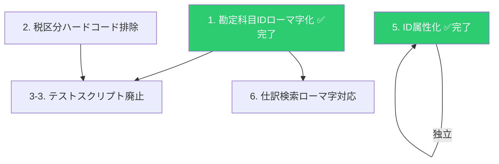

# ローマ字ID移行計画

> 作成: 2026-06-06（セッション 341b2d01）
> 最終更新: 2026-06-08（セッション ad30eff1。P6/P7/P8追加: defaultTaxCategoryId MCP上書き+事業形態フィルタ+顧問先別MCP優先+target判定バグ修正）

---

## 0. 実装状況の裏取り（2026-06-07）

> [!CAUTION]
> **本セクションは2026-06-07にAI自己申告を実コードで裏取りした結果。**

### ステップ別進捗

| ステップ | 内容                              | 設計書の記載                   | 実装状況                                                                                                           |
| -------- | --------------------------------- | ------------------------------ | ------------------------------------------------------------------------------------------------------------------ |
| **1**    | 勘定科目IDローマ字化（既存241件） | AI変換→人間目視確認            | ✅ 完了（account-master.json 241件）                                                                               |
| **2**    | 税区分ハードコード排除            | 13ファイル修正                 | ✅ 完了（1件のみ。属性ベースに修正済み）                                                                           |
| **3**    | 税区分IDローマ字化                | 151件ローマ字化                | ❌ **不要と判断**（英語属性IDを維持）                                                                              |
| **3-3**  | テストスクリプト廃止              | test-account-classifier.ts削除 | ❌ 未実施（ファイル残存）                                                                                          |
| **5**    | ID属性化                          | id→accountId等                 | ✅ 完了（[49_id_attribute_rename.md](file:///c:/dev/receipt-app/docs/genzai/49_id_attribute_rename.md)で実施済み） |
| **6**    | 仕訳検索ローマ字対応              | 検索ロジックにID照合追加       | ❌ **未実施**                                                                                                      |

### MFインポート時の新規科目ID生成（★最重要未実施項目）

| 項目                        | 設計書の記載                            | 実装状況                                                                                                                                       |
| --------------------------- | --------------------------------------- | ---------------------------------------------------------------------------------------------------------------------------------------------- |
| `generateMasterId()`        | 科目名→ローマ字→大文字→サフィックス付与 | **❌ 関数未実装（プロダクションコードに存在しない）**                                                                                          |
| ローマ字変換エンジン        | Gemini 3.5-flash                        | ✅ ベンチマーク済み（`romaji_benchmark.ts`）。本番組込み未実装                                                                                 |
| B系統（全社マスタ）のID     | ローマ字ID                              | **🔴 `MF_${日本語名}` で生成**（[mfAccountImportService.ts L149](file:///c:/dev/receipt-app/src/api/services/mfAccountImportService.ts#L149)） |
| C系統（顧問先sync-all）のID | ローマ字ID                              | **🔴 MFのBase64 IDをそのまま使用**（[mfRoutes.ts L440](file:///c:/dev/receipt-app/src/api/routes/mfRoutes.ts#L440)）                           |

### ID体系の現状（3系統が混在）

| 場所                    | ID体系        | 例                            | 状態                                       |
| ----------------------- | ------------- | ----------------------------- | ------------------------------------------ |
| 全社マスタ（241件）     | ローマ字ID ✅ | `GENKIN_CORP`                 | 問題なし                                   |
| B系統（新規追加）       | ローマ字ID ✅ | `RYOHIKOUTSUUHI_CORP`         | ✅ P1修正済み（generateMasterId使用）      |
| C系統（顧問先sync-all） | ローマ字ID ✅ | `GENKIN_CORP`（マスタID継承） | ✅ P2修正済み（名前照合+generateMasterId） |

### MFインポート関連の問題（5件）と対処状況

| #      | 問題                                     | 状態                          | 対処                                                                                                  |
| ------ | ---------------------------------------- | ----------------------------- | ----------------------------------------------------------------------------------------------------- |
| **P1** | B: 新規科目IDが`MF_日本語名`             | ✅ **修正済み（2026-06-07）** | `generateMasterId()`（Gemini 3.5-flash）でローマ字ID生成。existingIdsで重複チェック+累積追加          |
| **P2** | C: `accountId`にMFのBase64 IDを使用      | ✅ **修正済み（2026-06-07）** | 全社+顧問先名前照合→マスタID継承。未マッチ→`generateMasterId()`。`hasClientAccounts`で初回2重登録防止 |
| **P3** | C: `defaultTaxCategoryId`が常にundefined | ✅ **修正済み（2026-06-07）** | MFのtax_id→名前→マスタIDの二段階変換をB系統から移植                                                   |
| **P4** | B/C: 削除検知なし                        | ⚠️ 未対処                     | Bでは追加のみ / Cでは全上書き                                                                         |
| **P5** | B: 名前変更検知不可                      | ⚠️ 未対処                     | 全社マスタにmfAccountIdなし                                                                           |
| **P6** | B: `defaultTaxCategoryId`がMCP実機と不一致（法人10件+個人8件） | ✅ **修正済み（2026-06-08）** | MCPの値で常に上書き + 事業形態フィルタ（73件同名科目対策）+ `isIndividualType()`ヘルパー使用 |
| **P7** | C: `defaultTaxCategoryId`が全社マスタ優先でMCP変更を無視 | ✅ **修正済み（2026-06-08）** | `masterTaxId \|\| master.defaultTaxCategoryId` に順序逆転。MCP優先、未取得時のみ全社フォールバック |
| **P8** | B: 新規科目のtargetが常にcorp（個人4件が法人として追加される） | ✅ **修正済み（2026-06-08）** | `deriveTarget(mf.category)`→`clientType`（顧問先の事業形態）に変更。`deriveTarget()`はMFカテゴリから推定するが法人/個人判別に使えないため廃止 |

> [!IMPORTANT]
> **P1/P2の修正 = `generateMasterId()`実装がそのまま解決策。**
> 設計書§「ローマ字ID生成関数」に方針は書かれているが、プロダクションコードに移植されていない。

### P2が致命的である証拠（2026-06-07 実データ確認）

**仕訳データの`account`フィールドにはローマ字IDが入っている。**

```
# journals-c_VdAnGFq3.json 先頭の仕訳
"debit_entries": [{ "account": "RYOHIKOUTSUUHI_CORP", ... }]
```

バリデーションは`account`値をaccountIdとして照合する:

```typescript
// journalValidationCore.ts L199
const acc = accounts.find((a) => a.accountId === accountName);
// journalValidationCore.ts L434
const accountIds = new Set(accounts.map((a) => a.accountId));
```

**データフロー:**

```
仕訳データ: account = "RYOHIKOUTSUUHI_CORP"（ローマ字ID）
    ↓ バリデーション（accountIdで照合）
顧問先マスタ: accountId = ???
    ↓
起動時sync → accountId = "RYOHIKOUTSUUHI_CORP"（マスタ継承） ✅ マッチ
sync-all   → accountId = "DI7rnB..."（Base64 ID）        ❌ 全件不一致
```

> [!CAUTION]
> **sync-allを実行した瞬間、仕訳のローマ字IDと顧問先マスタのBase64 IDが不一致になり、全件ACCOUNT_UNKNOWNになる。**
> P2は「sync-allを実行したら仕訳が全部壊れる」致命的バグ。

### 修正方針（確定: 2026-06-07）

**C系統（sync-all）もB系統と同じ「名前照合→マスタID継承」方式に統一する。**

| ケース               | 修正前（現状）            | 修正後                                           |
| -------------------- | ------------------------- | ------------------------------------------------ |
| MF科目がマスタにある | accountId = MFのBase64 ID | accountId = マスタのローマ字ID（名前照合で継承） |
| MF科目がマスタにない | accountId = MFのBase64 ID | accountId = `generateMasterId()`でローマ字ID生成 |
| B系統の新規科目      | accountId = `MF_日本語名` | accountId = `generateMasterId()`でローマ字ID生成 |

### 修正対象ファイル

| #   | ファイル                                                                                             | 修正内容                                                                                    | 状態                          |
| --- | ---------------------------------------------------------------------------------------------------- | ------------------------------------------------------------------------------------------- | ----------------------------- |
| 1   | [mfAccountImportService.ts](file:///c:/dev/receipt-app/src/api/services/mfAccountImportService.ts)   | `MF_${日本語名}` → `generateMasterId()`。existingIdsをループ外に移動+累積追加               | ✅ **実施済み（2026-06-07）** |
| 2   | [mfRoutes.ts](file:///c:/dev/receipt-app/src/api/routes/mfRoutes.ts) L434-540（sync-all科目処理）    | 名前照合ロジック追加 + 税区分紐づけ + `generateMasterId()` + `hasClientAccounts`            | ✅ **実施済み（2026-06-07）** |
| 3   | [generateMasterId.ts](file:///c:/dev/receipt-app/src/api/services/generateMasterId.ts)               | ローマ字ID生成関数。Gemini 3.5-flash + 後処理 + existingIds重複チェック                     | ✅ **新規作成（2026-06-07）** |
| 4   | [accountMasterStore.ts](file:///c:/dev/receipt-app/src/api/services/accountMasterStore.ts)           | `hasClientAccounts()`をexport追加。初回実行時の2重登録防止                                  | ✅ **実施済み（2026-06-07）** |
| 5   | [mfRoutes.ts](file:///c:/dev/receipt-app/src/api/routes/mfRoutes.ts) L786-910                        | `POST /api/mf/import-client-accounts`エンドポイント新設。顧問先科目MFインポートボタンと接続 | ✅ **新規作成（2026-06-07）** |
| 6   | [MockClientAccountsPage.vue](file:///c:/dev/receipt-app/src/views/client/MockClientAccountsPage.vue) | `importFromMf()`をプレースホルダーからAPI呼び出しに変更                                     | ✅ **実施済み（2026-06-07）** |
| 7   | [mfTaxImportService.ts](file:///c:/dev/receipt-app/src/api/services/mfTaxImportService.ts)           | UNKNOWN\_ランダム→throw Error化。existingTaxIds重複チェック追加                             | ✅ **実施済み（2026-06-07）** |
| 8   | [taxIdGenerator.ts](file:///c:/dev/receipt-app/src/api/services/taxIdGenerator.ts)                   | `ensureUniqueTaxId()`ヘルパー追加。税区分ID重複回避                                         | ✅ **実施済み（2026-06-07）** |

### P1/P2/P3修正の実施結果（2026-06-07）

**全系統修正完了。**

修正内容:

1. マスタ全科目の名前→科目マップを構築（`nameToMaster`）
2. MF科目ごとに名前照合:
   - マッチ → `...master`スプレッドでマスタの全フィールド（accountId、taxDetermination、isContra\*等）を継承
   - 未マッチ → `generateMasterId()`（Gemini 3.5-flash）でローマ字ID生成
3. 税区分紐づけ（二段階変換）をB系統から移植:
   - `mcpFetchTaxes` → `mfTaxIdToMasterId`マップ構築
   - B系統: `defaultTaxCategoryId`はMCPの値で常に上書き（MCP実機が正。手動設定は不正確）
   - C系統: `defaultTaxCategoryId`はMCPの値を優先、取れない場合のみ全社マスタでフォールバック
4. `hasClientAccounts(clientId)`で初回sync-allの2重登録防止
5. `existingIds`をループ外で1回構築、生成後に`add`で累積追加（重複防止）
6. B系統の名前照合に事業形態フィルタ追加（法人/個人で73件の同名科目の誤マッチ防止）
7. B系統の`client?.type`直接比較を`isIndividualType()`ヘルパーに変更（lintルール準拠）
8. B系統の新規追加科目target判定を`deriveTarget(mf.category)`→`clientType`に変更（`deriveTarget()`はMFカテゴリから推定するが`OTHER_CURRENT_LIABILITIES`等で常にcorpを返すバグ。importも削除）
9. 顧問先MFインポートボタン接続: `POST /api/mf/import-client-accounts`新設
7. 税区分のUNKNOWN\_ランダム→throw Error化（3箇所）
8. 税区分のexistingIds重複チェック追加（3箇所）+ ensureUniqueTaxIdヘルパー追加
9. `vue-tsc --noEmit` パス確認: ✅ エラー0件
10. Gemini API実機テスト5件+重複テスト全パス

### 関連設計書

| ドキュメント                                                                                            | 関係                         |
| ------------------------------------------------------------------------------------------------------- | ---------------------------- |
| [48_category_mcp_unification.md](file:///c:/dev/receipt-app/docs/genzai/48_category_mcp_unification.md) | フェーズ8.5でP1-P5を詳細記載 |
| [49_id_attribute_rename.md](file:///c:/dev/receipt-app/docs/genzai/49_id_attribute_rename.md)           | Step 5（ID属性化）完了済み   |

---

## 実行順序と依存関係



> [!NOTE]
> **Step 3（税区分IDローマ字化）は不要。** 税区分IDは`SALES_TAXABLE_10`等のルールベースIDであり、ローマ字化の対象外。
> Step 1は完了済み（241件全件ローマ字ID化済み）。Step 5は完了済み（49_id_attribute_rename.md）。

---

## ローマ字変換エンジン

### 選定結果: Gemini 3.5-flash（kuroshiroから変更）

| 候補                    | 精度                         | 一貫性                           | サイズ    | コスト              |
| ----------------------- | ---------------------------- | -------------------------------- | --------- | ------------------- |
| **Gemini 3.5-flash** ✅ | **高**（164件中5件ミスのみ） | 非決定的（1回生成→DB保存で解決） | なし      | API呼び出し（微小） |
| Gemini 3-flash-preview  | 中（7件ミス）                | 非決定的                         | なし      | API呼び出し         |
| Gemini 2.5-flash        | 低（18件ミス）               | 非決定的                         | なし      | API呼び出し         |
| kuroshiro + kuromoji    | 未検証（形態素解析ベース）   | **決定的**                       | 辞書20MB+ | 無料                |

### 選定理由

- 3モデルベンチマーク実施（164件ユニーク科目名）。3.5-flashが最も精度が高い
- kuroshiroの辞書20MB+をプロダクションに含める必要がなくなる
- 非決定性の問題：新しい科目が来た時に**1回だけ生成してDBに保存**。以降は保存済みIDを使うため問題にならない
- 既存プロジェクトに`@google/genai`パッケージ + `GEMINI_API_KEY`環境変数が設定済み

### 配置

| 項目       | 決定                                              |
| ---------- | ------------------------------------------------- |
| ライブラリ | `@google/genai`（既存依存。追加インストール不要） |
| モデル     | `gemini-3.5-flash`                                |
| 使用場所   | サーバーサイドのみ（MFインポート時のID生成API）   |
| API key    | `.env.local` の `GEMINI_API_KEY`（既存）          |

### ID生成フロー

```
MFから未知の科目名 → Gemini 3.5-flash でローマ字変換 → 後処理（正規化） → 重複チェック → DBに保存
```

### 後処理（正規化）

生成されたローマ字IDに対して以下の後処理を必ず適用する：

| #   | 処理                 | 例                                                             |
| --- | -------------------- | -------------------------------------------------------------- |
| 1   | **大文字統一**       | `.toUpperCase()`                                               |
| 2   | **記号除去**         | `'` `・` `（` `）` 等を削除。`/[^A-Z_]/g` で除去               |
| 3   | **サフィックス付与** | `_CORP` / `_IND` / `_FUDOUSAN_IND` を付与                      |
| 4   | **重複チェック**     | 既存IDと衝突しないか確認。衝突時は連番サフィックス `_2` を付与 |

### 大文字小文字対応

| 場面         | 方針                                                            |
| ------------ | --------------------------------------------------------------- |
| IDの保存     | **常に大文字**で保存                                            |
| ID比較       | `toLowerCase()` で比較（case-insensitive）                      |
| 検索フィルタ | 入力値を `toLowerCase()` に変換してからID・科目名と部分一致検索 |
| PostgreSQL   | `CITEXT`型 または `LOWER()` インデックスで大文字小文字非区別    |

### 既存241件の変換方法

- 既存241件はAI（Claude）が変換した案を人間が全件目視確認して確定する（kuroshiroは使わない）
- 新規科目はGemini 3.5-flash + 後処理で自動生成

---

## ローマ字ID生成関数

### 共通ユーティリティ（勘定科目・税区分の両方で使用）

```typescript
// サーバーサイドユーティリティ
async function generateMasterId(
  name: string,
  suffix?: string,
): Promise<string> {
  const romaji = await toRomaji(name); // kuroshiro
  const id = romaji.toUpperCase().replace(/\s+/g, "_");
  return suffix ? `${id}_${suffix}` : id;
}

// 勘定科目
generateMasterId("旅費交通費", "CORP"); // → RYOHI_KOTSUHI_CORP
// 税区分
generateMasterId("課税仕入 10%"); // → KAZEI_SHIIRE_10
```

### 発火タイミング

> [!IMPORTANT]
> 科目の追加・修正・削除はMF側で行う。すぐする側では表示/非表示の切り替えのみ。
> マスタ画面・顧問先画面のカスタム科目追加・インライン編集・削除は全て廃止済み。

| 場面                    | 全社マスタ | 顧問先別 | ID生成必要か                    | 方式                     |
| ----------------------- | ---------- | -------- | ------------------------------- | ------------------------ |
| マスタ初期構築          | ✅         | —        | 1回のみ（既存241件+151件）      | スクリプトでバッチ変換   |
| MFインポート            | ✅         | ✅       | MFに未知の科目/税区分が来たとき | サーバーサイドで自動生成 |
| マスタ→顧問先クローン   | —          | ✅       | **不要**（マスタIDを継承）      | —                        |
| ~~admin画面で手動追加~~ | —          | —        | **廃止済み**                    | —                        |
| ~~カスタム科目追加~~    | —          | —        | **廃止済み**                    | —                        |
| ~~インライン編集~~      | —          | —        | **廃止済み**                    | —                        |

### 全社マスタ vs 顧問先別

| 項目           | 全社マスタ               | 顧問先別                                                   |
| -------------- | ------------------------ | ---------------------------------------------------------- |
| 科目ソース     | MFインポートのみ         | マスタから継承 + MFインポート                              |
| IDの決め方     | MFインポート時に自動生成 | マスタにある科目→マスタIDを継承。マスタにない科目→自動生成 |
| Supabase移行後 | DBのseed + APIインポート | APIインポート                                              |

### データ駆動化

| 方式                      | メリット              | デメリット                         | 採用   |
| ------------------------- | --------------------- | ---------------------------------- | ------ |
| アプリ層でID生成→DBに保存 | kuroshiro使える。柔軟 | —                                  | **✅** |
| DBトリガー（PostgreSQL）  | SSOT                  | PostgreSQLに日本語形態素解析がない | ❌     |

PostgreSQLに形態素解析を入れるのは過剰。アプリ層（サーバーサイド）でID生成し、DBに保存する。

---

## 1. 勘定科目IDローマ字化 ✅ 完了済み

> [!IMPORTANT]
> **2026-06-07 実データ検証: 完了済み。** account-master.json 241件全件がローマ字ID（`GENKIN_CORP`等）。
> 英語概念名（`CASH_CORP`等）は残存0件。accounts-c\_\*.json 10ファイルも同様。
> 仕訳データの`account`フィールドにもローマ字ID（`RYOHIKOUTSUUHI_CORP`等）が格納済み。

### 概要

241件の勘定科目IDを英語概念名→ローマ字に変更。

### ID変換例

| 科目名     | 旧ID                      | 現在のID（ローマ字）    |
| ---------- | ------------------------- | ----------------------- |
| 旅費交通費 | ~~`TRAVEL_CORP`~~         | `RYOHIKOUTSUUHI_CORP`   |
| 水道光熱費 | ~~`UTILITIES_CORP`~~      | `SUIDOUKOUNETSUHI_CORP` |
| 福利厚生費 | ~~`WELFARE_CORP`~~        | `FUKURIKOUSEISHI_CORP`  |
| 事業主貸   | ~~`OWNERS_DRAWINGS_IND`~~ | `JIGYOUNUSHIKASHI_IND`  |
| 現金       | ~~`CASH_CORP`~~           | `GENKIN_CORP`           |

---

## 2. 税区分ハードコード排除

### 概要

コード13ファイルにハードコードされた税区分ID（`COMMON_EXEMPT`等）をデータ駆動に置き換える。

## 2. 税区分ハードコード排除

### 概要

コード内にハードコードされた税区分ID（`COMMON_EXEMPT`等）をデータ駆動に置き換える。

### 実コード検証結果（2026-06-07）

> [!IMPORTANT]
> **設計書の「13ファイルにハードコード」は嘘。**
> 実コード検証の結果、ロジック内で税区分IDを文字列リテラルとして直接参照している箇所は **0件**。
> 残存しているのはコメント・JSDoc内の例示（10ファイル）と、別体系IDのスキーマ定義（1ファイル）のみ。

#### ロジック内ハードコード: 0件（排除済み）

現在のコードは既に属性ベース（direction等）またはマスタデータ駆動で判定しており、ID文字列リテラルに依存していない。
例:

- `isTaxCategoryInvalidForMode()` → direction属性で判定
- `resolveValidTaxCategoryForMode()` → マスタデータから動的解決
- `resolveTaxNameForSoftware()` → マスタのname/shortNameから取得

#### コメント・JSDoc内の例示: 10ファイル（ロジック影響なし）

| #   | ファイル                  | 行           | 種別             |
| --- | ------------------------- | ------------ | ---------------- |
| 1   | shared-tax-category.ts    | L18          | JSDoc例示        |
| 2   | domain-journal.ts         | L209         | JSDoc例示        |
| 3   | lineItemToJournalMock.ts  | L57          | コメント         |
| 4   | accountMasterStore.ts     | L474         | コメント         |
| 5   | mfTaxAvailableStore.ts    | L93          | JSDoc例示        |
| 6   | mfTaxImportService.ts     | L12          | コメント         |
| 7   | taxIdGenerator.ts         | L74,77,78,80 | JSDoc例示        |
| 8   | taxCategoryMappings.ts    | L31,35,42    | コメント         |
| 9   | JournalListLevel3Mock.vue | L2852,3405   | コメント         |
| 10  | schema_dictionary.ts      | L13-63       | 別体系ID（後述） |

#### 残存: schema_dictionary.ts の `TAX_OPTIONS`（別体系ID）

`TAX_SALES_10`、`TAX_PURCHASE_10`等の`TAX_`プレフィックス付きIDがハードコードされている。
マスタID（`SALES_TAXABLE_10`等）とは別の命名体系。旧設計の残骸の可能性あり。
→ 使用箇所を調査し、マスタデータ駆動に置き換えるか判断が必要。

---

### 方針比較

| 方針                            | 説明                                                          | メリット                                                   | デメリット                                                                     |
| ------------------------------- | ------------------------------------------------------------- | ---------------------------------------------------------- | ------------------------------------------------------------------------------ |
| **A: 属性判定**                 | IDの値に依存せず、属性（direction, name等）で判定             | ID変更時にコード修正不要。完全にデータ駆動                 | 属性の組み合わせが複雑な場合、判定が冗長になる。属性そのものが変わったら壊れる |
| **B: 定数集約**（ユーザー提案） | IDを1ファイルに集約。ロジックは集約された定数を参照           | 明確。追跡可能。ID変更時は1ファイルのみ修正                | ID変更時にファイル修正が必要（方針Aなら不要）。集約ファイルの肥大化            |
| **C: マスタデータ駆動**         | マスタJSONの属性（direction, taxDetermination等）から動的解決 | IDにもコードにも依存しない。マスタが変わればロジックも追従 | マスタデータの読み込みが前提。サーバー起動前やテスト時に参照できない場合がある |

### 結論

**現状のコードは既に方針A + Cの混合で実装されており、ロジック内のハードコードは0件。**
ユーザー提案（方針B: 定数集約）を採用する場合、集約すべきIDがロジックに存在しないため新規追加は不要。
ただし、将来の拡張で特定IDをロジック内で参照する必要が出た場合に備え、定数集約ファイルを1つ用意しておく選択肢はある。

> [!NOTE]
> **判断待ち項目:**
>
> 1. schema_dictionary.tsの`TAX_OPTIONS`（別体系ID）を廃止してマスタ駆動にするか
> 2. コメント・JSDoc内の旧ID例示を現行IDに更新するか（ロジック影響なし）
> 3. 方針Bの定数集約ファイルを予防的に作成するか

### 工数: ~~中（13ファイル修正）~~ → 低（ロジック修正不要。コメント更新+schema_dictionary判断のみ）

---

## ~~3. 税区分IDローマ字化~~ — 不要（廃止）

> [!IMPORTANT]
> **このステップは不要。実施しないこと。**
> 税区分IDは`SALES_TAXABLE_10`、`PURCHASE_REDUCED_8`等、`generateTaxMasterId()`がルールベースで生成する英語IDであり、ローマ字化の対象外。
> 勘定科目のように英語概念名→ローマ字に変換する必要はない。現在のIDをそのまま使用する。

---

## 3-3. テストスクリプト廃止

### 概要

`src/scripts/test-account-classifier.ts`を廃止する。

### 理由

- category/target/accountGroup → MFが返す。AI推定不要
- マスタID → ローマ字化により科目名から機械的に生成可能。AI推定不要
- プロンプト内の情報（48種、日本語category、corp/individual）は最新設計を反映済み。ただし分類ロジック自体が不要（MFが返すため）

### 影響範囲

- `test-account-classifier.ts`（1ファイル削除）
- `data/test-new-accounts.json`（テストデータ。削除候補）

### 依存: ステップ1の完了でAI推定が不要と確定（Step 1は完了済み。着手可能）

### 工数: 低（ファイル削除）

---

## 5. ID属性化（`id`→属性別ID） ✅ 完了済み

> [!IMPORTANT]
> **完了済み（49_id_attribute_rename.md）。** 実データ検証: account-master.jsonに`accountId`フィールドが存在。`id`フィールドは残存0件。

### 概要

全エンティティの`id`フィールドを属性別ID名にリネーム。

> [!NOTE]
> 詳細は [49_id_attribute_rename.md](file:///c:/dev/receipt-app/docs/genzai/49_id_attribute_rename.md) を参照。

| エンティティ | 旧       | 現在               |
| ------------ | -------- | ------------------ |
| 勘定科目     | ~~`id`~~ | `accountId` ✅     |
| 税区分       | ~~`id`~~ | `taxCategoryId` ✅ |
| 仕訳         | ~~`id`~~ | `journalId` ✅     |
| 証票         | ~~`id`~~ | `documentId` ✅    |
| 学習ルール   | ~~`id`~~ | `ruleId` ✅        |

---

## 6. 仕訳検索ローマ字対応

### 概要

仕訳入力画面の勘定科目・税区分検索で、半角ローマ字入力でも日本語科目がヒットするようにする。

### 現状

- 勘定科目検索: 日本語名のみ（「検索...」ボックス）
- 税区分検索: 日本語名のみ

### ローマ字化後

- `ryohi` → 「旅費交通費」がヒット（IDが`RYOHI_KOTSUHI_CORP`で前方一致）
- `kazei` → 「課税仕入 10%」等がヒット
- `genkin` → 「現金」がヒット
- 日本語入力 → 従来通りヒット

### 実装

検索ロジックに1行追加:

```typescript
// 現在
name.includes(query);

// 変更後
name.includes(query) || id.toLowerCase().includes(query.toLowerCase());
```

### 対象ファイル

- `JournalListLevel3Mock.vue`: `filterAccountGroups()`, `filterTaxGroups()`
- `MockMasterAccountsPage.vue`: 科目検索フィルタ
- `MockClientAccountsPage.vue`: 科目検索フィルタ

### 依存: ステップ1の完了が前提（Step 1は完了済み。着手可能）

### 工数: 低（検索ロジック数箇所の修正）

---

## 確定事項（旧・未決事項）

| 項目          | 決定                                    |
| ------------- | --------------------------------------- |
| ローマ字表記  | **ヘボン式**（shi, tsu, chi, fu）       |
| 長音          | **省略しない**（koutsuu, shouken）      |
| 単語区切り    | **なし**（一続き。RYOHIKOTSUHI）        |
| サフィックス  | `_CORP` / `_IND` の前のみアンダースコア |
| 大文字/小文字 | **大文字**                              |
| 変換方法      | AI変換→人間全件目視確認                 |

> [!NOTE]
>
> - 税区分ハードコード排除の方針: 別タスク（フェーズ2）で決定
> - ID属性化のタイミング: 別タスク（49_id_attribute_rename.md）で決定
> - ~~kuroshiroは継続運用時（MFインポート時の未知科目ID生成）に使用~~ → Gemini 3.5-flashに変更（2026-06-06）

---

## 勘定科目ローマ字ID変換案（全241件）

> [!IMPORTANT]
> 人間による全件目視確認が必要。読みの揺れ・区切り位置の誤りがあれば修正すること。

### 法人（\_CORP）専用 + 法人/個人共通

| #   | 現行ID                       | 科目名           | ローマ字案                          |
| --- | ---------------------------- | ---------------- | ----------------------------------- |
| 1   | CASH_CORP                    | 現金             | GENKIN_CORP                         |
| 2   | CHECKING_CORP                | 当座預金         | TOUZAYOKIN_CORP                     |
| 3   | SAVINGS_CORP                 | 普通預金         | FUTSUUYOKIN_CORP                    |
| 4   | ACCOUNTS_RECEIVABLE_CORP     | 売掛金           | URIKAKEKIN_CORP                     |
| 5   | NOTES_RECEIVABLE_CORP        | 受取手形         | UKETORITEGATA_CORP                  |
| 6   | PREPAID_CORP                 | 前払金           | MAEBARAIKIN_CORP                    |
| 7   | PREPAID_EXPENSE_CORP         | 前払費用         | MAEBARAIHIYOU_CORP                  |
| 8   | TEMPORARY_PAYMENT_CORP       | 仮払金           | KARIBARAIKIN_CORP                   |
| 9   | DEPOSIT_PAID_CORP            | 差入保証金       | SASHIIREHOSHOUKIN_CORP              |
| 10  | BUILDINGS_CORP               | 建物             | TATEMONO_CORP                       |
| 11  | LAND_CORP                    | 土地             | TOCHI_CORP                          |
| 12  | VEHICLES_CORP                | 車両運搬具       | SHARYOUUNPANGU_CORP                 |
| 13  | ACCOUNTS_PAYABLE_CORP        | 買掛金           | KAIKAKEKIN_CORP                     |
| 14  | NOTES_PAYABLE_CORP           | 支払手形         | SHIHARAITEGATA_CORP                 |
| 15  | ACCRUED_TAXES_CORP           | 未払金           | MIHARAIKIN_CORP                     |
| 16  | ADVANCE_RECEIVED_CORP        | 前受金           | MAEUKEKIN_CORP                      |
| 17  | TEMPORARY_RECEIPT_CORP       | 仮受金           | KARIUKEKIN_CORP                     |
| 18  | DEPOSITS_RECEIVED_CORP       | 預り金           | AZUKARIKIN_CORP                     |
| 19  | LONG_TERM_BORROWINGS_CORP    | 長期借入金       | CHOUKIKARIIREKIN_CORP               |
| 20  | SALES_CORP                   | 売上高           | URIAGEDAKA_CORP                     |
| 21  | WELFARE_CORP                 | 福利厚生費       | FUKURIKOUSEISHI_CORP                |
| 22  | LEGAL_WELFARE_CORP           | 法定福利費       | HOUTEIFUKURIHI_CORP                 |
| 23  | COMMUNICATION_CORP           | 通信費           | TSUUSHINHI_CORP                     |
| 24  | PACKING_SHIPPING_CORP        | 荷造運賃         | NIZUKURIUNCHIN_CORP                 |
| 25  | UTILITIES_CORP               | 水道光熱費       | SUIDOUKOUNETSUHI_CORP               |
| 26  | TRAVEL_CORP                  | 旅費交通費       | RYOHIKOUTSUUHI_CORP                 |
| 27  | ADVERTISING_CORP             | 広告宣伝費       | KOUKOKUSENDENHI_CORP                |
| 28  | ENTERTAINMENT_CORP           | 接待交際費       | SETTAIKOUSAIHI_CORP                 |
| 29  | MEETING_CORP                 | 会議費           | KAIGIHI_CORP                        |
| 30  | REPAIRS_CORP                 | 修繕費           | SHUUZENHI_CORP                      |
| 31  | RENT_CORP                    | 地代家賃         | CHIDAIYACHIN_CORP                   |
| 32  | TAXES_DUES_CORP              | 租税公課         | SOZEIKOUKAI_CORP                    |
| 33  | FEES_CORP                    | 支払手数料       | SHIHARAITESUURYOU_CORP              |
| 34  | DEPRECIATION_CORP            | 減価償却費       | GENKASHOUKYAKUHI_CORP               |
| 35  | MISCELLANEOUS_CORP           | 雑費             | ZAPPI_CORP                          |
| 36  | VEHICLE_COSTS_CORP           | 車両費           | SHARYOUHI_CORP                      |
| 37  | LEASE_CORP                   | リース料         | RIISURYOU_CORP                      |
| 38  | BOOKS_PERIODICALS_CORP       | 新聞図書費       | SHINBUNTOSHOHI_CORP                 |
| 39  | DEFERRED_AMORTIZATION_CORP   | 繰延資産償却     | KURINOBESHISANSHOUKYAKU_CORP        |
| 40  | UNCONFIRMED_CORP             | 未確定勘定       | MIKAKUTEIKANJOU_CORP                |
| 41  | BEGINNING_INVENTORY_CORP     | 期首商品棚卸高   | KISHUSHOUHINTANAOROSHIDAKA_CORP     |
| 42  | ENDING_INVENTORY_CORP        | 期末商品棚卸高   | KIMATSUSHOUHINTANAOROSHIDAKA_CORP   |
| 43  | RETIREMENT_PAY_CORP          | 退職給与         | TAISHOKUKYUUYO_CORP                 |
| 44  | TRAINING_CORP                | 研修採用費       | KENSHUUSAIYOUHI_CORP                |
| 45  | STARTUP_COSTS_CORP           | 開業費           | KAIGYOUHI_CORP                      |
| 46  | OTHER_DEPOSIT_CORP           | その他の預金     | SONOTANOYOKIN_CORP                  |
| 47  | MERCHANDISE_CORP             | 商品             | SHOUHIN_CORP                        |
| 48  | PRODUCTS_CORP                | 製品             | SEIHIN_CORP                         |
| 49  | MATERIALS_CORP               | 材料             | ZAIRYOU_CORP                        |
| 50  | WORK_IN_PROGRESS_CORP        | 仕掛品           | SHIKAKARIHIN_CORP                   |
| 51  | STORED_GOODS_CORP            | 貯蔵品           | CHOZOUHIN_CORP                      |
| 52  | SHORT_TERM_LOANS             | 短期貸付金       | TANKIKASHITSUKEKIN_CORP             |
| 53  | ACCRUED_REVENUE_CORP         | 未収入金         | MISHUUNYUUKIN_CORP                  |
| 54  | ADVANCE_PAID_CORP            | 立替金           | TATEKAEKIN_CORP                     |
| 55  | ALLOWANCE_DOUBTFUL_CORP      | 貸倒引当金       | KASHIDAOREHIKIATEKIN_CORP           |
| 56  | MACHINERY_CORP               | 機械装置         | KIKAISOUCHI_CORP                    |
| 57  | FIXTURES_CORP                | 工具器具備品     | KOUGUKIGUBIHIN_CORP                 |
| 58  | SOFTWARE                     | ソフトウェア     | SOFUTOWEA_CORP                      |
| 59  | INVESTMENT_SECURITIES        | 投資有価証券     | TOUSHIYUUKASHOUKEN_CORP             |
| 60  | LONG_TERM_LOANS              | 長期貸付金       | CHOUKIKASHITSUKEKIN_CORP            |
| 61  | LONG_TERM_PREPAID            | 長期前払費用     | CHOUKIMAEBARAIHIYOU_CORP            |
| 62  | SHORT_TERM_BORROWINGS        | 短期借入金       | TANKIKARIIREKIN_CORP                |
| 63  | ACCRUED_LIABILITIES          | 未払費用         | MIHARAIHIYOU_CORP                   |
| 64  | CAPITAL                      | 資本金           | SHIHONKIN_CORP                      |
| 65  | CAPITAL_RESERVE              | 資本準備金       | SHIHONJUNBIKIN_CORP                 |
| 66  | RETAINED_EARNINGS            | 繰越利益剰余金   | KURIKOSHIRIEKIJOURYOKIN_CORP        |
| 67  | SALES_RETURNS_CORP           | 売上値引・返品   | URIAGENEBIKIHENPIN_CORP             |
| 68  | PURCHASES_CORP               | 仕入高           | SHIIREDAKA_CORP                     |
| 69  | PURCHASE_RETURNS_CORP        | 仕入値引・返品   | SHIIRENEBIKIHENPIN_CORP             |
| 70  | OFFICER_COMPENSATION         | 役員報酬         | YAKUINHOUSHU_CORP                   |
| 71  | SALARIES                     | 給料賃金         | KYUURYOUCHINGIN_CORP                |
| 72  | BONUSES                      | 賞与             | SHOUYO_CORP                         |
| 73  | INSURANCE_CORP               | 保険料           | HOKENRYOU_CORP                      |
| 74  | DONATIONS                    | 寄付金           | KIFUKIN_CORP                        |
| 75  | BAD_DEBT_PROVISION_CORP      | 貸倒引当金繰入額 | KASHIDAOREHIKIATEKINKUNIREGAKU_CORP |
| 76  | BAD_DEBT_LOSS_CORP           | 貸倒損失         | KASHIDAORESONSHITSU_CORP            |
| 77  | INTEREST_INCOME              | 受取利息         | UKETORIRISOKU_CORP                  |
| 78  | DIVIDEND_INCOME              | 受取配当金       | UKETORIHAITOUKIN_CORP               |
| 79  | MISC_INCOME_CORP             | 雑収入           | ZATSUSHUUNYUU_CORP                  |
| 80  | INTEREST_EXPENSE             | 支払利息         | SHIHARAIRISOKU_CORP                 |
| 81  | MISC_LOSS                    | 雑損失           | ZATSUSONSHITSU_CORP                 |
| 82  | GAIN_ON_SALE_OF_FIXED_ASSETS | 固定資産売却益   | KOTEISHISANBAIKYAKUEKI_CORP         |
| 83  | LOSS_ON_SALE_OF_FIXED_ASSETS | 固定資産売却損   | KOTEISHISANBAIKYAKUSON_CORP         |

### 個人（\_IND）専用 + 個人のみ

| #   | 現行ID                    | 科目名         | ローマ字案                        |
| --- | ------------------------- | -------------- | --------------------------------- |
| 84  | CASH_IND                  | 現金           | GENKIN_IND                        |
| 85  | CHECKING_IND              | 当座預金       | TOUZAYOKIN_IND                    |
| 86  | SAVINGS_IND               | 普通預金       | FUTSUUYOKIN_IND                   |
| 87  | ACCOUNTS_RECEIVABLE_IND   | 売掛金         | URIKAKEKIN_IND                    |
| 88  | NOTES_RECEIVABLE_IND      | 受取手形       | UKETORITEGATA_IND                 |
| 89  | PREPAID_IND               | 前払金         | MAEBARAIKIN_IND                   |
| 90  | PREPAID_EXPENSE_IND       | 前払費用       | MAEBARAIHIYOU_IND                 |
| 91  | TEMPORARY_PAYMENT_IND     | 仮払金         | KARIBARAIKIN_IND                  |
| 92  | DEPOSIT_PAID_IND          | 差入保証金     | SASHIIREHOSHOUKIN_IND             |
| 93  | BUILDINGS_IND             | 建物           | TATEMONO_IND                      |
| 94  | LAND_IND                  | 土地           | TOCHI_IND                         |
| 95  | VEHICLES_IND              | 車両運搬具     | SHARYOUUNPANGU_IND                |
| 96  | ACCOUNTS_PAYABLE_IND      | 買掛金         | KAIKAKEKIN_IND                    |
| 97  | NOTES_PAYABLE_IND         | 支払手形       | SHIHARAITEGATA_IND                |
| 98  | ACCRUED_TAXES_IND         | 未払金         | MIHARAIKIN_IND                    |
| 99  | ADVANCE_RECEIVED_IND      | 前受金         | MAEUKEKIN_IND                     |
| 100 | TEMPORARY_RECEIPT_IND     | 仮受金         | KARIUKEKIN_IND                    |
| 101 | DEPOSITS_RECEIVED_IND     | 預り金         | AZUKARIKIN_IND                    |
| 102 | LONG_TERM_BORROWINGS_IND  | 長期借入金     | CHOUKIKARIIREKIN_IND              |
| 103 | SALES_IND                 | 売上高         | URIAGEDAKA_IND                    |
| 104 | WELFARE_IND               | 福利厚生費     | FUKURIKOUSEISHI_IND               |
| 105 | LEGAL_WELFARE_IND         | 法定福利費     | HOUTEIFUKURIHI_IND                |
| 106 | COMMUNICATION_IND         | 通信費         | TSUUSHINHI_IND                    |
| 107 | PACKING_SHIPPING_IND      | 荷造運賃       | NIZUKURIUNCHIN_IND                |
| 108 | UTILITIES_IND             | 水道光熱費     | SUIDOUKOUNETSUHI_IND              |
| 109 | TRAVEL_IND                | 旅費交通費     | RYOHIKOUTSUUHI_IND                |
| 110 | ADVERTISING_IND           | 広告宣伝費     | KOUKOKUSENDENHI_IND               |
| 111 | ENTERTAINMENT_IND         | 接待交際費     | SETTAIKOUSAIHI_IND                |
| 112 | MEETING_IND               | 会議費         | KAIGIHI_IND                       |
| 113 | REPAIRS_IND               | 修繕費         | SHUUZENHI_IND                     |
| 114 | RENT_IND                  | 地代家賃       | CHIDAIYACHIN_IND                  |
| 115 | TAXES_DUES_IND            | 租税公課       | SOZEIKOUKAI_IND                   |
| 116 | FEES_IND                  | 支払手数料     | SHIHARAITESUURYOU_IND             |
| 117 | DEPRECIATION_IND          | 減価償却費     | GENKASHOUKYAKUHI_IND              |
| 118 | MISCELLANEOUS_IND         | 雑費           | ZAPPI_IND                         |
| 119 | VEHICLE_COSTS_IND         | 車両費         | SHARYOUHI_IND                     |
| 120 | LEASE_IND                 | リース料       | RIISURYOU_IND                     |
| 121 | BOOKS_PERIODICALS_IND     | 新聞図書費     | SHINBUNTOSHOHI_IND                |
| 122 | DEFERRED_AMORTIZATION_IND | 繰延資産償却   | KURINOBESHISANSHOUKYAKU_IND       |
| 123 | UNCONFIRMED_IND           | 未確定勘定     | MIKAKUTEIKANJOU_IND               |
| 124 | BEGINNING_INVENTORY_IND   | 期首商品棚卸高 | KISHUSHOUHINTANAOROSHIDAKA_IND    |
| 125 | ENDING_INVENTORY_IND      | 期末商品棚卸高 | KIMATSUSHOUHINTANAOROSHIDAKA_IND  |
| 126 | RETIREMENT_PAY_IND        | 退職給与       | TAISHOKUKYUUYO_IND                |
| 127 | TRAINING_IND              | 研修採用費     | KENSHUUSAIYOUHI_IND               |
| 128 | STARTUP_COSTS_IND         | 開業費         | KAIGYOUHI_IND                     |
| 129 | OTHER_DEPOSIT             | その他の預金   | SONOTANOYOKIN_IND                 |
| 130 | MERCHANDISE               | 商品           | SHOUHIN_IND                       |
| 131 | STORED_GOODS              | 貯蔵品         | CHOZOUHIN_IND                     |
| 132 | MATERIALS                 | 材料           | ZAIRYOU_IND                       |
| 133 | WORK_IN_PROGRESS          | 仕掛品         | SHIKAKARIHIN_IND                  |
| 134 | PRODUCTS                  | 製品           | SEIHIN_IND                        |
| 135 | LOANS                     | 貸付金         | KASHITSUKEKIN_IND                 |
| 136 | ADVANCE_PAID              | 立替金         | TATEKAEKIN_IND                    |
| 137 | ACCRUED_REVENUE           | 未収金         | MISHUUKIN_IND                     |
| 138 | FIXTURES                  | 工具器具備品   | KOUGUKIGUBIHIN_IND                |
| 139 | MACHINERY                 | 機械装置       | KIKAISOUCHI_IND                   |
| 140 | OWNER_DRAWING             | 事業主貸       | JIGYOUNUSHIKASHI_IND              |
| 141 | OWNER_INVESTMENT          | 事業主借       | JIGYOUNUSHIKARI_IND               |
| 142 | OWNER_CAPITAL             | 元入金         | MOTOIREKIN_IND                    |
| 143 | BORROWINGS                | 借入金         | KARIIREKIN_IND                    |
| 144 | ALLOWANCE_DOUBTFUL        | 貸倒引当金     | KASHIDAOREHIKIATEKIN_IND          |
| 145 | SALES_RETURNS             | 売上値引・返品 | URIAGENEBIKIHENPIN_IND            |
| 146 | PERSONAL_CONSUMPTION      | 家事消費等     | KAJISHOUHITOU_IND                 |
| 147 | MISC_INCOME               | 雑収入         | ZATSUSHUUNYUU_IND                 |
| 148 | PURCHASES                 | 仕入高         | SHIIREDAKA_IND                    |
| 149 | PURCHASE_RETURNS          | 仕入値引・返品 | SHIIRENEBIKIHENPIN_IND            |
| 150 | INSURANCE                 | 損害保険料     | SONGAIHOKENRYOU_IND               |
| 151 | SUPPLIES                  | 消耗品費       | SHOUMOUHINHI_IND                  |
| 152 | WAGES                     | 給料賃金       | KYUURYOUCHINGIN_IND               |
| 153 | OUTSOURCING               | 外注工賃       | GAICHUUKOUCHIN_IND                |
| 154 | INTEREST_DISCOUNT         | 利子割引料     | RISHIWARIBIKIRYOU_IND             |
| 155 | BAD_DEBT_LOSS             | 貸倒金(損失)   | KASHIDAOREKIN_IND                 |
| 156 | BAD_DEBT_REVERSAL         | 貸倒引当金戻入 | KASHIDAOREHIKIATEKINMODOSHIRE_IND |
| 157 | FAMILY_EMPLOYEE_PAY       | 専従者給与     | SENJUSHAKYUUYO_IND                |
| 158 | BAD_DEBT_PROVISION        | 貸倒引当金繰入 | KASHIDAOREHIKIATEKINKUNIIRE_IND   |

### 不動産所得（個人・RENTAL\_）

| #   | 現行ID              | 科目名                     | ローマ字案                             |
| --- | ------------------- | -------------------------- | -------------------------------------- |
| 159 | RENTAL_INCOME       | 賃貸料(不動産)             | CHINTAIRYOU_FUDOUSAN_IND               |
| 160 | RENTAL_KEY_MONEY    | 礼金・権利金更新料(不動産) | REIKINKENRIKINKOUSHINRYOU_FUDOUSAN_IND |
| 161 | RENTAL_TRANSFER_FEE | 名義書換料その他(不動産)   | MEIGIKAKIKAESONOTA_FUDOUSAN_IND        |
| 162 | RENTAL_TAXES        | 租税公課(不動産)           | SOZEIKOUKAI_FUDOUSAN_IND               |
| 163 | RENTAL_INSURANCE    | 損害保険料(不動産)         | SONGAIHOKENRYOU_FUDOUSAN_IND           |
| 164 | RENTAL_REPAIRS      | 修繕費(不動産)             | SHUUZENHI_FUDOUSAN_IND                 |
| 165 | RENTAL_DEPRECIATION | 減価償却費(不動産)         | GENKASHOUKYAKUHI_FUDOUSAN_IND          |
| 166 | RENTAL_INTEREST     | 借入金利子(不動産)         | KARIIREKINRISHI_FUDOUSAN_IND           |
| 167 | RENTAL_RENT         | 地代家賃(不動産)           | CHIDAIYACHIN_FUDOUSAN_IND              |
| 168 | RENTAL_WAGES        | 給料賃金(不動産)           | KYUURYOUCHINGIN_FUDOUSAN_IND           |
| 169 | RENTAL_OUTSOURCING  | 外注管理費(不動産)         | GAICHUUKANRIHI_FUDOUSAN_IND            |
| 170 | RENTAL_TRAVEL       | 旅費交通費(不動産)         | RYOHIKOUTSUUHI_FUDOUSAN_IND            |
| 171 | RENTAL_BOOKS        | 新聞図書費(不動産)         | SHINBUNTOSHOHI_FUDOUSAN_IND            |
| 172 | RENTAL_OTHER        | その他の経費(不動産)       | SONOTANOKEIHI_FUDOUSAN_IND             |
| 173 | RENTAL_FAMILY_PAY   | 専従者給与(不動産)         | SENJUSHAKYUUYO_FUDOUSAN_IND            |

### MF由来科目（法人）

| #   | 現行ID                       | 科目名                   | ローマ字案                              |
| --- | ---------------------------- | ------------------------ | --------------------------------------- |
| 174 | MF\_未収賃貸料\_CORP         | 未収賃貸料               | MISHUUCHINTAIRYOU_CORP                  |
| 175 | MF\_仮払消費税\_CORP         | 仮払消費税               | KARIBARAISHYOUHIZEI_CORP                |
| 176 | MF\_附属設備\_CORP           | 附属設備                 | FUZOKUSETSUBI_CORP                      |
| 177 | MF\_船舶\_CORP               | 船舶                     | SENPAKU_CORP                            |
| 178 | MF\_一括償却資産\_CORP       | 一括償却資産             | IKKATSUSHOUKYAKUSHISAN_CORP             |
| 179 | MF\_減価償却累計額\_CORP     | 減価償却累計額           | GENKASHOUKYAKURUIKEIGAKU_CORP           |
| 180 | MF\_借地権\_CORP             | 借地権                   | SHAKKUCHIKEN_CORP                       |
| 181 | MF\_公共施設負担金\_CORP     | 公共施設負担金           | KOUKYOUSHISETSUFUTANKIN_CORP            |
| 182 | MF\_預託金\_CORP             | 預託金                   | YOTAKUKIN_CORP                          |
| 183 | MF\_未払消費税\_CORP         | 未払消費税               | MIHARAISHYOUHIZEI_CORP                  |
| 184 | MF\_保証金・敷金\_CORP       | 保証金・敷金             | HOSHOUKINSHIKIKIN_CORP                  |
| 185 | MF\_商品券\_CORP             | 商品券                   | SHOUHINKEN_CORP                         |
| 186 | MF\_仮受消費税\_CORP         | 仮受消費税               | KARIUKESHYOUHIZEI_CORP                  |
| 187 | MF*繰延税金資産*流\_         | 繰延税金資産(流)         | KURINOBEZEIKINSHISAN_RYUU_CORP          |
| 188 | MF\_出資金                   | 出資金                   | SHUSSHIKIN_CORP                         |
| 189 | MF*繰延税金資産*固\_         | 繰延税金資産(固)         | KURINOBEZEIKINSHISAN_KO_CORP            |
| 190 | MF\_創立費                   | 創立費                   | SOURITSUHI_CORP                         |
| 191 | MF*繰延税金負債*流\_         | 繰延税金負債(流)         | KURINOBEZEIKINFUSAI_RYUU_CORP           |
| 192 | MF\_預り保証金               | 預り保証金               | AZUKARIHOSHOUKIN_CORP                   |
| 193 | MF\_未払法人税等             | 未払法人税等             | MIHARAIHOUJINZEITOU_CORP                |
| 194 | MF*繰延税金負債*固\_         | 繰延税金負債(固)         | KURINOBEZEIKINFUSAI_KO_CORP             |
| 195 | MF\_新株式申込証拠金         | 新株式申込証拠金         | SHINKABUSHIKIMOUSHIKOMISHOUKOKIN_CORP   |
| 196 | MF\_その他資本剰余金         | その他資本剰余金         | SONOTASHIHONJOURYOKIN_CORP              |
| 197 | MF\_利益準備金               | 利益準備金               | RIEKIJUNBIKIN_CORP                      |
| 198 | MF\_別途積立金               | 別途積立金               | BETTOTSUMITATEKIN_CORP                  |
| 199 | MF\_自己株式                 | 自己株式                 | JIKOKABUSHIKI_CORP                      |
| 200 | MF\_自己株式申込証拠金       | 自己株式申込証拠金       | JIKOKABUSHIKIMOUSHIKOMISHOUKOKIN_CORP   |
| 201 | MF\_その他有価証券評価差額金 | その他有価証券評価差額金 | SONOTAYUUKASHOUKENHYOUKASAGAKUKIN_CORP  |
| 202 | MF\_土地再評価差額金         | 土地再評価差額金         | TOCHISAIHYOUKASAGAKUKIN_CORP            |
| 203 | MF\_新株予約権               | 新株予約権               | SHINKABUYOYAKUKEN_CORP                  |
| 204 | MF\_他勘定振替高             | 他勘定振替高             | TAKANJOUFURIKAEDAKA_CORP                |
| 205 | MF\_雑給                     | 雑給                     | ZAKKYUU_CORP                            |
| 206 | MF\_業務委託料               | 業務委託料               | GYOUMUITAKURYOU_CORP                    |
| 207 | MF\_備品・消耗品費           | 備品・消耗品費           | BIHINSHOUMOUHINHI_CORP                  |
| 208 | MF\_支払報酬                 | 支払報酬                 | SHIHARAIHOUSHU_CORP                     |
| 209 | MF\_貸倒引当金戻入額         | 貸倒引当金戻入額         | KASHIDAOREHIKIATEKINMODOSHIIREGAKU_CORP |
| 210 | MF\_有価証券売却益           | 有価証券売却益           | YUUKASHOUKENBAIKYAKUEKI_CORP            |
| 211 | MF\_仕入割引                 | 仕入割引                 | SHIIREWARIBIKI_CORP                     |
| 212 | MF\_有価証券売却損           | 有価証券売却損           | YUUKASHOUKENBAIKYAKUSON_CORP            |
| 213 | MF\_売上割引                 | 売上割引                 | URIAGEWARIBIKI_CORP                     |
| 214 | MF\_前期損益修正益           | 前期損益修正益           | ZENKISON'EKISHUUSEIEKI_CORP             |
| 215 | MF\_投資有価証券売却益       | 投資有価証券売却益       | TOUSHIYUUKASHOUKENBAIKYAKUEKI_CORP      |
| 216 | MF\_前期損益修正損           | 前期損益修正損           | ZENKISON'EKISHUUSEISON_CORP             |
| 217 | MF\_投資有価証券売却損       | 投資有価証券売却損       | TOUSHIYUUKASHOUKENBAIKYAKUSON_CORP      |
| 218 | MF\_法人税等                 | 法人税等                 | HOUJINZEITOU_CORP                       |
| 219 | MF\_法人税等調整額           | 法人税等調整額           | HOUJINZEITOUCHOUSEIGAKU_CORP            |
| 220 | MF\_資産譲渡損               | 資産譲渡損               | SHISANJOUTOSOON_IND                     |

### MF由来科目（個人）

| #   | 現行ID                  | 科目名         | ローマ字案                   |
| --- | ----------------------- | -------------- | ---------------------------- |
| 221 | MF\_未収賃貸料\_IND     | 未収賃貸料     | MISHUUCHINTAIRYOU_IND        |
| 222 | MF\_仮払消費税\_IND     | 仮払消費税     | KARIBARAISHYOUHIZEI_IND      |
| 223 | MF\_附属設備\_IND       | 附属設備       | FUZOKUSETSUBI_IND            |
| 224 | MF\_船舶\_IND           | 船舶           | SENPAKU_IND                  |
| 225 | MF\_一括償却資産\_IND   | 一括償却資産   | IKKATSUSHOUKYAKUSHISAN_IND   |
| 226 | MF\_減価償却累計額\_IND | 減価償却累計額 | GENKASHOUKYAKURUIKEIGAKU_IND |
| 227 | MF\_借地権\_IND         | 借地権         | SHAKKUCHIKEN_IND             |
| 228 | MF\_公共施設負担金\_IND | 公共施設負担金 | KOUKYOUSHISETSUFUTANKIN_IND  |
| 229 | MF\_預託金\_IND         | 預託金         | YOTAKUKIN_IND                |
| 230 | MF\_未払消費税\_IND     | 未払消費税     | MIHARAISHYOUHIZEI_IND        |
| 231 | MF\_保証金・敷金\_IND   | 保証金・敷金   | HOSHOUKINSHIKIKIN_IND        |
| 232 | MF\_商品券\_IND         | 商品券         | SHOUHINKEN_IND               |
| 233 | MF\_仮受消費税\_IND     | 仮受消費税     | KARIUKESHYOUHIZEI_IND        |

### 最長ID

| ランク | ローマ字ID                              | 文字数 |
| ------ | --------------------------------------- | ------ |
| 1      | SONOTAYUUKASHOUKENHYOUKASAGAKUKIN_CORP  | 39     |
| 2      | JIKOKABUSHIKIMOUSHIKOMISHOUKOKIN_CORP   | 38     |
| 3      | SHINKABUSHIKIMOUSHIKOMISHOUKOKIN_CORP   | 38     |
| 4      | KASHIDAOREHIKIATEKINMODOSHIIREGAKU_CORP | 40     |
| 5      | KIMATSUSHOUHINTANAOROSHIDAKA_CORP       | 33     |

PostgreSQL identifier上限63バイトに対し、最長40文字。**余裕あり**。

---

## 税区分ID

### 決定: 現行ID維持（ローマ字化しない）

税区分ID（151件）は既に英語属性ベース（`PURCHASE_TAXABLE_10`, `SALES_RETURN_REDUCED_8_T3`等）で命名されている。
消費税法の構造を属性化したID体系であり、ローマ字化の意味がない。

| 英語属性                       | 意味           | 例                   |
| ------------------------------ | -------------- | -------------------- |
| SALES / PURCHASE / COMMON      | 方向           | SALES_TAXABLE_10     |
| TAXABLE / EXEMPT / NON_TAXABLE | 課税区分       | PURCHASE_EXEMPT      |
| 10 / 8 / 5                     | 税率           | SALES_TAXABLE_10     |
| \_T1 ～ \_T6                   | 簡易課税の業種 | SALES_TAXABLE_10_T3  |
| RETURN / BAD_DEBT / RECOVERY   | 取引種別       | SALES_RETURN_10      |
| IMPORT                         | 輸入           | IMPORT_BODY_10       |
| REDUCED                        | 軽減税率       | PURCHASE_REDUCED_8   |
| SPECIFIC                       | 特定課税       | PURCHASE_SPECIFIC_10 |
| NT                             | 非課税対応     | PURCHASE_NT_10       |

### ハードコード排除: 完了

プロダクションコード内の税区分IDハードコードは**1件のみ**検出され、属性ベースに修正済み。

| 箇所                         | 旧                                   | 新                                            |
| ---------------------------- | ------------------------------------ | --------------------------------------------- |
| journalValidationCore.ts:134 | `taxCategoryId === 'COMMON_UNKNOWN'` | `taxCategories.find(t => t.isUnknownDefault)` |

追加した属性:

- `TaxCategory` 型に `isUnknownDefault?: boolean` 追加
- `tax-category-master.json` の `COMMON_UNKNOWN` に `isUnknownDefault: true` 設定
- `accountMasterStore.ts` のバリデーション用関数に `isUnknownDefault` を伝播
- TypeScript型チェック: ✅ パス
