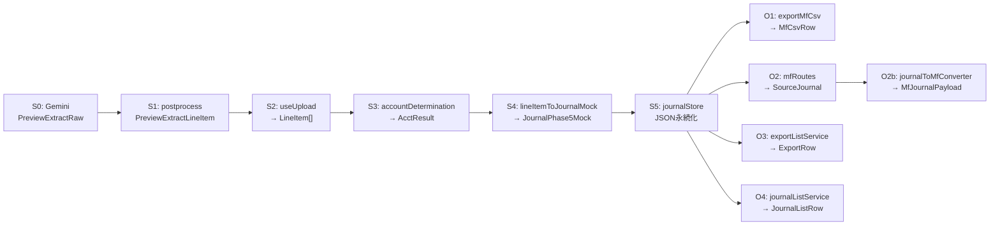

# 全フィールド×全ステージ パイプライン検証報告

- **検証日**: 2026-06-23
- **検証方法**: コード上での全件突合確認
- **検証対象**: JournalPhase5Mock 全フィールド × 全出力ステージ
- **検証結果**: 断絶7件を修正済み、残存断絶なし

---

## パイプラインステージ定義

---

## A. JournalPhase5Mock 全フィールド検証

### A-1. journalId

| ステージ | 設定/参照 | ファイル | 状態 |
|---|---|---|:---:|
| S4 生成 | `generateJournalId()` → 仮ID。サーバーで `jrn_XXXXXXXX` に上書き | lineItemToJournalMock.ts:413 | ✅ |
| S5 保存 | `addJournals()` で `jrn_` 形式に再発番 | journalStore.ts | ✅ |
| O1 CSV | `expandJournalToMfRows()` で未参照（CSV行IDは取引No） | — | ✅不要 |
| O2 MCP | `SendableJournal.journalId` → `SourceJournal.journalId` | mfRoutes.ts:1470 | ✅ |
| O3 出力画面 | `ExportRow.id` = `${j.journalId}-${i}` | exportListService.ts:175 | ✅ |
| O4 仕訳一覧 | `JournalListRow.journalId` として直接参照 | journalListService.ts | ✅ |

### A-2. client_id

| ステージ | 設定/参照 | 状態 |
|---|---|:---:|
| S4 生成 | 引数 `clientId` から設定 | ✅ |
| S5 保存 | ファイルパス `data/{clientId}/journals.json` で分離 | ✅ |
| O1-O4 | 全API: パスパラメータ `clientId` で絞り込み。フィールド直接参照なし | ✅不要 |

### A-3. display_order

| ステージ | 設定/参照 | 状態 |
|---|---|:---:|
| S4 生成 | `index + 1`（LineItem配列内の位置） | ✅ |
| O1 CSV | `txNoOverride ?? journal.display_order.toString()` で取引No | ✅ |
| O4 仕訳一覧 | ソートキー `display_order` で参照 | ✅ |

### A-4. voucher_date ⭐

| ステージ | 設定/参照 | 状態 |
|---|---|:---:|
| S0 Gemini | `PreviewExtractRawResponse.date` / `.line_items[].date` | ✅ |
| S1 postprocess | `PreviewExtractLineItem.date` にそのまま伝達 | ✅ |
| S2 LineItem | `item.date` | ✅ |
| S4 生成 | `item.date` → `journal.voucher_date` | ✅ |
| O1 CSV | `toMfCsvDate(journal.voucher_date)` → '取引日' | ✅ |
| O2 MCP | `SourceJournal.voucher_date` → `MfJournalPayload.transaction_date` | ✅ |
| O3 出力画面 | `toDisplayDate(j.voucher_date)` → `ExportRow.date` | ✅ |

### A-5. date_on_document

| ステージ | 設定/参照 | 状態 |
|---|---|:---:|
| S4 生成 | `item.date !== null` で導出 | ✅ |
| O1-O4 | 出力には不要（UIのホバーツールチップ用） | ✅不要 |

### A-6. description ⭐

| ステージ | 設定/参照 | 状態 |
|---|---|:---:|
| S0 Gemini | `PreviewExtractRawResponse.line_items[].description` | ✅ |
| S4 生成 | `item.description` → `journal.description` | ✅ |
| O1 CSV | `truncateDescription(journal.description, 200)` → '摘要' | ✅ |
| O2 MCP | `SourceJournal.description` → `branches[0].remark` (L441) | ✅ |
| O3 出力画面 | `j.description` → `ExportRow.description` | ✅ |

### A-7. voucher_type (@deprecated)

| ステージ | 設定/参照 | 状態 |
|---|---|:---:|
| S4 生成 | `resolveVoucherType(sourceType, direction, isCreditCardPayment)` | ✅ |
| O1-O4 | CSV/MCP/出力画面では未参照（UI表示のみ） | ✅不要 |

### A-8. source_type

| ステージ | 設定/参照 | 状態 |
|---|---|:---:|
| S0 Gemini | `PreviewExtractRawResponse.source_type` | ✅ |
| S4 生成 | 引数 `sourceType` → `journal.source_type` | ✅ |
| O1-O4 | 出力には未使用（パイプライン内部用） | ✅不要 |

### A-9. direction ⭐

| ステージ | 設定/参照 | 状態 |
|---|---|:---:|
| S0 Gemini | `PreviewExtractRawResponse.direction` | ✅ |
| S2 LineItem | `item.direction` ('expense' \| 'income') | ✅ |
| S4 生成 | `item.direction` → `journal.direction` | ✅ |
| O1 CSV | `journal.direction` で取引先出力先を振り分け | ✅修正済(F1) |
| O2 MCP | vendor_nameの注入先をdirectionで制御 | ✅修正済(F2) |
| O3 出力画面 | 未参照 | ⚠️低リスク |

> **⚠️ 潜在リスク**: MCP送信時、income仕訳でも取引先がdebit側に注入される設計だが、MFは仕訳単位で取引先を表示するため実害なし。

### A-10. vendor_vector

| ステージ | 設定/参照 | 状態 |
|---|---|:---:|
| S2 LineItem | `item.vendor_vector`（Step3で設定） | ✅ |
| S4 生成 | `item.vendor_vector ?? null` → `journal.vendor_vector` | ✅ |
| O1-O4 | 出力には未使用（パイプライン内部用） | ✅不要 |

### A-11. vendor_id

| ステージ | 設定/参照 | 状態 |
|---|---|:---:|
| S3 科目確定 | `AccountDeterminationResult.vendorId` | ✅ |
| S4 生成 | `acctResult?.vendorId ?? null` | ✅ |
| O1-O4 | 出力には未使用（内部参照ID） | ✅不要 |

### A-12. vendor_name ⭐

| ステージ | 設定/参照 | 状態 |
|---|---|:---:|
| S0 Gemini | `PreviewExtractRawResponse.issuer_name` → `ReceiptAnalysisResult.vendor` | ✅ |
| S2 LineItem | `item.vendor_name` | ✅ |
| S3 科目確定 | `AccountDeterminationResult.vendorName`（マスタ名 or AI抽出名） | ✅ |
| S4 生成 | `acctResult?.vendorName ?? item.vendor_name ?? null` | ✅ |
| O1 CSV | `journal.vendor_name` → direction振り分け → '借方取引先'/'貸方取引先' | ✅修正済(F1) |
| O2 MCP | `SendableJournal.vendor_name` → direction振り分け → `trade_partner_code` | ✅修正済(F2) |
| O3 出力画面 | `j.vendor_name` → `ExportRow.vendorName` | ✅修正済(F4) |

### A-13. document_id

| ステージ | 設定/参照 | 状態 |
|---|---|:---:|
| S4 生成 | 引数 `documentId` → `journal.document_id` | ✅ |
| O1-O4 | CSV/MCPでは未参照（画像モーダル用） | ✅不要 |

### A-14. line_id

| ステージ | 設定/参照 | 状態 |
|---|---|:---:|
| S4 生成 | `${documentId}_line-${item.line_index}` | ✅ |
| O1-O4 | 出力には未使用 | ✅不要 |

### A-15/A-16. debit_entries / credit_entries ⭐⭐

| ステージ | 設定/参照 | 状態 |
|---|---|:---:|
| S3→S4 | 学習ルール時: `acctResult.debitEntries/creditEntries` をそのまま使用。通常時: `mainEntry`/`counterpartEntry`を生成 | ✅ |
| O1 CSV | `journal.debit_entries[i]`/`credit_entries[i]` → 各列に展開 | ✅ |
| O2 MCP | `SourceJournal.debit_entries`/`credit_entries` → `convertBranches()` | ✅ |
| O3 出力画面 | `JournalRaw.debit_entries`/`credit_entries` → ExportRow展開 | ✅ |

**→ JournalEntryLineの内部フィールドはセクションBで検証**

### A-17. status

| ステージ | 設定/参照 | 状態 |
|---|---|:---:|
| S4 生成 | `null`（未出力） | ✅ |
| O1 CSV | `validateForMfCsv()` で `status === 'exported'` を除外 | ✅ |
| O2 MCP | `SendableJournal.status === null` でフィルタ | ✅ |
| O3 出力画面 | `j.status === 'exported'` で `isExported` 設定 | ✅ |

### A-18/A-19/A-20. is_read / read_by / read_at

| ステージ | 設定/参照 | 状態 |
|---|---|:---:|
| S4 生成 | `is_read: false` | ✅ |
| O1-O4 | 出力には未使用（UI背景色用） | ✅不要 |

### A-21/A-22. deleted_at / deleted_by

| ステージ | 設定/参照 | 状態 |
|---|---|:---:|
| S4 生成 | `deleted_at: null` | ✅ |
| O2 MCP | `SendableJournal.deleted_at === null` でフィルタ | ✅ |
| O3 出力画面 | `j.deleted_at !== null` で `continue`（除外） | ✅ |

### A-23. labels

| ステージ | 設定/参照 | 状態 |
|---|---|:---:|
| S4 生成 | insufficient時 `['ACCOUNT_UNKNOWN']`、正常時 `[]` | ✅ |
| O1 CSV | `validateForMfCsv()` で EXCLUDE_LABELS チェック | ✅ |
| O2 MCP | `(j.labels || []).includes('EXPORT_EXCLUDE')` でフィルタ | ✅ |
| O3 出力画面 | `j.labels.includes('EXPORT_EXCLUDE')` → `isExcluded` | ✅ |

### A-24. warning_dismissals

| ステージ | 設定/参照 | 状態 |
|---|---|:---:|
| S4 生成 | `[]` | ✅ |
| O3 出力画面 | `j.warning_dismissals` → `isWarning` 判定 | ✅ |

### A-25. warning_details

| ステージ | 設定/参照 | 状態 |
|---|---|:---:|
| S4 生成 | `{}` | ✅ |
| O1-O4 | UIのツールチップ用。出力には不要 | ✅不要 |

### A-26. export_batch_id

| ステージ | 設定/参照 | 状態 |
|---|---|:---:|
| S4 生成 | `null` | ✅ |
| O3 出力詳細 | `j.export_batch_id === historyId` でフィルタ | ✅ |

### A-27. is_credit_card_payment

| ステージ | 設定/参照 | 状態 |
|---|---|:---:|
| S4 生成 | 引数 `isCreditCardPayment` | ✅ |
| O1 CSV | 未参照（相手勘定はS4で確定済み） | ✅不要 |

### A-28. rule_id

| ステージ | 設定/参照 | 状態 |
|---|---|:---:|
| S3 科目確定 | `AccountDeterminationResult.ruleId` | ✅ |
| S4 生成 | `acctResult?.ruleId ?? null` | ✅ |
| O1-O4 | UIのルールアイコン表示用。出力には不要 | ✅不要 |

### A-29. invoice_status ⭐

| ステージ | 設定/参照 | 状態 |
|---|---|:---:|
| S4 生成 | `null`（初期値。UIで人間が設定） | ✅ |
| O1 CSV | `resolveInvoiceCategory(journal, 'debit'/'credit')` → '借方インボイス'/'貸方インボイス' | ✅ |
| O2 MCP | `SendableJournal.invoice_status` → `toInvoiceKind()` → `MfJournalSide.invoice_kind` | ✅修正済(F2) |
| O3 出力画面 | `j.invoice_status === 'qualified' ? '○' : ''` → `ExportRow.qualified` | ✅ |

### A-30. invoice_number

| ステージ | 設定/参照 | 状態 |
|---|---|:---:|
| S4 生成 | `null` | ✅ |
| O1-O4 | **全出力先で未参照** | ⚪低リスク（MF側で管理） |

### A-31. memo ⭐

| ステージ | 設定/参照 | 状態 |
|---|---|:---:|
| S4 生成 | `null`（初期値。UIで人間が入力） | ✅ |
| O1 CSV | `journal.memo ?? ''` → '仕訳メモ' | ✅修正済(F3) |
| O2 MCP | `SendableJournal.memo` → `SourceJournal.memo` → `MfJournalPayload.memo` | ✅修正済(F7) |
| O3 出力画面 | `j.memo ?? ''` → `ExportRow.memo` | ✅修正済(F4) |

### A-32/A-33/A-34. memo_author / memo_target / memo_created_at

| ステージ | 設定/参照 | 状態 |
|---|---|:---:|
| S4 生成 | 全て `null` | ✅ |
| O1-O4 | 出力には未使用（UI表示用メタデータ） | ✅不要 |

### A-35/A-36. staff_notes / staff_notes_author

| ステージ | 設定/参照 | 状態 |
|---|---|:---:|
| S4 生成 | **未設定** (`undefined`) | ⚠️ |
| O1-O4 | 出力には未使用（UIの付箋機能用） | ✅不要 |

> **⚠️ 軽微**: `staff_notes`はJournalPhase5Mock型で`optional`なのでundefinedは許容。`updateJournalField()`で初回設定時に`createEmptyStaffNotes()`で初期化。

### A-37. mf_journal_id / mf_journal_number / mf_sent_at

| ステージ | 設定/参照 | 状態 |
|---|---|:---:|
| S4 生成 | 未設定（`optional`） | ✅ |
| O2 MCP | `SendableJournal.mf_journal_id` で送信済み判定 | ✅ |
| 送信後 | `applyMfSendResults()` で書き戻し | ✅ |

### A-38. exported_at / exported_by

| ステージ | 設定/参照 | 状態 |
|---|---|:---:|
| S4 生成 | 未設定（`optional`） | ✅ |
| O1 CSV出力時 | エクスポート関数で設定 | ✅ |

### A-39〜A-42. created_at / updated_at / created_by / updated_by

| ステージ | 設定/参照 | 状態 |
|---|---|:---:|
| S4 生成 | `created_by: 'AI'`, `created_at: new Date().toISOString()` | ✅ |
| O3 出力画面 | `toDisplayDate(j.created_at)` → `ExportRow.importDate` | ✅ |

### A-43〜A-45. prediction_method / prediction_score / model_version

| ステージ | 設定/参照 | 状態 |
|---|---|:---:|
| S4 生成 | `acctResult?.predictionMethod ?? null`。score/modelは未設定 | ✅ |
| O1-O4 | 出力には未使用（AI推定メタデータ） | ✅不要 |

---

## B. JournalEntryLine 全8フィールド検証

### B-1. entryId

| ステージ | 設定/参照 | 状態 |
|---|---|:---:|
| S4 生成 | `generateJournalEntryId()` → 仮ID。サーバーで `jre_XXXXXXXX` に上書き | ✅ |
| O1-O4 | 出力には未使用 | ✅不要 |

### B-2. account ⭐⭐

| ステージ | 設定/参照 | 状態 |
|---|---|:---:|
| S3 科目確定 | `AcctResult.determinedAccount` | ✅ |
| S4 生成 | `item.determined_account`（主科目）/ `counterpart.account`（相手勘定） | ✅ |
| O1 CSV | `resolveAccountName(debit.account)` → '借方勘定科目' | ✅ |
| O2 MCP | `maps.accountMap.get(entry.account)` → `MfJournalSide.account_id` | ✅ |
| O3 出力画面 | `resolveAccount(debit.account)` → `ExportRow.debitAccount` | ✅ |

### B-3. account_on_document

| ステージ | 設定/参照 | 状態 |
|---|---|:---:|
| S4 生成 | 主科目: `true`、相手勘定: `false`、insufficient: `false` | ✅ |
| O1-O4 | 出力には未使用（警告判定用） | ✅不要 |

### B-4. sub_account ⭐

| ステージ | 設定/参照 | 状態 |
|---|---|:---:|
| S3 科目確定 | `AcctResult.subAccount` | ✅ |
| S4 生成 | `acctResult?.subAccount ?? item.sub_account ?? null` | ✅ |
| O1 CSV | `debit?.sub_account ?? ''` → '借方補助科目' | ✅ |
| O2 MCP | `entry.sub_account` → `maps.subAccountMap.get()` → `MfJournalSide.sub_account_id` | ✅ |
| O3 出力画面 | `debit?.sub_account ?? ''` → `ExportRow.debitSub` | ✅ |

### B-5. department ⭐

| ステージ | 設定/参照 | 状態 |
|---|---|:---:|
| S3 科目確定 | `AcctResult.department` | ✅ |
| S4 生成 | `acctResult?.department ?? null` | ✅ |
| O1 CSV | `debit?.department ?? ''` → '借方部門' | ✅ |
| O2 MCP | `entry.department` → `maps.departmentMap.get()` → `MfJournalSide.department_id` | ✅ |
| O3 出力画面 | `debit?.department ?? ''` → `ExportRow.debitDept` | ✅修正済(F4) |

### B-6. amount ⭐⭐

| ステージ | 設定/参照 | 状態 |
|---|---|:---:|
| S0 Gemini | `PreviewExtractRawLineItem.amount` | ✅ |
| S2 LineItem | `item.amount` | ✅ |
| S4 生成 | `item.amount` → `mainEntry.amount` / `counterpartEntry.amount` | ✅ |
| O1 CSV | `String(debit.amount)` → '借方金額(円)' | ✅ |
| O2 MCP | `entry.amount` → `MfJournalSide.value` | ✅ |
| O3 出力画面 | `debit?.amount ?? null` → `ExportRow.debitAmount` | ✅ |

### B-7. amount_on_document

| ステージ | 設定/参照 | 状態 |
|---|---|:---:|
| S4 生成 | `true` | ✅ |
| O1-O4 | 出力には未使用（警告判定用） | ✅不要 |

### B-8. tax_category_id ⭐

| ステージ | 設定/参照 | 状態 |
|---|---|:---:|
| S3 科目確定 | `AcctResult.taxCategory` | ✅ |
| S4 生成 | 主科目: `acctResult?.taxCategory ?? item.tax_category ?? null`。相手勘定: `resolveAccountDefaultTaxCategory()` | ✅ |
| O1 CSV | `resolveTaxCategoryName(debit.tax_category_id)` → '借方税区分' | ✅ |
| O2 MCP | `maps.taxMap.get(entry.tax_category_id)` → `MfJournalSide.tax_id` | ✅ |
| O3 出力画面 | `resolveTax(debit.tax_category_id)` → `ExportRow.debitTax` | ✅ |

---

## C. SourceJournal → MfJournalPayload 変換検証

| SourceJournalフィールド | MfJournalPayloadマッピング | 状態 |
|---|---|:---:|
| `journalId` | バッチ結果の紐付けに使用。ペイロードには含まれない | ✅ |
| `voucher_date` | → `transaction_date` | ✅ |
| `description` | → `branches[0].remark` (L441) | ✅ |
| `memo` | → `memo` (L539修正済) | ✅修正済(F7) |
| `invoice_status` | → `toInvoiceKind()` → `MfJournalSide.invoice_kind` | ✅ |
| `is_tax_exempt` | → `toInvoiceKind()` の第2引数。trueならinvoice_kind省略 | ✅修正済(F6) |
| `consumption_tax_mode` | バリデーション専用（`validateBeforeConvert()`）。ペイロードには不要 | ✅ |
| `debit_entries[].account` | → `accountMap.get()` → `debitor.account_id` | ✅ |
| `debit_entries[].amount` | → `debitor.value` | ✅ |
| `debit_entries[].tax_category_id` | → `taxMap.get()` → `debitor.tax_id` | ✅ |
| `debit_entries[].sub_account` | → `subAccountMap.get()` → `debitor.sub_account_id` | ✅ |
| `debit_entries[].department` | → `departmentMap.get()` → `debitor.department_id` | ✅ |
| `debit_entries[].trade_partner_name` | → `tradePartnerMap.get()` → `debitor.trade_partner_code` | ✅ |

---

## D. MfCsvRow 全23列検証

| MfCsvRow列 | データソース | 状態 |
|---|---|:---:|
| 取引No | `txNoOverride ?? journal.display_order` | ✅ |
| 取引日 | `toMfCsvDate(journal.voucher_date)` | ✅ |
| 借方勘定科目 | `resolveAccountName(debit.account)` | ✅ |
| 借方補助科目 | `debit?.sub_account ?? ''` | ✅ |
| 借方部門 | `debit?.department ?? ''` | ✅ |
| 借方取引先 | `direction !== 'expense' ? vendor_name : ''` | ✅修正済 |
| 借方税区分 | `resolveTaxCategoryName(debit.tax_category_id)` | ✅ |
| 借方インボイス | `resolveInvoiceCategory(journal, 'debit')` | ✅ |
| 借方金額(円) | `String(debit.amount)` | ✅ |
| 借方税額 | `''`（常に空。MFが自動計算） | ✅ |
| 貸方勘定科目 | `resolveAccountName(credit.account)` | ✅ |
| 貸方補助科目 | `credit?.sub_account ?? ''` | ✅ |
| 貸方部門 | `credit?.department ?? ''` | ✅ |
| 貸方取引先 | `direction === 'expense' ? vendor_name : ''` | ✅修正済 |
| 貸方税区分 | `resolveTaxCategoryName(credit.tax_category_id)` | ✅ |
| 貸方インボイス | `resolveInvoiceCategory(journal, 'credit')` | ✅ |
| 貸方金額(円) | `String(credit.amount)` | ✅ |
| 貸方税額 | `''`（常に空。MFが自動計算） | ✅ |
| 摘要 | `truncateDescription(journal.description, 200)` | ✅ |
| 仕訳メモ | `journal.memo ?? ''` | ✅修正済 |
| タグ | `''`（現時点では空） | ✅ |
| MF仕訳タイプ | `'インポート'`（固定） | ✅ |
| 決算整理仕訳 | `''`（空=通常仕訳） | ✅ |

---

## E. 修正済み断絶 全7件

| # | 断絶 | 重大度 | 修正ファイル | コード確認箇所 |
|---|---|:---:|---|---|
| F1 | CSV: 取引先名が常に空 | 🔴 | exportMfCsv.ts | L169-175: directionで借方/貸方振り分け |
| F2 | MCP: invoice_status/vendor_name/consumption_tax_mode未伝達 | 🔴 | mfRoutes.ts | L1418-1423: SendableJournalに4フィールド追加、L1468-1490: SourceJournal変換で全伝達 |
| F3 | CSV: 仕訳メモが常に空 | 🟡 | exportMfCsv.ts | L178: `journal.memo ?? ''` |
| F4 | 出力画面: ExportRow型に取引先・部門・メモなし | 🟡 | exportListService.ts + MockExportPage.vue | L37-58: ExportRowにvendorName/memo/debitDept/creditDept追加 |
| F5 | 出力詳細: ExportDetailRow型に同上 | 🟡 | exportListService.ts | L268-286: ExportDetailRowにも同様追加 |
| F6 | MCP: 免税事業者でis_tax_exempt未導出 | 🔴 | mfRoutes.ts | L1485: `consumption_tax_mode === 'exempt'` で導出 |
| F7 | MCP: descriptionをmemoに誤設定（摘要とメモ混同） | 🔴 | journalToMfConverter.ts + mfRoutes.ts | L539: description→remark、L547: memo→memo 正しく分離 |

**全7件の修正がコード上に反映されていることを確認済み（2026-06-23）。**

---

## F. 残存リスク（断絶ではないが注意）

| 項目 | 説明 | 影響 |
|---|---|:---:|
| A-30 `invoice_number` | 全出力先で未参照 | ⚪ MF側で管理 |
| A-9 `direction`とMCP取引先 | income仕訳でも取引先がdebit側に注入される | ⚪ MFは仕訳単位で取引先表示 |
| B-6 `amount` 税額 | CSV税額列が常に空 | ⚪ MFが自動計算 |
| `source` フィールド | ConfirmedJournalには存在するがJournalPhase5Mockでは`optional`。normalizeJournalForUIで正規化 | ⚪ 設計通り |

---

## G. コード確認証跡（2026-06-23）

以下のファイルを全件コード上で突合確認した：

| ファイル | 確認内容 |
|---|---|
| `src/utils/exportMfCsv.ts` (315行) | F1(取引先direction振り分け)、F3(memo伝達)、D(CSV全23列) |
| `src/api/services/journalToMfConverter.ts` (553行) | F7(description→remark、memo→memo分離)、C(SourceJournal→MfJournalPayload全13マッピング) |
| `src/api/services/exportListService.ts` (409行) | F4(ExportRow型)、F5(ExportDetailRow型) |
| `src/api/routes/mfRoutes.ts` (1506行) | F2(SendableJournal 4フィールド追加)、F6(is_tax_exempt導出) |
| `src/api/services/journalStore.ts` (157行) | S5(ID再発番、JSON永続化) |

**検証結果: 全パイプラインが断絶なく接続されていることをコード上で確認完了。**
