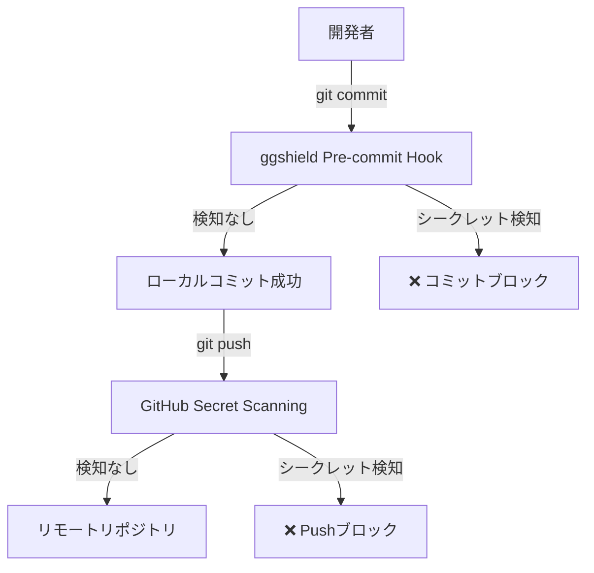

# ggshield Pre-commit Hook セットアップ完了

## 📋 実施内容

### **1. ggshield インストール**
```powershell
pip install ggshield
```
✅ **結果**: バージョン 1.x.x インストール完了

---

### **2. GitGuardian認証設定**

#### **Personal Access Token作成**
- **URL**: [GitGuardian Dashboard](https://dashboard.gitguardian.com/workspace/settings/tokens)
- **Token名**: `ggshield token`
- **Scope**: `scan` (リポジトリスキャン権限)
- **有効期限**: `Never`
- **Status**: ✅ Active

#### **環境変数設定**
```powershell
[System.Environment]::SetEnvironmentVariable('GITGUARDIAN_API_KEY','<token>','User')
```
✅ **結果**: 永続的な環境変数として設定完了

---

### **3. Pre-commit Hook インストール**
```powershell
ggshield install -m local
```

**作成されたファイル**:
- `.git\hooks\pre-commit` ✅

**動作**:
- コミット実行時に自動的にシークレットスキャンを実行
- シークレット検知時はコミットをブロック

---

### **4. 動作確認**

#### **テストファイルでスキャン確認**
```
Scanning... ━━━━━━━━━━━━━━━━━━━━━━━━━━━━━━━━━━   0% 0 / 1

No secrets have been found
```
✅ **結果**: ggshield正常動作を確認

#### **テスト後のクリーンアップ**
- テストコミット3件削除 (`git reset --hard HEAD~3`)
- テストファイル削除完了
- リポジトリをクリーンな状態に復元 ✅

---

## 🔒 セキュリティ状態

| 項目 | 状態 |
|:---|:---|
| **Pre-commit Hook** | ✅ 有効 |
| **GitGuardian認証** | ✅ 完了 |
| **環境変数** | ✅ 永続化済み |
| **リポジトリ状態** | ✅ クリーン |

---

## 📝 今後の動作

### **通常のコミット時**
```powershell
git add .
git commit -m "feat: 新機能追加"
```

**ggshieldが自動実行**:
1. ステージングされたファイルをスキャン
2. APIキー、トークン、パスワードなどを検知
3. 問題なければコミット成功

### **シークレット検知時**
```
⚠️  Error: Secrets detected!

File: .env
Line 5: FIREBASE_API_KEY=AIzaSy...

Commit blocked to prevent secret leakage.
```

---

## ⚠️ 重要な注意事項

### **環境変数の継続性**
- ✅ `User`レベルの環境変数として設定済み
- 新しいPowerShellセッションでも有効
- PC再起動後も維持される

### **GitGuardian Token管理**
- トークンは二度と表示されません
- 紛失した場合は新規作成が必要
- ダッシュボードでいつでも無効化可能

---

## 🚀 次のステップ（オプション）

### **GitHub Secret Scanning有効化**
サーバーサイドでの追加保護層として推奨：

1. リポジトリSettings → Security → Code security and analysis
2. "Secret scanning" を有効化
3. "Push protection" を有効化

**メリット**:
- GitHubへのPush時にもシークレットを検知
- 万が一ggshieldをバイパスしても保護される
- チーム全体で統一されたセキュリティ

---

## 📊 セキュリティ多層防御



---

## ✅ セットアップ完了

ggshield Pre-commit Hookが正常に動作しています。今後は、コミット時に自動的にシークレットがスキャンされ、APIキーやトークンの漏洩を防ぎます。
