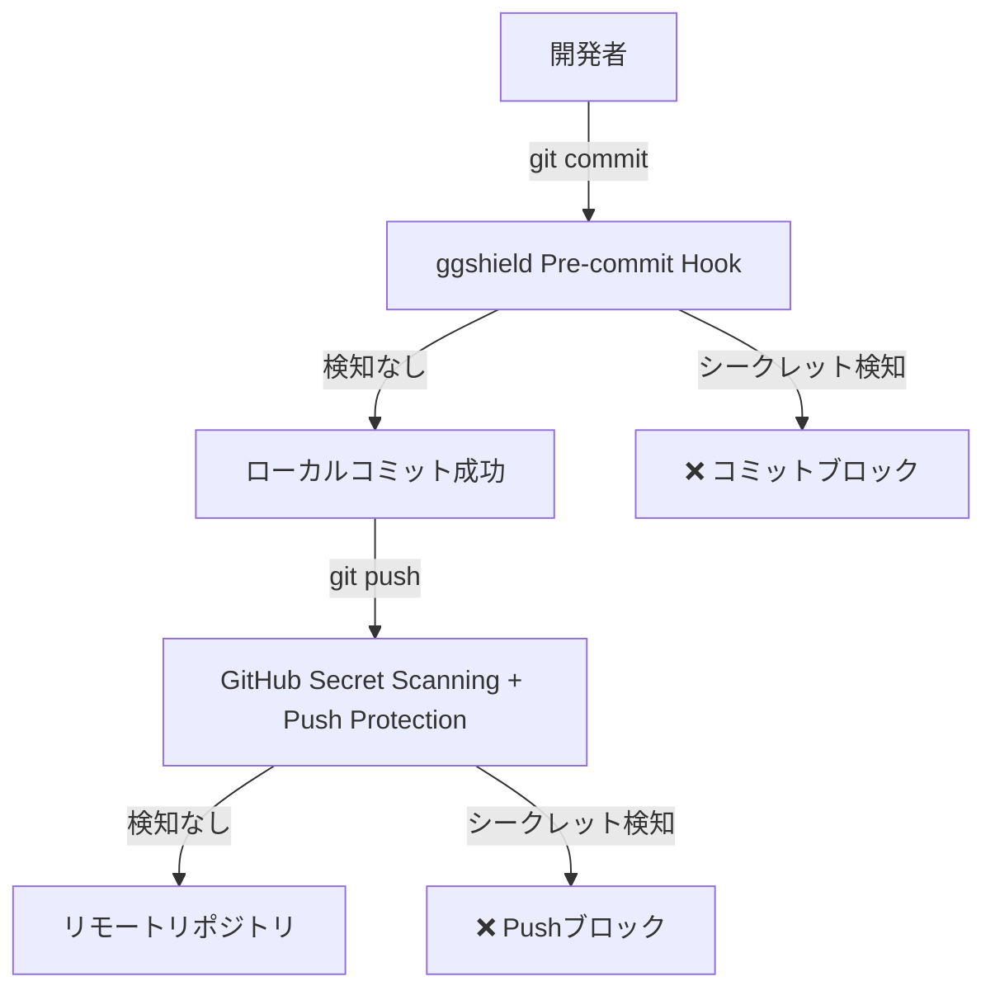

# GitHub Secret Scanning 有効化ガイド

## 🔗 **アクセスURL**

**直接リンク**:
```
https://github.com/tani0120/receipt-app/settings/security_analysis
```

👆 **このURLをクリックしてください**

---

## 📋 **設定手順**

### **Step 1: GitHubにログイン**
- ✅ `tani0120` アカウントでログインしていることを確認

### **Step 2: セキュリティ設定ページにアクセス**
1. 上記のURLにアクセス
2. または、リポジトリページから：
   - `Settings` タブをクリック
   - 左サイドバーの `Security` セクション
   - `Code security and analysis` をクリック

### **Step 3: Secret Scanning を有効化**

**探す項目**:
```
Secret scanning
├─ Alerts
│  └─ [Enable] または [Disable]
└─ Push protection
   └─ [Enable] または [Disable]
```

**操作**:
1. ✅ **"Secret scanning"** の `Enable` ボタンをクリック
2. ✅ **"Push protection"** の `Enable` ボタンをクリック

---

## 🎯 **各機能の説明**

### **Secret Scanning**
- **目的**: リポジトリ全体をスキャンしてシークレットを検知
- **動作**: 既存のコミット履歴も含めてスキャン
- **通知**: シークレット発見時にアラートを表示

### **Push Protection** ⭐ **重要**
- **目的**: Push時にシークレットをブロック
- **動作**: `git push` の前にシークレットを検知
- **効果**: ggshieldをバイパスしてもGitHub側でブロック

---

## ✅ **有効化後の確認**

設定完了後、以下を確認してください：

### **1. ステータス確認**
```
Secret scanning: ✅ Enabled
Push protection: ✅ Enabled
```

### **2. 既存のアラート確認**
- 同じページに "Secret scanning alerts" セクションが表示されます
- もし既存のシークレットが検知されていたら、リストが表示されます

---

## 📸 **設定画面イメージ**

設定ページは以下のような構成になっています：

```
Code security and analysis
├─ Dependency graph (有効/無効)
├─ Dependabot alerts (有効/無効)
├─ Dependabot security updates (有効/無効)
├─ Secret scanning ⬅️ ここを有効化
│  ├─ Alerts: [Enable]
│  └─ Push protection: [Enable] ⬅️ これも有効化
└─ ...
```

---

## 🚨 **Public Repositoryの場合**

> [!NOTE]
> `tani0120/receipt-app` がPublicリポジトリの場合、Secret Scanningは**デフォルトで有効**になっている可能性があります。
> 
> その場合、ページに以下のように表示されます：
> - `Secret scanning: Enabled`
> - ボタンが `Disable` になっている

**確認すること**:
- ✅ Secret scanning が `Enabled` になっているか
- ✅ **Push protection** が `Enabled` になっているか（これは手動で有効化が必要）

---

## ⚠️ **Private Repositoryの場合**

Private リポジトリの場合、以下の条件が必要です：

- ✅ GitHub Advanced Security が有効（GitHub Proまたは組織アカウント）
- もし利用できない場合は、ggshield Pre-commit Hook のみで保護されます

---

## 📊 **完了後のセキュリティ構成**



---

## 🎉 **設定完了チェックリスト**

- [ ] GitHub設定ページにアクセス完了
- [ ] Secret scanning が `Enabled`
- [ ] Push protection が `Enabled`
- [ ] 既存アラートを確認（あれば対応）

---

## 🔗 **参考リンク**

- [GitHub Secret Scanning 公式ドキュメント](https://docs.github.com/ja/code-security/secret-scanning/about-secret-scanning)
- [Push Protection 公式ドキュメント](https://docs.github.com/ja/code-security/secret-scanning/push-protection-for-repositories-and-organizations)
