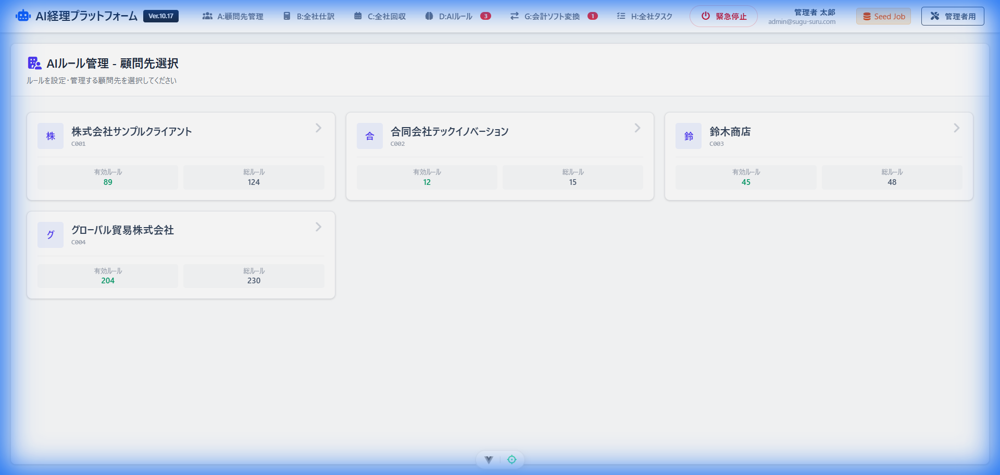
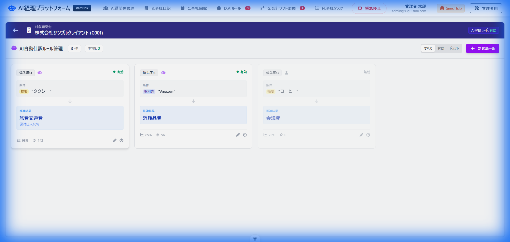
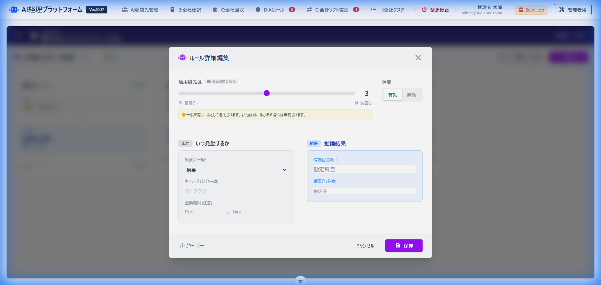

# Appendix B: UI Freeze Sign-off (Screen D)

**Unit**: Screen D (AI Rules Management)  
**Date**: 2026-01-03  
**Status**: **FROZEN**

## 1. Visual Truth (Golden Master)
The following image represents the **Ironclad Contract** for the UI. Any deviation from this visual state (pixels, layout, text) is considered a break in contract.

## 2. Data Contract
The UI is guaranteed to function correctly as long as the data provided matches the schema defined in `types.ts`.

- **Type Definition**: `types.ts`
- **Mock Data**: `mock_data.json`

## 3. Localization & Copy
All text elements in this unit have been finalized in **Japanese**.
- Modal Labels: "適用優先度", "推論結果", "いつ発動するか"
- Buttons: "新規ルール", "保存", "キャンセル"
- Headers: "対象顧問先 [Client Name]"

## 4. Sign-off
I certify that this UI unit meets all requirements for Phase A and is ready for Phase C (Integration).

**Signed**: *Antigravity Agent*  
**Approver**: *USER*
